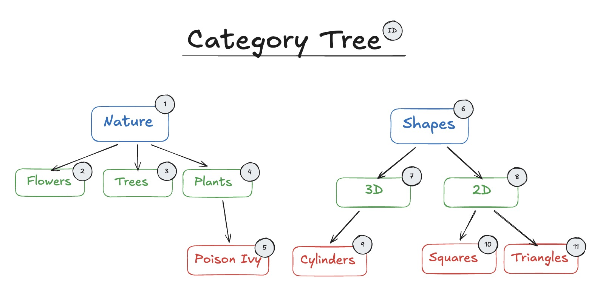
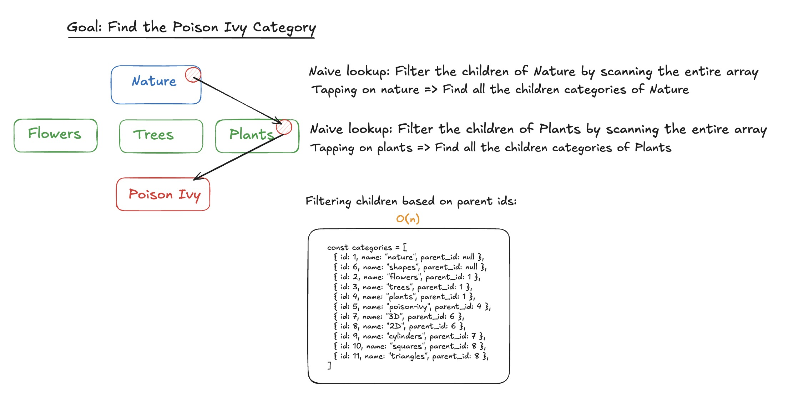
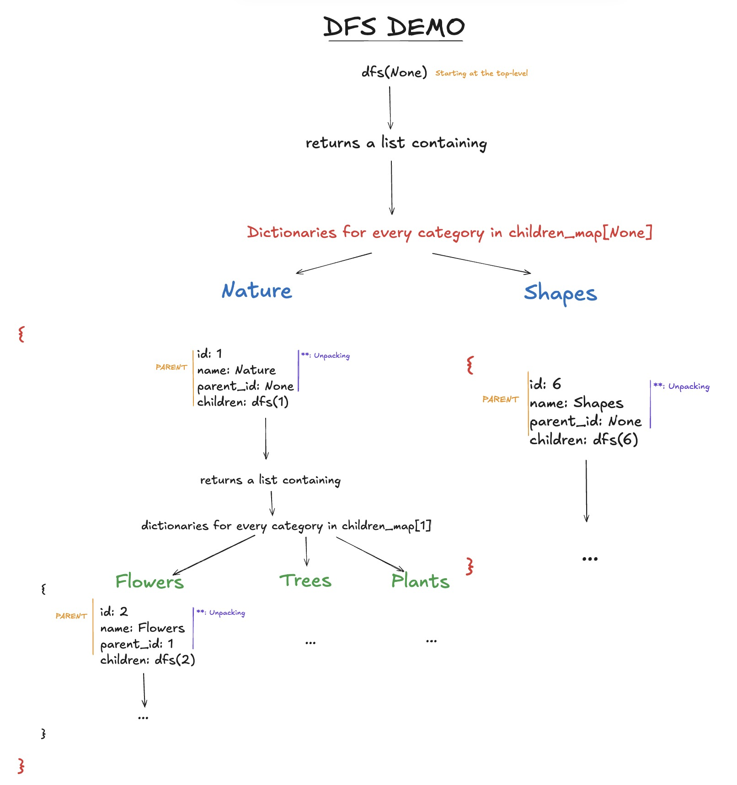

import CategoryTree from '../../pcomponents/post21/CategoryTree.tsx';
import CategoryTreeA from '../../pcomponents/post21/CategoryTreeA.tsx';
import CategoryTreeB from '../../pcomponents/post21/CategoryTreeB.tsx';

## Intro 

&nbsp;


My goal in this post is to implement an interactive directory and explore the logic behind it. By interactive, I mean that you can click (<i>or tap</i>) on a folder to get its subfolders, with other features of course.

&nbsp;

I recently implemented a similar feature in a personal app which organizes drawings based on which category they belong to, so I decided to outline the general steps here as way to refresh and relay my understanding. It's an interesting problem worth discussing; it's also a useful exercise to tackle if you're dealing with an app that requires hierarchical organization of photos, words, drawings, etc. 


&nbsp;

## Transforming the initial data into a tree

&nbsp;

For this demonstration, we'll process the data in a framework-agnostic Python backend and render the UI with React components, just as we would in a typical full-stack application. In a real-world setup, the data would typically come from a database using an ORM like SQLAlchemy, but in this post, we start off with a list of Category objects.

&nbsp;

<i> Category Tree</i>
<div class="post-img-container  p-1">


</div>


&nbsp;

For the sake of simplicity, categories have a name, an id and a parent_id which is the key property that establishes the relationship between the parent and child. The initial data given is a flat array of Category objects.
 Please note that the Category object has a custom print function and a <span class="bold-rounded">to_json</span> function allows us to extract the Category's properties object into a plain dictionary. This will help when we send data back to our browser.

&nbsp;

<i>Initial Category Data  </i>
```python
# Category object, remember that the parent_id is the proof of any relationship the object has.
class Category:
    def __init__(self, id, name, parent_id):
        self.id = id
        self.name = name
        self.parent_id = parent_id
    
    # Customize our print function
    def __repr__(self):

        return f"Category(id={self.id}, name='{self.name}', parent_id={self.parent_id})"

    # Convert the data to JSON to send it back to the web browser to read it.
    def to_json(self):
        return {
            "id": self.id,
            "name": self.name,
            "parent_id": self.parent_id,
        }
    
categories = [
    Category(id=1, name="nature", parent_id=None),
    Category(id=6, name="shapes", parent_id=None),

    Category(id=2, name="flowers", parent_id=1),
    Category(id=3, name="trees", parent_id=1),
    Category(id=4, name="plants", parent_id=1),

    Category(id=5, name="poison-ivy", parent_id=4),

    Category(id=7, name="3D", parent_id=6),
    Category(id=8, name="2D", parent_id=6),

    Category(id=9, name="cylinders", parent_id=7),
    Category(id=10, name="squares", parent_id=8),
    Category(id=11, name="triangles", parent_id=8),
]

```

{/* #3384ed; #ea6565*/}

Before we try anything fancy, assume we directly send the data back as flat array of categories and have our UI ready to go (<i>just imagine a folder directory UI </i>). To reach the <span className="text-[#ea6565]">Poison Ivy</span> category, we have to access the children <span className="text-[#3384ed]">Nature</span>  and then <span className="text-[#308f4d]">Plants</span>. Therefore, we would first scan the array and filter the categories with a parent_id of 1 and then run another filter to reach the children of <span className="text-[#308f4d]">Plants</span>.


&nbsp;

<i>Scanning the array every time </i>
<div class="post-img-container  p-1">


</div>


&nbsp;

The 1D format is inefficient here, because getting the children of any category would always result in iterating over the whole array. Our initial data is formatted in a way that parents don't know who their children are, so we can't directly access them without a full search of the array. Luckily, we can flip the script and transform our data to show those direct parent to child relationships. With a pinch of recursion, we'll be building a tree of categories through DFS, and the final result will allow us to access a parent's children in constant time. For reference, this is what we're aiming for:

&nbsp;


<i> A list of nested category objects with a new property <span class="bold-rounded">children</span> </i>
```python
# Our goal is to obtain this structure and send it back to the browser.
[
    {
        "id": 1,
        "name": "nature",
        "parent_id": null,
        "children": [
            {
                "id": 2,
                "name": "flowers",
                "parent_id": 1,
                "children": []
            },
            {
                "id": 3,
                "name": "trees",
                "parent_id": 1,
                "children": []
            },
            {
                "id": 4,
                "name": "plants",
                "parent_id": 1,
                "children": [
                    {
                        "id": 5,
                        "name": "poison-ivy",
                        "parent_id": 4,
                        "children": []
                    }
                ]
            }
        ]
    },
    {
        "id": 6,
        "name": "shapes",
        "parent_id": null,
        "children": [
            {
                "id": 7,
                "name": "3D",
                "parent_id": 6,
                "children": [
                    {
                        "id": 9,
                        "name": "cylinders",
                        "parent_id": 7,
                        "children": []
                    }
                ]
            },
            {
                "id": 8,
                "name": "2D",
                "parent_id": 6,
                "children": [
                    {
                        "id": 10,
                        "name": "squares",
                        "parent_id": 8,
                        "children": []
                    },
                    {
                        "id": 11,
                        "name": "triangles",
                        "parent_id": 8,
                        "children": []
                    }
                ]
            }
        ]
    }
]
```

&nbsp;

To achieve the above, the first step is to create a <span class="bold-rounded">children_map</span> with keys as parent_ids and the values as children Category objects, which will help us build the tree with DFS. We're basically building an index for DFS's faster traversal, all with a cost of O(n) in space.

&nbsp;

<i> Creating the children_map </i>

```python
from collections import defaultdict

children_map = defaultdict(list)

# Building a children map is recommended for executing a DFS.
    for cat in categories:
        children_map[cat.parent_id].append(cat)

# ----- RESULT ----- 
# Notice the None key here, this will be the starting point of the DFS
children_map = {

    None: [
        Category(id=1, name="nature", parent_id=None),
        Category(id=6, name="shapes", parent_id=None),
    ],

    1: [
        Category(id=2, name="flowers", parent_id=1),
        Category(id=3, name="trees", parent_id=1),
        Category(id=4, name="plants", parent_id=1),
    ],

    4: [
        Category(id=5, name="poison-ivy", parent_id=4),
    ],

    6: [
        Category(id=7, name="3D", parent_id=6),
        Category(id=8, name="2D", parent_id=6),
    ],

    7: [
        Category(id=9, name="cylinders", parent_id=7),
    ],

    8: [
        Category(id=10, name="squares", parent_id=8),
        Category(id=11, name="triangles", parent_id=8),
    ],
}
```

With this in hand, we have to implement a DFS function that creates a list of objects which contain the traversed category and its children. The base case returns an empty array if a child does not have a parent, i.e., if the child's id doesn't appear 
in the children_map. A clearer accompanying graphic follows with the attached code.

&nbsp;

<i> DFS implementation where the search  starts at <span class="bold-rounded">parent_id == None</span></i>

```python
 def dfs(parent_id):
        # Current category's ID does not appear in the children_map => it has no descendants.
        if parent_id not in children_map:
            return []
        
         # A list comprehension that builds dictionaries: 
        return [           
            {
                **cat.to_json(), # Unpack the Category properties: id, name, parent_id 
                "children": dfs(cat.id) # Run a dfs from the children
            } 
            for cat in children_map[parent_id]
        ]

 # Start the DFS at None
 dfs(None)
```

<i> Graphically illustrated...</i>
<div class="post-img-container  p-1">


</div>

&nbsp;

Pythonically, we use a list comprehension to iterate through each child and the <span class="bold-rounded">**</span> operator unpacks the Category properties into the newly created dictionaries. The combined code snippets follows:

&nbsp;

<i>All together</i>
```python
import json
from collections import defaultdict
def build_category_tree(categories):

    children_map = defaultdict(list)

    # Building a children_map makes the DFS search faster.
    for cat in categories:
        children_map[cat.parent_id].append(cat)
   

    def dfs(parent_id):

        if parent_id not in children_map:
            return []
        return [
            {
                **cat.to_json(),
                "children": dfs(cat.id)
            }
            for cat in children_map[parent_id]
        ]

    # Top level categories exist in the None bucket
    return dfs(None)


```


Now, we serialize<sup><a class="secondary-a" href="#footnotes">1.</a></sup>  the category tree and return it through our API. 
When our web page loads to fetch the categories, the HTTP response containing the JSON data is used to construct the UI, which leads us to the next part. In FastAPI, Python dictionaries are converted under the hood into a JSON response at the framework level. In Flask, this conversion must be done explicitly using jsonify() before returning the response to the client. 


```python
# Through the API of your choice (FastAPI, Flask, etc.)

# 1. FastAPI
@router.get("/api/drawings/nested_categories/")
def fetch_nested_categories():
    return build_nested_categories(categories)


# 2. Flask 
from flask import jsonify,

@bp.route("/api/drawings/nested_categories/",  methods = ["GET"])
nested = _build_category_tree(categories)
return jsonify(nested)

```


&nbsp;

## Building the UI

&nbsp;


Instead of receiving a JSON string through a GET request as shown above, I'll plainly and directly use transformed category <a class="secondary-a "href= "https://github.com/Kangiriyanka/joe-farah-code-extras/blob/main/post-21/categorydata.json"> data</a> to build a CategoryTree component. The skeleton code
has an initial <span class="bold-rounded">TreeNode</span> component which has the Category and depth React props. The depth property here is useful to add colours based on our current depth. The top-level <span class="bold-rounded">TreeNodes</span> and all its children reside in the <u>category-tree-main-container</u> div. As we go further down the main tree, we'll see new subtrees be formed; they will be colored in the demonstration that follows.


```javascript
interface Category {
  id: number;
  name: string;
  parent_id: number | null;
  children: Category[];
}

interface TreeNodeProps {
  cat: Category
  depth: number;
}

function TreeNode({cat,depth}:TreeNodeProps) {

    return (
        // TO IMPLEMENT
    )
}

// Color based on the depth 
const clr_map: Record<number, string> = {
  0: "#3384ed",
  1: "#308f4d",
  2: "#ea6565",
};


export default function CategoryTree() {
  return (
    // INITIAL MAIN TREE STARTS HERE
    <div className="category-tree-main-container flex gap-2">

      {categorydata.map(cat => (
        
         <TreeNode
          key={cat.id}
          cat={cat}
          depth = {0}
       
        />
      ))}
    </div>
  );
}
```

### TreeNode and Flexbox

&nbsp;

Initially, we see the implementation of the <span class="bold-rounded">TreeNode</span> component which is a category's container.
It has a button which conditionally renders the children <span class="bold-rounded">TreeNodes</span>. A <span class="bold-rounded">TreeNode</span> is a recursive structure that renders a subtree of <span class="bold-rounded">TreeNodes</span> when applicable. 
Precisely, we render the children based on 2 conditions: if a user clicks a category node, and if that clicked node actually has children. All <span class="bold-rounded">TreeNodes</span> on a level exist within the same flex container, the subtree.


 

&nbsp;

<i> Children rendering logic handled by state variable  <span class="bold-rounded">isOpen</span> and the <span class="bold-rounded">hasChildren</span> property</i>  


```javascript


function TreeNode( {cat, depth}: TreeNodeProps) {

 const [isOpen, setIsOpen] = useState(false)
 const hasChildren = cat.children.length > 0;
 const borderColor = clr_map[depth % Object.keys(clr_map).length];

  return (
    <div 
    className=" w-[100%]"
      
    >
     <span className="text-xs"> TreeNode </span>
    {/* CATEGORY INFORMATION */}
    <button 
    onClick = {() => setIsOpen(prev => !prev)}
    className= {`cursor-pointer bg-zinc-100 relative border-2  rounded-md w-[100%] text-black p-2 hover:bg-gray-400 transition-colors`}
    >
        <p> {cat.name} </p>

        {/* ID LABEL */}
        <div className="flex absolute -right-1 -top-2  text-sm  bg-zinc-100 text-black border-1  w-4 m-05 h-4 items-center justify-center  rounded-full"> 
          {cat.id} 
        
        </div>
    </button>

  

    {/* CHILDREN TREE NODES  */}
    {hasChildren && isOpen  && ( 
      // SUBTREES START HERE
      // DISPLAY CHILDREN SIDE BY SIDE
     
      <div 
      className=" subtree flex gap-2 mt-2"
    >
   
      {cat.children.map(child => (
        
        <TreeNode 
          key= {child.id}
          cat = {child}
          depth = {depth + 1}
          />
     
      ))}
      </div>
    )}
   
    </div>
  )
}

```

&nbsp;

This solution above uses Tailwind for styling and Flexbox to distribute the elements. There's more code in my <a class="secondary-a "href= "https://github.com/Kangiriyanka/joe-farah-code-extras/blob/main/post-21/CategoryTreeA.tsx">actual </a> solution, but I only wanted to cover the essential. If you toggle the Tree Visual Aid button below, you can discern the subtrees by the black borders and color on each level. 

&nbsp;


<CategoryTreeA client:load/>
&nbsp;


### TreeNode and SVG 

&nbsp;

I don't visually like the solution above because of the limitations of flexbox; the layout can expand or shrink based on the number of nodes.


<CategoryTreeB client:load/>

<h3 className="text-center"> Under construction </h3>

&nbsp;


## Footnotes

1. Serialize in this context means converting the Python object into a JSON-formatted string.