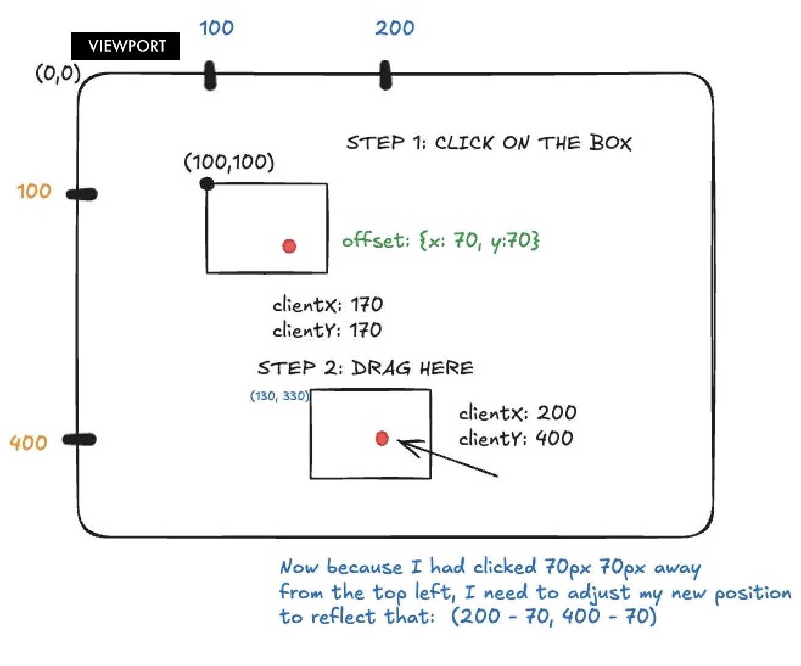

## Intro 


import SheetV1 from "../../pcomponents/post23/SheetV1.tsx"
import SheetV2 from "../../pcomponents/post23/SheetV2.tsx"
import SheetV3 from "../../pcomponents/post23/SheetV3.tsx"


&nbsp;

Have you ever seen <a class="secondary-a "href= "https://www.amazon.co.jp/-/en/Memorization-Sheets-Green-Piece-Underlay/dp/B0FMQSCKMG/357-5314039-3699264?pd_rd_w=PZTBB&content-id=amzn1.sym.289d93c5-bb87-47e6-b56c-76ff89f5333d&pf_rd_p=289d93c5-bb87-47e6-b56c-76ff89f5333d&pf_rd_r=ZM1BFMRZFMNP545FQTYM&pd_rd_wg=fXl7F&pd_rd_r=a586491f-4db7-426d-8906-dd857666c27f&pd_rd_i=B0FMQSCKMG&psc=1">coloured memorization sheets</a>? Some Japanese vocabulary books I've seen mark the key terms in red or green, so upon sliding identical-coloured sheets on top of them, they disappear! This post replicates those sheets in code through rectangle overlays we'll be rendering in React.

 


&nbsp;

## The Sheet

&nbsp;

### Mouse Events

&nbsp;

Our initial goal is to render a rectangle and drag it across the viewport. We rely on the MouseEvents below. 

&nbsp;


1. The <a class="secondary-a "href= "https://developer.mozilla.org/en-US/docs/Web/API/Element/mousemove_event" >mousemove</a> Event. This event fires when  moving our cursor across the screen.

2. The <a class="secondary-a "href= "https://developer.mozilla.org/en-US/docs/Web/API/Element/mousedown_event">mousedown </a> Event. This event fires when clicking on an HTML element. The <a class="secondary-a "href= "https://developer.mozilla.org/en-US/docs/Web/API/Element/mouseup_event">mouseUp</a> is its counterpart.

&nbsp;

We can pass handler functions, callbacks, to these MouseEvents to make any necessary calculations that suit our needs. In our case, we'll want to calculate the positions before and after an element has been dragged.
They're also packed with relevant properties like  <a class="secondary-a "href= "https://developer.mozilla.org/en-US/docs/Web/API/MouseEvent/clientX">clientX</a>: the X coordinate within the viewport. I promise we'll see them in action. 

&nbsp;


### Starter Code

&nbsp;


Our starter code includes a Sheet interface which holds the information of a div Element's position, dimensions and colours. We create a <span class="bold-rounded">sheet</span> state variable and assign it a Sheet object.
Its properties are then given to the style Attribute of our target element.
```typescript
// x and y are the positions from the top left corner
// w and h are the width and height
import {useState} from "preact/hooks";

interface Sheet {    
  x: number;         
  y: number;        
  w: number;      
  h: number;       
  color: string;  
  opacity: number;   
}


export default function Sheet() {

   const [sheet, setSheet] = useState<Sheet>( 
     {
       x: 0,
       y:0,
       w: 300,
       h: 200,
       color: "#3384ed",
       opacity: 1
     }
   )
    

   return (
     <div className="outer-container">
     <div 
       className="sheet mx-auto"
       style = {{
         left: sheet.x,
         top: sheet.y,
         width: sheet.w,
         height: sheet.h,
         background: sheet.color, 
         opacity: sheet.opacity,
       }}
     >
       <p className="text-lg text-center">
         Cannot be dragged.
       </p>
     </div>
     </div>

   )

}

```

<i>Undraggable sheet</i>

<SheetV1 client:load/>


&nbsp;


## Click, Drag, Release

&nbsp;

The next step is making that sheet above draggable. Once we click the sheet, we need to register its initial position and start tracking any cursor movement. We'll need to establish a system of functions that link the <u>mouseDown</u>, <u>mouseMove</u>, and <u>mouseUp</u> Events or simply put: click, drag, release. Before moving on, all calculations will be relative to the viewport where the HTML coordinate system starts at the top left corner. Precisely, moving right increases x and moving down increases y.

&nbsp;

The first stage involves keeping track of our initial click position. We create a <span class="bold-rounded">DragData</span>  <a class="secondary-a "href= "https://www.typescriptlang.org/docs/handbook/2/objects.html">type</a> to which we initialize a <a class="secondary-a "href= "https://react.dev/reference/react/useRef">ref</a> object that holds its kind. We use a ref because its information is only used for calculations and doesn't need to trigger re-renders. A simpler explanation is clicking  <sup><a class="secondary-a" href="#footnotes">1.</a></sup> The data stored on the initial click will
be the offset from the original sheet position to a point clicked inside of it.  It's also where event Listeners  <span class="bold-rounded">mousemove</span> and <span class="bold-rounded">mouseup</span> will be added. 

&nbsp;


<i>Partial code skeleton</i>
```typescript
// ...
interface DragData {
  offsetX: number;
  offsetY: number;
}

const dragData = useRef<DragData | null>(null);

const handleMouseDown = (e: MouseEvent) => {
    dragData.current = {
      offsetX: e.clientX - sheet.x,
      offsetY: e.clientY - sheet.y
    };

    // handleMouseMove and handleMouse up will be shown later.
    document.addEventListener("mousemove", handleMouseMove);
    document.addEventListener("mouseup", handleMouseUp);
}


<div 
 onMouseDown = {(e) => handleMouseDown}> 
 // ...
</div>
// ...
```

### Dragging vs positioning
&nbsp;

 Assume your sheet's top left corner  sits at (100,100) initially relative to the viewport. 
     Tapping 70px from the top left of the sheet will give us <span class="bold-rounded ">(e.clientX, e.clientY) = (170,170)</span>, the initial dragging point. Now, here's an important distinction:

     <p class="text-center my-2 text-[#308f4d]"> We drag from point where the user clicked, but we position the element using its top-left corner.</p>
     
    Precisely, if we drag the sheet from P1: (170,170) to  P2: (200,400), we need to readjust the sheet's top-left position  by subtracting the original offset between the sheet's top-left corner and the point where the user clicked <u>within the sheet </u>.
    Without calculating these offsets, every drag would cause the sheet's top-left corner to automatically teleport to the cursor. It's better seen in the figure below:
&nbsp;

&nbsp;


<div class="post-img-container  p-1">


<p className="text-center my-2">Figure 1: Calculating offsets and storing them in DragData</p>
</div>

&nbsp;

### Mousemove and Mouseup
&nbsp;

The event handler for <span class="bold-rounded">mousemove</span>, <span class="bold-rounded">handleMouseMove</span>, is in charge of adjusting the position of the top-left corner of our sheet as shown in the blue text explanation in Figure 1.
To update the sheet's position, we create a new one by shallow copying its properties with the spread operator and correcting the position with the offset from <span class="bold-rounded">DragData</span>.  <span class="bold-rounded">handleMouseup</span> has a cleanup role, it removes the event listeners and resets the offset to null. Essentially, this is the drag and release.

```typescript

const handleMouseMove = (e: MouseEvent) => {
    if (dragData.current) {

      const { offsetX, offsetY } = dragData.current;
      setSheet((prev) => ({
        ...prev,
        x: e.clientX - offsetX,
        y: e.clientY - offsetY,
      }));
        
    }
const handleMouseUp = () => {

    // The next point we drag the sheet from could be different!
    dragData.current = null;
    document.removeEventListener("mousemove", handleMouseMove);
    document.removeEventListener("mouseup", handleMouseUp);
  };

```

Here's the full code. I added a <span class="bold-rounded">isDragging</span> state to change the cursor image to a hand grab.
&nbsp;

```typescript
import {useState, useRef} from "preact/hooks";

interface Sheet {    
  x: number;         
  y: number;        
  w: number;      
  h: number;       
  color: string;  
  opacity: number;   
}

interface DragData {
  offsetX: number;
  offsetY: number;
}

export default function SheetV2() {

  const [isDragging, setIsDragging] = useState(false);
   const [sheet, setSheet] = useState<Sheet>( 
     {
       x: 0,
       y:0,
       w: 150,
       h: 75,
       color: "#3384ed",
       opacity: 1
     }
   )

   const dragData = useRef<DragData | null>(null);

  
   const handleMouseDown = (e: MouseEvent) => {
   

       dragData.current = {
  
      offsetX: e.clientX - sheet.x,
      offsetY: e.clientY - sheet.y
    };

    setIsDragging(true)


    document.addEventListener("mousemove", handleMouseMove);
    document.addEventListener("mouseup", handleMouseUp);
   


   }

   const handleMouseMove = (e: MouseEvent) => {
    // We defined <DragData | null>, so we make sure it's not null before we access it.
    if (dragData.current) {

      const { offsetX, offsetY } = dragData.current;
      
      setSheet( prev => ({
      
    

      ...prev,
      x: e.clientX - offsetX, 
      y: e.clientY - offsetY 
      }))
      
  }

   
        
    }

   const handleMouseUp = () => {
    dragData.current = null;
    setIsDragging(false)
    
    document.removeEventListener("mousemove", handleMouseMove);
    document.removeEventListener("mouseup", handleMouseUp);
  };
    
    


   return (

     <div class="outer-container relative h-40 border-1 p-3"> 
     <div 

       className="sheet"
       onMouseDown = {(e) => handleMouseDown(e)}
       style = {{
         position: "absolute",
         left: sheet.x,
         top: sheet.y,
         width: sheet.w,
         height: sheet.h,
         background: sheet.color, 
         opacity: sheet.opacity,
         userSelect: "none",
         zIndex: 1,
         cursor: isDragging  ? "grabbing" : "grab",
         
         
       }}
     >  
    
     </div>

      <p className="relative text-lg z-50 text-center"> Drag across the <span className="text-[#3384ed]">blue text </span> </p>

   
     </div>

   )

}
```


&nbsp;

I've added a stacking context with z-indices to the paragraph and sheet inside the outer-container in the interest of having the sheet behind the text. 

&nbsp;

On drag, we observe that: 

&nbsp;

1. Sliding the sheet on the blue text to make it disappear. 
2. The sheet can be dragged outside the black-bordered outer container, because we're working with the viewport coordinates <span class="bold-rounded">clientX</span> and <span class="bold-rounded">clientY</span> to calculate the sheet's position.
3. Dragging the sheet on the text will highlight the text, because this is the default browser behavior.
&nbsp;


&nbsp;


<SheetV2 client:load/>

&nbsp;


### getBoundingClientRect()

&nbsp;

For completeness sake, let's restrain the blue sheet to its outer container. To do so, we need the x and y coordinates of the outer container relative to the viewport. These are obtained with the <a class="secondary-a "href= "https://developer.mozilla.org/en-US/docs/Web/API/Element/getBoundingClientRect">getBoundingClientRect</a> API, which only works on DOM elements. To manipulate the DOM directly in React, we'll tag our outer-container with a  <span class="bold-rounded">containerRef</span> to <a class="secondary-a "href= "https://react.dev/learn/manipulating-the-dom-with-refs">access</a> it.

&nbsp;

<i>Tagging the outer-container, a lot of code left out for clarity</i>
```typescript

//... 
const containerRef = useRef<HTMLDivElement>(null);
//... 
<div
  ref={containerRef}
  className="outer-container relative h-40 border-1 p-3"
>
  <div
    className="sheet"
    onMouseDown={(e) => handleMouseDown(e)}
    style={{
      position: "absolute",
      left: sheet.x,
      top: sheet.y,
      width: sheet.w,
      height: sheet.h,
      background: sheet.color,
      opacity: sheet.opacity,
      userSelect: "none",
      zIndex: 1,
      cursor: isDragging ? "grabbing" : "grab",
    }}
  >
  </div>
</div>

```

We adapt our click,drag, and release functions in consequence: 

&nbsp;


1. handleMouseDown: the o<span class="bold-rounded">e.preventDefault()</span> added to prevent the default highlighting behaviour.

```typescript

const handleMouseDown = (e: MouseEvent) => {
  // Prevent the highlighting when dragging the rectangle
  e.preventDefault();

  if (!containerRef.current) return;

  const rect = containerRef.current.getBoundingClientRect();

  dragData.current = {
    offsetX: e.clientX - rect.left - sheet.x,
    offsetY: e.clientY - rect.top - sheet.y,
  };

  setIsDragging(true);

  document.addEventListener("mousemove", handleMouseMove);
  document.addEventListener("mouseup", handleMouseUp);
};
```

2. handleMouseMove


```typescript

const handleMouseMove = (e: MouseEvent) => {
  // We defined <DragData | null>, so we make sure it's not null before we access it.
  // We also need to check if the container ref because we declared in the type that it could be null.
  if (dragData.current && containerRef.current) {
    const { offsetX, offsetY } = dragData.current;
    const rect = containerRef.current.getBoundingClientRect();

    const rawX = e.clientX - offsetX - rect.left;
    const rawY = e.clientY - offsetY - rect.top;

    const clampedX = Math.max(0, Math.min(rawX, rect.width - sheet.w));
    const clampedY = Math.max(0, Math.min(rawY, rect.height - sheet.h));

    setSheet((prev) => ({
      ...prev,
      x: clampedX,
      y: clampedY,
    }));
  }
};

```

&nbsp;

<SheetV3 client:load/>


&nbsp;


## Adding more sheets

To add more sheets, we can instead create an array of Sheet and assign an id to each.

## Footnotes

&nbsp;

1. Assume we had just used let dragData = null and somewhere in our app and then decided to have a setState function that changes the rectangle's color. Upon colour changing, React would re-create the whole component and set our dragData back to null. 
reset the dragData back to null. 

&nbsp;


