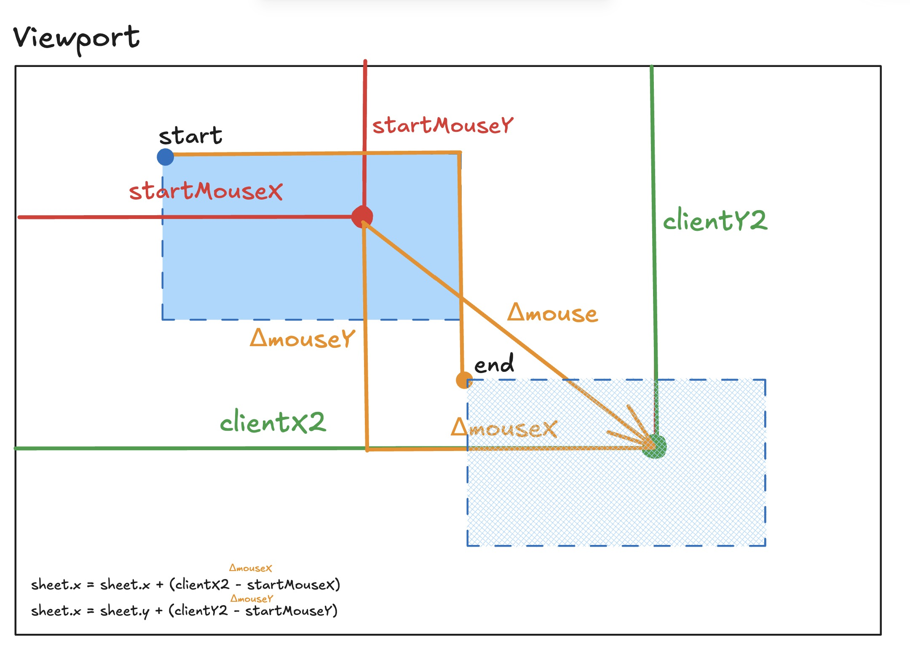
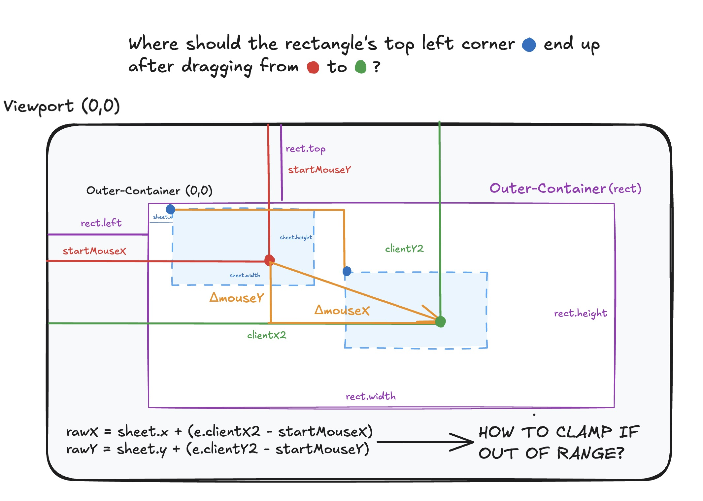
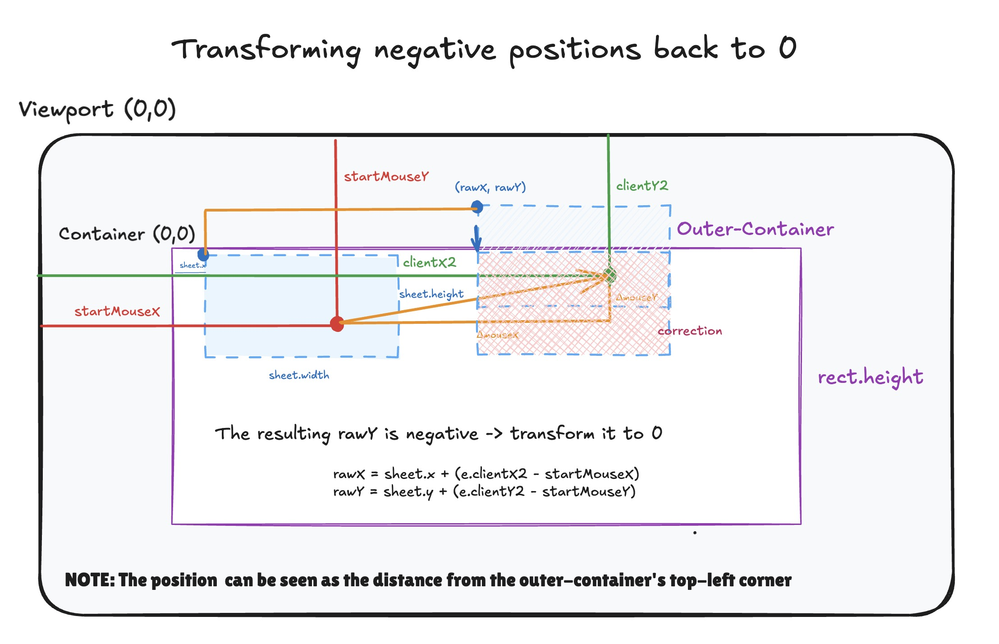
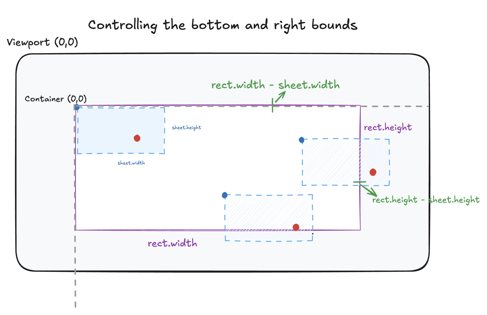

{/* Proofread on Jul 16, 20:43 EST */}

## Intro 


import SheetV1 from "../../pcomponents/post23/SheetV1.tsx"
import SheetV2 from "../../pcomponents/post23/SheetV2.tsx"
import SheetV3 from "../../pcomponents/post23/SheetV3.tsx"
import SheetVF from "../../pcomponents/post23/SheetVF.tsx"
import MultipleSheets from "../../pcomponents/post23/MultipleSheets.tsx"


&nbsp;

Have you ever seen <a class="secondary-a "href= "https://www.amazon.co.jp/-/en/Memorization-Sheets-Green-Piece-Underlay/dp/B0FMQSCKMG/357-5314039-3699264?pd_rd_w=PZTBB&content-id=amzn1.sym.289d93c5-bb87-47e6-b56c-76ff89f5333d&pf_rd_p=289d93c5-bb87-47e6-b56c-76ff89f5333d&pf_rd_r=ZM1BFMRZFMNP545FQTYM&pd_rd_wg=fXl7F&pd_rd_r=a586491f-4db7-426d-8906-dd857666c27f&pd_rd_i=B0FMQSCKMG&psc=1">coloured memorization sheets</a>? Some Japanese vocabulary books I've seen highlight the key terms of study in red or green, so upon sliding identical-coloured sheets on top of them, they disappear!  This post replicates those sheets in code through rectangle overlays generated in React.

 


&nbsp;

## The Sheet

&nbsp;

### Mouse Events

&nbsp;

Our rudimentary goal is to draw a rectangle, a sheet, and drag it across the viewport. We rely on the MouseEvents below. 

&nbsp;


1. The <a class="secondary-a "href= "https://developer.mozilla.org/en-US/docs/Web/API/Element/mousemove_event" >mousemove</a> Event. This event fires when  moving our cursor.

2. The <a class="secondary-a "href= "https://developer.mozilla.org/en-US/docs/Web/API/Element/mousedown_event">mousedown </a> Event. This event fires when clicking on an HTML element. The <a class="secondary-a "href= "https://developer.mozilla.org/en-US/docs/Web/API/Element/mouseup_event">mouseUp</a> is its counterpart.

&nbsp;

We pass handler functions, callbacks, to these MouseEvents to make any necessary calculations that suit our needs. In our case, we'll want to calculate mouse positions before and after an element has been dragged. On a final note for this section, mouse positions relative to the viewport are given by <a class="secondary-a "href= "https://developer.mozilla.org/en-US/docs/Web/API/MouseEvent/clientX">clientX</a>: the X coordinate relative to the viewport. 

&nbsp;


### Starter Code

&nbsp;


Our starter code includes a Sheet interface which holds the information of a div Element's position, dimensions and colours. We create a <span class="bold-rounded">sheet</span> state variable and assign it a Sheet object.
Its properties are then given to the style Attribute of our target element. 
```typescript
// x and y are the positions from the top left corner
// w and h are the width and height
import {useState} from "preact/hooks";

interface Sheet {    
  x: number;         
  y: number;        
  w: number;      
  h: number;       
  color: string;  
  opacity: number;   
}


export default function Sheet() {

   const [sheet, setSheet] = useState<Sheet>( 
     {
       x: 0,
       y:0,
       w: 300,
       h: 200,
       color: "#3384ed",
       opacity: 1
     }
   )
    

   return (
    
     <div 
       className="sheet mx-auto"
      //  Styles are obtained from the sheet object
       style = {{
         left: sheet.x,
         top: sheet.y,
         width: sheet.w,
         height: sheet.h,
         background: sheet.color, 
         opacity: sheet.opacity,
       }}
     >
       <p className="text-lg text-center">
         Cannot be dragged.
       </p>
     </div>
  

   )

}

```


&nbsp;

<i>Result: a Sheet that cannot be dragged</i>

&nbsp;

<SheetV1 client:load/>


&nbsp;


## Drag Scheme

&nbsp;

### Click: (startMouseX, startMouseY)
&nbsp;


Let's make the sheet draggable; we'll need to establish a system of functions that link <u>mouseDown</u>, <u>mouseMove</u>, and <u>mouseUp</u> Events. In simple terms, it's a click, drag and release.
For reference, we'll work under the viewport coordinate system where the top-left corner is the origin (0,0). Bear in mind that moving right increases x and moving down increases y in the HTML world.

&nbsp;

Adding a <span class="bold-rounded">onmousedown</span> attribute to our sheet (div), the first stage involves storing the coordinates of our initial mouse click on the sheet: <span class="bold-rounded">startMouseX</span> and <span class="bold-rounded">startMouseY</span>. We create a <span class="bold-rounded">DragData</span>  <a class="secondary-a "href= "https://www.typescriptlang.org/docs/handbook/2/objects.html">type</a> to which we initialize a <a class="secondary-a "href= "https://react.dev/reference/react/useRef">ref</a> object that holds its kind. We use a ref because its information is only used for calculations and doesn't need to trigger re-renders. <sup><a class="secondary-a" href="#footnotes">1.</a></sup>


&nbsp;

The <span class="bold-rounded">onmousedown</span>'s event handler, <span class="bold-rounded">handleMouseDown</span>, on top of holding the start coordinates through<span class="bold-rounded">dragData</span> ref, <a class="secondary-a "href= "https://developer.mozilla.org/en-US/docs/Web/API/EventTarget/addEventListener">adds</a> the event listeners and their handler functions for tracking cursor movement and its release. In the next section, we'll explore how to handle changing the position of the sheet with the <span class="bold-rounded">handleMouseMove</span> handler. 


&nbsp;


<i>Partial code skeleton</i>
```typescript
// ...
interface DragData {
  offsetX: number;
  offsetY: number;
}

const dragData = useRef<DragData | null>(null);

const handleMouseDown = (e: MouseEvent) => {
    dragData.current = {
      startMouseX: e.clientX,
      startMouseY: e.clientY
    };

    // handleMouseMove and handleMouse up will be shown later.
    document.addEventListener("mousemove", handleMouseMove);
    document.addEventListener("mouseup", handleMouseUp);
}


<div 
 onMouseDown = {(e) => handleMouseDown}> 
 // ...
</div>
// ...
```


&nbsp;


&nbsp;

### Unbound Dragging

&nbsp;


We can change the sheet's position in different ways according to our end goal: we can either allow our sheet to be dragged anywhere across the viewport or restrain it to an arbitrary container, namely not allowing the sheet to go outside the bounds of its container. In all cases, our sheet has <span class="bold-rounded">position:relative</span>, so its top-left corner given by  <span class="bold-rounded">top</span> and <span class="bold-rounded">left</span> is always being moved by the distance created from the clicked point to the dragged point. All I'm trying to say is don't consider the top and left attributes as exact coordinates, but rather relative distances.

&nbsp;

The first way involves calculating the distance (Δx,Δy) the mouse moved between two points on the (X,Y) axes, and moving the sheet's top left corner accordingly. In our <span class="bold-rounded">handleMouseDown</span> handler, we registered the initial x,y coordinates of the cursor as <span class="bold-rounded">startMouseX</span> and <span class="bold-rounded">startMouseY</span>. Those are utilized in the event handler for <span class="bold-rounded">mousemove</span>, <span class="bold-rounded">handleMouseMove</span>, which adjusts the position of the top-left corner with the new coordinates of the dragged point.
Essentially, once we finish dragging our cursor to a new point, we subtract the start coordinates from the current ones (clientX2, clientY2), and move the top left corner by the result. For reference, the figure below demonstrates this with the orange lines.


&nbsp;

<i>Figure 1: Getting the deltas of our initial and end mouse positions</i>

<div class="post-img-container  p-1">


</div>


&nbsp;

To update the sheet's position, we create a new one by shallow copying the original's properties with the spread operator and correcting the position with our deltas from the formulas in the figure 1. The <span class="bold-rounded">handleMouseup</span> has a cleanup role, it removes the event listeners and resets everything.

&nbsp;

```typescript
const handleMouseMove = (e: MouseEvent) => {
  // We defined <DragData | null>, so we make sure it's not null before we access it.
  if (dragData.current) {
    const { startMouseX, startMouseY } = dragData.current;

    setSheet(prev => ({
      // The sheet's position moves by the delta of the mouse
      ...prev,
      x: sheet.x + (e.clientX - startMouseX),
      y: sheet.y + (e.clientY - startMouseY),
    }));
  }
};

const handleMouseUp = () => {
  dragData.current = null;
  

  document.removeEventListener("mousemove", handleMouseMove);
  document.removeEventListener("mouseup", handleMouseUp);
};

```
&nbsp;

Here's the full code with some modifications:


&nbsp;

1.  I threw in a  <span class="bold-rounded">isDragging</span> state to change the cursor image to a hand grab. 
2. I added the option to disable default highlighting on click and drag. With <a class="secondary-a "href= "https://developer.mozilla.org/en-US/docs/Web/API/Event/preventDefault">preventDefault()</a>, dragging the sheet on text will not highlight it.
3. I've made a stacking context (relative + z-index shenanigans) to make the blue sheet slide under my **p** tag. You'll also notice that the sheet goes over the text of this post, the reason being that they're in different contexts. 
&nbsp;

&nbsp;


<i>Full code with touch-ups. If you'd like, drag he blue sheet below to your heart's desire.</i>

```typescript
// Unbound dragging
import {useState, useRef} from "preact/hooks";

interface Sheet {    
  x: number;         
  y: number;        
  w: number;      
  h: number;       
  color: string;  
  opacity: number;   
}

interface DragData {
  startMouseX: number;
  startMouseY: number;
}

export default function SheetV2() {

  const [isDragging, setIsDragging] = useState(false);
  const [disableHighlight, setDisableHighlight] = useState(false)

  const [sheet, setSheet] = useState<Sheet>( 
    {
      x: 0,
      y: 0,
      w: 250,
      h: 150,
      color: "#3384ed",
      opacity: 1
    }
  );

  const dragData = useRef<DragData | null>(null);

  const handleMouseDown = (e: MouseEvent) => {

    {disableHighlight ? e.preventDefault() : ""}

    dragData.current = {
      startMouseX: e.clientX,
      startMouseY: e.clientY
    };

    setIsDragging(true);

    document.addEventListener("mousemove", handleMouseMove);
    document.addEventListener("mouseup", handleMouseUp);
  };

  const handleMouseMove = (e: MouseEvent) => {
    // We defined <DragData | null>, so we make sure it's not null before we access it.
    if (dragData.current) {

      const { startMouseX, startMouseY } = dragData.current;

      setSheet(prev => ({

        // The sheet's position moves by the delta of the mouse 
        ...prev,
        x: sheet.x + (e.clientX - startMouseX),
        y: sheet.y + (e.clientY - startMouseY)

      }));
    }
  };

  const handleMouseUp = () => {
    dragData.current = null;
    setIsDragging(false);

    document.removeEventListener("mousemove", handleMouseMove);
    document.removeEventListener("mouseup", handleMouseUp);
  };

  return (

    <div className="relative">

      <div className="flex items-center justify-between border-b-1 border-dashed mb-10 p-2">
        Toggling the disable button to prevent any highlights on text.

        <button  
          className="cursor-pointer hover:bg-gray-200 transition-colors border-1 p-0.5 rounded-md"
          style={{background: disableHighlight ? "#3384ed87" : ""}}
          onClick={() => setDisableHighlight(prev => !prev)}
        >
          Disable highlighting
        </button>
      </div>

      <div 

        className="sheet"

        // camelCase due to JSX syntax, normally onmousedown
        onMouseDown={(e) => handleMouseDown(e)}

        style={{
          position: "relative",
          left: sheet.x,
          top: sheet.y,
          width: sheet.w,
          height: sheet.h,
          background: sheet.color, 
          opacity: sheet.opacity,
          userSelect: "none",
          zIndex: 1,
          cursor: isDragging ? "grabbing" : "grab",
        }}

      >

      </div>

      <p style={{fontSize: "24px"}} className="relative mt-5 z-2 text-center">
        Hover over the <span className="text-[#3384ed]">blue text</span> to <span className="text-[#3384ed]">blue text</span>
      </p>

    </div>

  );
}
```


&nbsp;


&nbsp;

<SheetV2 client:load/>

&nbsp;


### Restrained dragging

&nbsp;

With unbound dragging, the sheet can go anywhere on the screen, but what if we wanted to restrain it to a container? We proceed with similar logic anew, except this time we must change the sheet's position to <span class="bold-rounded">absolute</span> and ensure mathematically that it respects its parents bounds. We'll make use of the 
the <a class="secondary-a "href= "https://developer.mozilla.org/en-US/docs/Web/API/Element/getBoundingClientRect">getBoundingClientRect</a> API. With the <span class="bold-rounded">rect.width</span>, <span class="bold-rounded">rect.height</span>, we'll construct a formula that clamps our coordinates to prevent our sheet from escaping its captor. 


&nbsp;

<i>Figure 2: How to clamp the coordinates?</i>

&nbsp;


<div class="post-img-container  p-1">


</div>

&nbsp;

In the figure above, the sheet is being dragged to a point inside the outer-container, 
so the <span class="bold-rounded">rawX</span> and <span class="bold-rounded">rawY</span> are in range<sup><a class="secondary-a" href="#footnotes">2.</a></sup>, 
however let's solve the problem when this is not the case. Remember that because we're in absolute positiong, the coordinates represent relative distances of the sheet from the outer-container's top left corner.


&nbsp;

1. Negative positions: 

&nbsp;


A negative <span class="bold-rounded">rawX</span> or <span class="bold-rounded">rawY</span> in this paradigm means that it can go past the outer-container's top and left bounds.
We prevent this by transforming them back to 0.


&nbsp;

<i>Figure 3: Transforming negative positions back to 0</i>

&nbsp;

<div class="post-img-container  p-1">


</div>

&nbsp;

The preliminary changes in <a class="secondary-a "href= "https://github.com/Kangiriyanka/joe-farah-code-extras/blob/main/post-22/SheetV3.tsx">code</a> affect the <span class="bold-rounded">handleMouseMove</span> handler and the sheet's position attribute. Only the handler is shown here.

```typescript

  /// ... Alot of code omitted
  const handleMouseMove = (e: MouseEvent) {

    if (dragData.current && containerRef.current ) {

      const { startMouseX, startMouseY } = dragData.current;

      const rawX = sheet.x + e.clientX - startMouseX 
      const rawY = sheet.y + e.clientY - startMouseY 

      // Transforming negatives to 0.
      const clampedX = Math.max(0, rawX));
      const clampedY = Math.max(0, rawY));
      
      setSheet( prev => ({
        ...prev,
        x: clampedX,
        y: clampedY
      }))
    }
  }
```

&nbsp;

Cool, we can no longer drag the sheet past the left and top bounds of the outer container. But wait, we can certainly go past the bottom and right bounds as those positions are still considered positive in the HTML convention. 


&nbsp;

<i>The sheet still goes past the right and bottom edges...</i>
<SheetV3 client:load/>

&nbsp;


This means we need to also limit
the sheet from going past the right and bottom bounds. This is where the <a class="secondary-a "href= "https://developer.mozilla.org/en-US/docs/Web/API/Element/getBoundingClientRect">getBoundingClientRect</a> comes into play as we'll need the outer-container's width and height for calculations. Conveniently, the API directly gives the bounding box of the outer-container with its padding and margins, which means we don't have to manually insert them in our code.
Furthermore, to use browser DOM APIs, we need to tag the outer-container (div) with a <a class="secondary-a "href= "https://react.dev/learn/manipulating-the-dom-with-refs">ref</a> attribute, <span class="bold-rounded">containerRef</span>. 

&nbsp;

To set the remaining limits, we can subtract the sheet's width from the<span class="bold-rounded">rect.width</span>, and the sheet's height from the <span class="bold-rounded">rect.height</span> to obtain our max positions. Visually, it's more convincing:<sup><a class="secondary-a" href="#footnotes">3.</a></sup>

&nbsp;


<i>Figure 4: Subtracting the outer-container's dimensions from the sheet dimensions to block the sheet on the right and bottom</i>

&nbsp;


<div class="post-img-container  p-2">


</div>


&nbsp;


Adding the negative constraint obtained earlier, the formula then becomes:

<div class=" flex flex-col text-center border-1 rounded-md ">
<p> const clampedX = Math.max(0, Math.min(rawX, rect.width - sheet.w)); </p>
<p>const clampedY = Math.max(0, Math.min(rawY, rect.height - sheet.h)); </p>
</div>


&nbsp;

<i>Tagging the outer-container with a ref</i>
```typescript

//... 
const containerRef = useRef<HTMLDivElement>(null);
//... 
<div
  ref={containerRef}
  className="outer-container"
>
  <div
    className="sheet"
    onMouseDown={(e) => handleMouseDown(e)}
    // 
    style={{
      position: "absolute",
      left: sheet.x,
      top: sheet.y,
      width: sheet.w,
      height: sheet.h,
      background: sheet.color,
      opacity: sheet.opacity,
      userSelect: "none",
      zIndex: 1,
      cursor: isDragging ? "grabbing" : "grab",
    }}
  >
  </div>
</div>

```

&nbsp;

<i>Modifying handleMouseMove again</i>
```typescript
// A lot of code omitted...
const handleMouseMove = (e: MouseEvent) => {
  // We defined <DragData | null>, so we make sure it's not null before we access it.
  // We also need to check if the container ref because we declared in the type that it could be null.
  if (dragData.current && containerRef.current) {
    const { startMouseX, startMouseY } = dragData.current;
    const rect = containerRef.current.getBoundingClientRect();

    const rawX = sheet.x + e.clientX - startMouseX;
    const rawY = sheet.y + e.clientY - startMouseY;

    const clampedX = Math.max(0, Math.min(rawX, rect.width - sheet.w));
    const clampedY = Math.max(0, Math.min(rawY, rect.height - sheet.h));

    setSheet((prev) => ({
      ...prev,
      x: clampedX,
      y: clampedY,
    }));
  }
};


```

The code for this section is <a class="secondary-a "href= "https://github.com/Kangiriyanka/joe-farah-code-extras/blob/main/post-22/SheetVF.tsx">here</a>.

&nbsp;


<i>We've trapped the sheet!</i>
<SheetVF client:load />


&nbsp;


## Adding more sheets

&nbsp;


To add more sheets, we can instead create an array of Sheet and assign an id to each.


<MultipleSheets client:load/>

&nbsp;


## Footnotes

&nbsp;

1. Assume we had just used let dragData = null and somewhere in our app and then decided to have a setState function that changes the rectangle's color. Upon colour changing, React would re-create the whole component and set our dragData back to null. 
reset the dragData back to null. 


&nbsp;

2. rawX and rawY are the coordinates before our final adjustment to respect the outer-container's bounds.

&nbsp;


3.To justify this operation, the bound can't simply be the rect.width as this would allow the sheet's left side to be dragged to the outer-container's right side to align.


