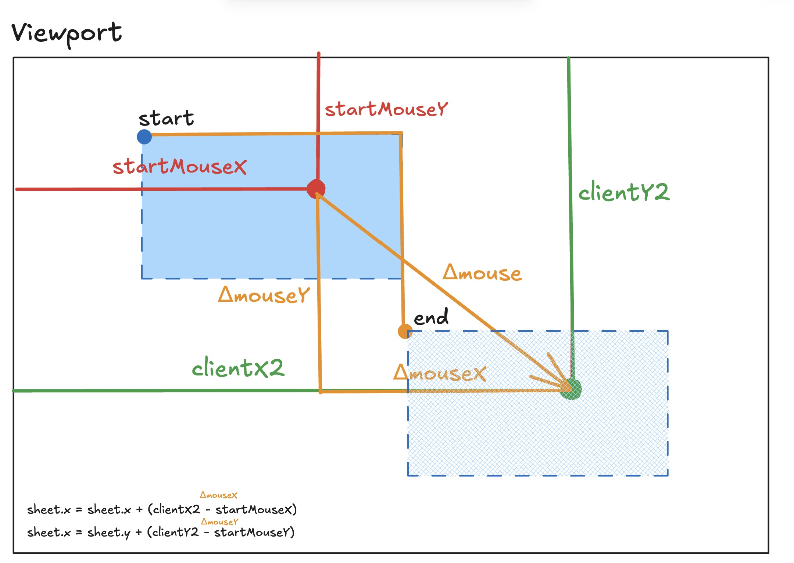
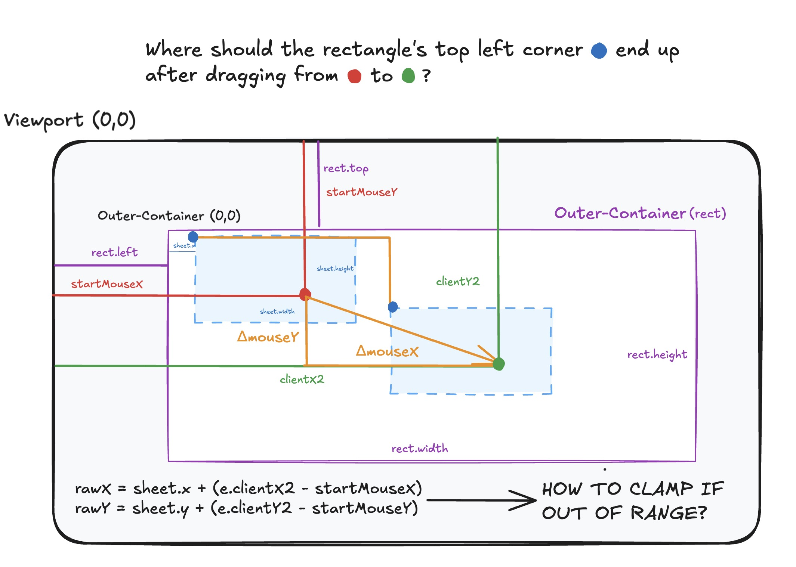
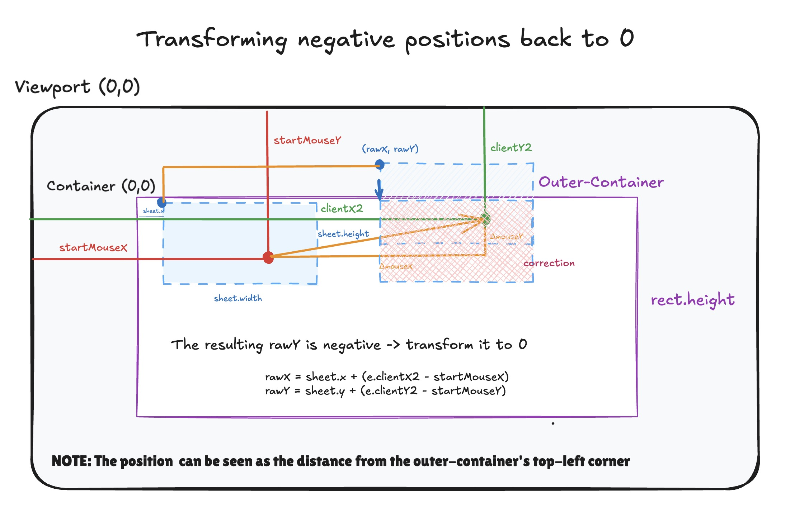
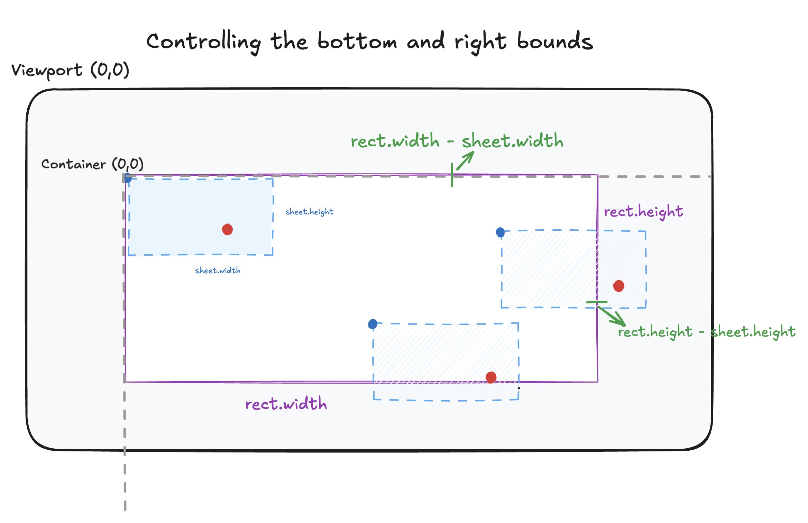
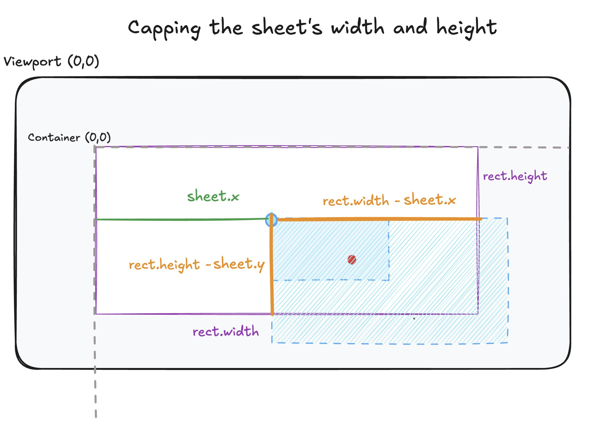

{/* Proofread on Jul 16, 20:43 EST */}

## Intro 


import SheetV1 from "@components/pcomponents/post23/SheetV1.tsx"
import SheetV2 from "@components/pcomponents/post23/SheetV2.tsx"
import SheetV3 from "@components/pcomponents/post23/SheetV3.tsx"
import SheetVF from "@components/pcomponents/post23/SheetVF.tsx"
import MultipleSheets from "@components/pcomponents/post23/MultipleSheets.tsx"
import ResizableSheets from "@components/pcomponents/post23/ResizableSheets.tsx"


&nbsp;

Have you ever seen <a class="secondary-a "href= "https://www.amazon.co.jp/-/en/Memorization-Sheets-Green-Piece-Underlay/dp/B0FMQSCKMG/357-5314039-3699264?pd_rd_w=PZTBB&content-id=amzn1.sym.289d93c5-bb87-47e6-b56c-76ff89f5333d&pf_rd_p=289d93c5-bb87-47e6-b56c-76ff89f5333d&pf_rd_r=ZM1BFMRZFMNP545FQTYM&pd_rd_wg=fXl7F&pd_rd_r=a586491f-4db7-426d-8906-dd857666c27f&pd_rd_i=B0FMQSCKMG&psc=1">coloured memorization sheets</a>? Some Japanese vocabulary books 
I've seen highlight the key terms of study in red or green, 
so upon sliding identical-coloured sheets on top of them, they disappear! If there's a sentence marked with different colours, one could selectively hide the words they don't know and attempt to fill in the blanks mentally. It's not limited to vocabulary; one could also hide specific portions of a reference image by stacking sheets (rectangles) over it, and try to draw the image from memory. 

&nbsp;

Through repetition, I believe that part of learning is about filling the gaps without looking, without having the answer next to you. 
All to say, those memorizations sheets reminded me of that straightforwardness, so I set out to replicate them in <a class="secondary-a "href= "https://react.dev/">React</a>.

 


&nbsp;

## The Sheet

&nbsp;

### Mouse Events

&nbsp;

Our rudimentary goal is to draw a rectangle, a sheet, and drag it across the viewport. To do so, we rely on the MouseEvents below. 

&nbsp;


1. The <a class="secondary-a "href= "https://developer.mozilla.org/en-US/docs/Web/API/Element/mousemove_event" >mousemove</a> Event. This event fires when  moving our cursor.

2. The <a class="secondary-a "href= "https://developer.mozilla.org/en-US/docs/Web/API/Element/mousedown_event">mousedown </a> Event. This event fires when clicking on an HTML element. The <a class="secondary-a "href= "https://developer.mozilla.org/en-US/docs/Web/API/Element/mouseup_event">mouseUp</a> is its counterpart.

&nbsp;

We pass handler functions, callbacks, to these MouseEvents to make any necessary calculations that suit our needs. In our case, we'll want to calculate mouse positions before and after an element has been dragged. Mouse positions relative to the viewport are given by <a class="secondary-a "href= "https://developer.mozilla.org/en-US/docs/Web/API/MouseEvent/clientX">clientX</a>: the X coordinate relative to the viewport. The same applies to the Y coordinate. 

&nbsp;


### Regular Events

&nbsp;

The event methods below are applied in some code snippets, notably in the <a class="secondary-a "href= "/posts/en/post-23#resizing-sheets">Resizing Sheets</a> section. Their applications will be demonstrated down the line, but their use cases are mentioned briefly here.

&nbsp;


1. <a class="secondary-a "href= "https://developer.mozilla.org/en-US/docs/Web/API/Event/preventDefault">preventDefault</a> -> Use case:  prevent text highlighting when a sheet gets dragged.
2. <a class="secondary-a "href= "https://developer.mozilla.org/en-US/docs/Web/API/Event/stopPropagation">stopPropagation</a> -> Use case: prevent the sheet from being resized and dragged at the same time.


&nbsp;

### Starter Code

&nbsp;


Our starter code includes a Sheet interface which holds the information of a div Element's position, dimensions and colours. We create a <span class="bold-rounded">sheet</span> state variable and assign it a Sheet object.
Its properties are then given to the style Attribute of our target div element. 
```typescript

// preact is a lightweight package of React
import {useState} from "preact/hooks";

// x and y are the positions from the top left corner
// w and h are the width and height
interface Sheet {    
  x: number;         
  y: number;        
  w: number;      
  h: number;       
  color: string;  
  opacity: number;   
}


export default function Sheet() {

   const [sheet, setSheet] = useState<Sheet>( 
     {
       x: 0,
       y:0,
       w: 300,
       h: 200,
       color: "#3384ed",
       opacity: 1
     }
   )
    

   return (
    
     <div 
       className="sheet mx-auto"
      //  Styles are obtained from the sheet object
       style = {{
         left: sheet.x,
         top: sheet.y,
         width: sheet.w,
         height: sheet.h,
         background: sheet.color, 
         opacity: sheet.opacity,
       }}
     >
       <p className="text-lg text-center">
         Cannot be dragged.
       </p>
     </div>
  

   )

}

```


&nbsp;

<i>Result: a Sheet that cannot be dragged</i>

&nbsp;

<SheetV1 client:load/>


&nbsp;


## Drag Scheme

&nbsp;

### Click: (startMouseX, startMouseY)
&nbsp;


Let's make the sheet draggable; we'll establish a system of functions that link <u>mouseDown</u>, <u>mouseMove</u>, and <u>mouseUp</u> Events. In simple terms, it's a click, drag, and release.
For reference, we'll work under the viewport coordinate system where the top-left corner is the origin (0,0). Bear in mind that moving right increases x and moving down increases y in the HTML world.

&nbsp;

With the <span class="bold-rounded">onmousedown</span> attribute on our sheet (div), the first stage involves storing the coordinates of our initial mouse click on the sheet: <span class="bold-rounded">startMouseX</span> and <span class="bold-rounded">startMouseY</span>. We create a <span class="bold-rounded">DragData</span>  <a class="secondary-a "href= "https://www.typescriptlang.org/docs/handbook/2/objects.html">type</a> to which we initialize a <a class="secondary-a "href= "https://react.dev/reference/react/useRef">ref</a> object that holds its kind. To specify, we use a ref because its information is only used for calculations and doesn't need to trigger re-renders. <sup><a class="secondary-a" href="#footnotes">1.</a></sup>
In other words, clicking on my div shouldn't re-render the whole component, it should just fetch the positions for calculation purposes.


&nbsp;

The <span class="bold-rounded">onmousedown</span>'s event handler, <span class="bold-rounded">handleMouseDown</span>, on top of holding the start coordinates through the <span class="bold-rounded">dragData</span> ref, <a class="secondary-a "href= "https://developer.mozilla.org/en-US/docs/Web/API/EventTarget/addEventListener">adds</a> the event listeners and their handler functions for tracking the cursor's movement and the time of its release. In the next section, we'll explore how to handle changing the position of the sheet with the <span class="bold-rounded">handleMouseMove</span> handler. 


&nbsp;


<i id="partial-code-skeleton">Partial code skeleton</i>
```typescript
// A lot of code has omitted for clarity
interface DragData {
  offsetX: number;
  offsetY: number;
}

const dragData = useRef<DragData | null>(null);

// When I click on the sheet, I have the starting coordinates of the mouse used for calculations.
// It's a ref because clicking on a div shouldn't re-render the component
const handleMouseDown = (e: MouseEvent) => {
    dragData.current = {
      startMouseX: e.clientX,
      startMouseY: e.clientY
    };

    // handleMouseMove and handleMouse up will be shown later.

    document.addEventListener("mousemove", handleMouseMove);
    document.addEventListener("mouseup", handleMouseUp);
}


<div 
 onMouseDown = {(e) => handleMouseDown}> 
 // ...
</div>
// ...
```


&nbsp;


&nbsp;

### Unbound Dragging

&nbsp;


We can change the sheet's position in different ways according to our end goal: we can either allow our sheet to be dragged anywhere across the viewport or restrain it to an arbitrary container, namely not allowing the sheet to go outside the bounds of its container. 

&nbsp;

Our sheet's relative position is determined by its top-left corner, given by <span class="bold-rounded">top</span> and <span class="bold-rounded">left</span> <a class="secondary-a "href= "https://developer.mozilla.org/en-US/docs/Web/CSS/Reference/Properties/position">properties</a>. For clarity, the <span class="bold-rounded">top</span> and <span class="bold-rounded">left</span> properties aren't exact coordinates in the viewport, but can rather be seen as relative distances.

&nbsp;

The first way involves calculating the distance (Δx,Δy) the mouse moved between two points on the (X,Y) axes, and moving the sheet's top left corner accordingly. In our <span class="bold-rounded">handleMouseDown</span> handler, we registered the initial x,y coordinates of the cursor as <span class="bold-rounded">startMouseX</span> and <span class="bold-rounded">startMouseY</span>. Those are utilized in the event handler for <span class="bold-rounded">mousemove</span>, <span class="bold-rounded">handleMouseMove</span>, which adjusts the position of the top-left corner.
Essentially, once we finish dragging our cursor to a new point, we subtract the start coordinates from the current ones (clientX2, clientY2), and move the top left corner by the result. For reference, the figure below demonstrates this with the orange lines.


&nbsp;

<i>Figure 1: Getting the deltas of our initial and end mouse positions</i>

&nbsp;


<div class="post-img-container  p-1">


</div>


&nbsp;

To update the sheet's position, we create a new one by shallow copying the original's properties with the spread operator and correcting the position with our deltas from the formulas in Figure 1. The <span class="bold-rounded">handleMouseup</span> has a cleanup role, it removes the event listeners and resets our data to null.

&nbsp;

```typescript
const handleMouseMove = (e: MouseEvent) => {
  // We defined <DragData | null>, so we make sure it's not null before we access it.
  if (dragData.current) {
    const { startMouseX, startMouseY } = dragData.current;

    setSheet(prev => ({
      // The sheet's position moves by the delta of the mouse
      // We could have stored the starting sheet x, startSheetX, and starting sheet y, startSheetY, in DragData
      // to calculate the new position from the sheet's original position when dragging began.
      ...prev,
      x: sheet.x + (e.clientX - startMouseX),
      y: sheet.y + (e.clientY - startMouseY),
    }));
  }
};

const handleMouseUp = () => {
  dragData.current = null;
  document.removeEventListener("mousemove", handleMouseMove);
  document.removeEventListener("mouseup", handleMouseUp);
};

```
&nbsp;

Here's the full code with some modifications:


&nbsp;

1.  I threw in a  <span class="bold-rounded">isDragging</span> state to change the cursor image to a hand grab. 
2. I added the option to disable default highlighting on click and drag. With <a class="secondary-a "href= "https://developer.mozilla.org/en-US/docs/Web/API/Event/preventDefault">preventDefault()</a>, dragging the sheet on text will not highlight it.
3. I've made a stacking context (relative + z-index shenanigans) to make the blue sheet slide under my **p** tag. You'll also notice that the sheet goes over the text of this post, the reason being that they're in different contexts. 
&nbsp;

&nbsp;


<i>Full code with touch-ups. If willing, drag the blue sheet below to your heart's desire.</i>

```typescript
// Unbound dragging
import {useState, useRef} from "preact/hooks";

interface Sheet {    
  x: number;         
  y: number;        
  w: number;      
  h: number;       
  color: string;  
  opacity: number;   
}

interface DragData {
  startMouseX: number;
  startMouseY: number;
}

export default function SheetV2() {

  const [isDragging, setIsDragging] = useState(false);
  const [disableHighlight, setDisableHighlight] = useState(false)

  const [sheet, setSheet] = useState<Sheet>( 
    {
      x: 0,
      y: 0,
      w: 250,
      h: 150,
      color: "#3384ed",
      opacity: 1
    }
  );

  const dragData = useRef<DragData | null>(null);

  const handleMouseDown = (e: MouseEvent) => {

    {disableHighlight ? e.preventDefault() : ""}

    dragData.current = {
      startMouseX: e.clientX,
      startMouseY: e.clientY
    };

    setIsDragging(true);

    document.addEventListener("mousemove", handleMouseMove);
    document.addEventListener("mouseup", handleMouseUp);
  };

  const handleMouseMove = (e: MouseEvent) => {
    // We defined <DragData | null>, so we make sure it's not null before we access it.
    if (dragData.current) {

      const { startMouseX, startMouseY } = dragData.current;

      setSheet(prev => ({

        // The sheet's position moves by the delta of the mouse 
        // It would have been better to store  startSheetX and startSheetY for robustness instead of using sheet.x and sheet.y directly
        ...prev,
        x: sheet.x + (e.clientX - startMouseX),
        y: sheet.y + (e.clientY - startMouseY)

      }));
    }
  };

  const handleMouseUp = () => {
    dragData.current = null;
    setIsDragging(false);

    document.removeEventListener("mousemove", handleMouseMove);
    document.removeEventListener("mouseup", handleMouseUp);
  };

  return (

    <div className="relative">

      <div className="flex items-center justify-between border-b-1 border-dashed mb-10 p-2">
        Toggling the disable button to prevent any highlights on text.

        <button  
          className="cursor-pointer hover:bg-gray-200 transition-colors border-1 p-0.5 rounded-md"
          style={{background: disableHighlight ? "#3384ed87" : ""}}
          onClick={() => setDisableHighlight(prev => !prev)}
        >
          Disable highlighting
        </button>
      </div>

      <div 

        className="sheet"

        // camelCase due to JSX syntax, normally onmousedown
        onMouseDown={(e) => handleMouseDown(e)}

        style={{
          position: "relative",
          left: sheet.x,
          top: sheet.y,
          width: sheet.w,
          height: sheet.h,
          background: sheet.color, 
          opacity: sheet.opacity,
          userSelect: "none",
          zIndex: 1,
          cursor: isDragging ? "grabbing" : "grab",
        }}

      >

      </div>

      <p style={{fontSize: "24px"}} className="relative mt-5 z-2 text-center">
        Hover over the <span className="text-[#3384ed]">blue text</span> to <span className="text-[#3384ed]">blue text</span>
      </p>

    </div>

  );
}
```


&nbsp;


&nbsp;

<SheetV2 client:load/>

&nbsp;


### Restrained dragging

&nbsp;

With unbound dragging, the sheet can go anywhere on the screen, but what if we wanted to restrain it to a container? We proceed with similar logic anew, except this time we must change the sheet's position to <span class="bold-rounded">absolute</span> and ensure mathematically that it respects its parent's bounds. We'll make use of the 
the <a class="secondary-a "href= "https://developer.mozilla.org/en-US/docs/Web/API/Element/getBoundingClientRect">getBoundingClientRect</a> API. With the <span class="bold-rounded">rect.width</span>, <span class="bold-rounded">rect.height</span>, we'll construct a formula that clamps our coordinates to prevent our sheet from escaping its captor. 


&nbsp;

<i>Figure 2: How to clamp the coordinates?</i>

&nbsp;


<div class="post-img-container  p-1">


</div>

&nbsp;

In Figure 2, the sheet is being dragged to a point inside the outer container, 
so the <span class="bold-rounded">rawX</span> and <span class="bold-rounded">rawY</span> are in range<sup><a class="secondary-a" href="#footnotes">2.</a></sup>, 
however let's solve the problem when this is not the case. Remember that because the sheet is "absolutely" positioned, the coordinates represent relative distances of the sheet from the outer container's top left corner.


&nbsp;

1. Negative positions: 

&nbsp;


A negative <span class="bold-rounded">rawX</span> or <span class="bold-rounded">rawY</span> in this paradigm means that it can go past the outer container's top and left bounds.
We prevent this by transforming them back to 0.


&nbsp;

<i>Figure 3: Transforming negative positions back to 0</i>

&nbsp;

<div class="post-img-container  p-1">


</div>

&nbsp;

The preliminary changes in <a class="secondary-a "href= "https://github.com/Kangiriyanka/joe-farah-code-extras/blob/main/post-23/SheetV3.tsx">code</a> affect the <span class="bold-rounded">handleMouseMove</span> handler and the sheet's position attribute. Only the handler is shown here.

```typescript
  /// ... Alot of code omitted
  const handleMouseMove = (e: MouseEvent) {

    if (dragData.current && containerRef.current ) {

      const { startMouseX, startMouseY } = dragData.current;

      const rawX = sheet.x + e.clientX - startMouseX 
      const rawY = sheet.y + e.clientY - startMouseY 

      // Transforming negatives to 0.
      const clampedX = Math.max(0, rawX));
      const clampedY = Math.max(0, rawY));
      
      setSheet( prev => ({
        ...prev,
        x: clampedX,
        y: clampedY
      }))
    }
  }
```

&nbsp;

Cool, we can no longer drag the sheet past the left and top bounds of the outer container. But wait, we can certainly go past the bottom and right bounds as those positions are still considered positive in the HTML convention. 


&nbsp;

<i>The sheet still goes past the right and bottom edges...</i>

&nbsp;

<SheetV3 client:load/>

&nbsp;


This means we need to also limit
the sheet from going past the right and bottom bounds. This is where the <a class="secondary-a "href= "https://developer.mozilla.org/en-US/docs/Web/API/Element/getBoundingClientRect">getBoundingClientRect</a> comes into play as we'll need the outer container's width and height for calculations. Conveniently, the API directly gives the bounding box of the outer container with its padding and margins, which means we don't have to manually insert them in our code.
Furthermore, to use browser DOM APIs, we need to tag the outer container (div) with a <a class="secondary-a "href= "https://react.dev/learn/manipulating-the-dom-with-refs">ref</a> attribute, <span class="bold-rounded">containerRef</span>. 

&nbsp;

To set the remaining limits, we can subtract the sheet's width from the<span class="bold-rounded">rect.width</span>, and the sheet's height from the <span class="bold-rounded">rect.height</span> to obtain our max positions. Visually, it's more convincing:<sup><a class="secondary-a" href="#footnotes">3.</a></sup>

&nbsp;


<i>Figure 4: Subtracting the outer container's dimensions from the sheet dimensions to block the sheet on the right and bottom</i>

&nbsp;


<div class="post-img-container  p-2">


</div>


&nbsp;


Adding the negative constraint obtained earlier, the formula then becomes:

<div class=" flex flex-col text-center border-1 rounded-md p-1 mt-1  ">
<p> const clampedX = Math.max(0, Math.min(rawX, rect.width - sheet.w)); </p>
<p>const clampedY = Math.max(0, Math.min(rawY, rect.height - sheet.h)); </p>
</div>


&nbsp;

<i>Tagging the outer-container with a ref</i>
```typescript

//... 
const containerRef = useRef<HTMLDivElement>(null);
//... 
<div
  ref={containerRef}
  className="outer-container"
>
  <div
    className="sheet"
    onMouseDown={(e) => handleMouseDown(e)}
    // 
    style={{
      position: "absolute",
      left: sheet.x,
      top: sheet.y,
      width: sheet.w,
      height: sheet.h,
      background: sheet.color,
      opacity: sheet.opacity,
      userSelect: "none",
      zIndex: 1,
      cursor: isDragging ? "grabbing" : "grab",
    }}
  >
  </div>
</div>

```

&nbsp;

<i>Modifying handleMouseMove again</i>
```typescript
// A lot of code omitted...
const handleMouseMove = (e: MouseEvent) => {
  // We defined <DragData | null>, so we make sure it's not null before we access it.
  // We also need to check if the container ref because we declared in the type that it could be null.
  if (dragData.current && containerRef.current) {
    const { startMouseX, startMouseY } = dragData.current;
    const rect = containerRef.current.getBoundingClientRect();

    const rawX = sheet.x + e.clientX - startMouseX;
    const rawY = sheet.y + e.clientY - startMouseY;

    const clampedX = Math.max(0, Math.min(rawX, rect.width - sheet.w));
    const clampedY = Math.max(0, Math.min(rawY, rect.height - sheet.h));

    setSheet((prev) => ({
      ...prev,
      x: clampedX,
      y: clampedY,
    }));
  }
};


```

The code for this section is <a class="secondary-a "href= "https://github.com/Kangiriyanka/joe-farah-code-extras/blob/main/post-23/SheetVF.tsx">here</a>.

&nbsp;


<i>We've trapped the sheet!</i>
<SheetVF client:load />


&nbsp;


## Adding more sheets

&nbsp;


For multiple sheets, we progress by inserting an id property in the Sheet object. With this addition, we create a unique array of Sheets from which we can map through and pass their respective ids
to the <span class="bold-rounded">handleMouseDown</span> event handler.
 For example, if a user clicks a sheet with an id of 3, the state updates to reflect this in consequence; the code guarantees that 
we're only resizing that one.
 The <a class="secondary-a "href= "https://developer.mozilla.org/en-US/docs/Web/JavaScript/Reference/Global_Objects/Array/find">find</a> and <a class="secondary-a "href= "https://developer.mozilla.org/en-US/docs/Web/JavaScript/Reference/Global_Objects/Array/filter">filter</a> 
 do wonders in the upcoming code snippet. 

 &nbsp;
 
 
 There's some missing code for sheet deletion and other fine details, but the focal point I wanted to present here was that linking the sheet id with the mousedown event is the prelude to accomplish such functionality. The full code for multiple sheets is found <a class="secondary-a "href= "https://github.com/Kangiriyanka/joe-farah-code-extras/blob/main/post-23/MultipleSheets.tsx">here </a> for reference.


&nbsp;


```typescript
// Please note that some a lot of code is omitted
import { useState, useRef } from "preact/hooks";

interface Sheet {
  id: number;
  x: number;
  y: number;
  w: number;
  h: number;
  color: string;
  opacity: number;
}

interface DragData {
  id: number;
  startMouseX: number;
  startMouseY: number;
}

export default function MultiSheets() {
  const [activeSheet, setActiveSheet] = useState<number | null>(null);
  const containerRef = useRef<HTMLDivElement>(null);
  const [sheets, setSheets] = useState<Sheet[]>([
    {
      id: 1,
      x: 0,
      y: 0,
      w: 150,
      h: 75,
      color: "#3384ed",
      opacity: 1,
    },
  ]);

  const dragData = useRef<DragData | null>(null);

  const handleMouseDown = (e: MouseEvent, id: number) => {
    e.preventDefault();

    if (!containerRef.current) return;

    dragData.current = {
      id: id,
      startMouseX: e.clientX,
      startMouseY: e.clientY,
    };

    setActiveSheet(id);

    document.addEventListener("mousemove", handleMouseMove);
    document.addEventListener("mouseup", handleMouseUp);
  };

  const handleMouseMove = (e: MouseEvent) => {
    // We defined <DragData | null>, so we make sure it's not null before we access it.
    // We also need to check if the container ref because we declared in the type that it could be null.
    if (dragData.current && containerRef.current) {
      const { id, startMouseX, startMouseY } = dragData.current;
      const rect = containerRef.current.getBoundingClientRect();

      const sheet = sheets.find((sheet) => sheet.id === id);

      if (!sheet) return;

      const rawX = sheet.x + e.clientX - startMouseX;
      const rawY = sheet.y + e.clientY - startMouseY;

      const clampedX = Math.max(
        0,
        Math.min(rawX, rect.width - sheet.w)
      );

      const clampedY = Math.max(
        0,
        Math.min(rawY, rect.height - sheet.h)
      );

      // Update the relevant sheet with the spread operator
      // Copy the object and insert the properties that are going to change 
      setSheets((prevSheets) =>
        prevSheets.map((sheet) =>
          sheet.id === id
            ? {
                ...sheet,
                x: clampedX,
                y: clampedY,
              }
            : sheet
        )
      );
    }
  };

  const handleMouseUp = () => {
    dragData.current = null;
    setActiveSheet(null);

    document.removeEventListener("mousemove", handleMouseMove);
    document.removeEventListener("mouseup", handleMouseUp);
  };

  const addSheet = () => {
    if (containerRef.current != null) {
      const rect = containerRef.current.getBoundingClientRect();

      setSheets((currentSheets) => {
        const nextId =
          Math.max(
            0,
            // The length is inappropriate to determine the next ID.
            // If our sheets have IDs 3,5,6 --> The next ID will be Math.max(0,3,5,6) + 1 = 7
            ...currentSheets.map((sheet) => sheet.id)
          ) + 1;

        // An added sheet will stay within the bounds of its container
        const horizontalOffset =
          Math.random() * (rect.width / 2);

        const verticalOffset =
          Math.random() * (rect.height / 2);

        return [
          ...currentSheets,
          {
            id: nextId,
            x: horizontalOffset,
            y: verticalOffset,
            w: 150,
            h: 75,
            // Colours object not shown in this code snippet
            color:
              colours[((nextId - 1) % 10) + 1] ?? "red",
            opacity: 1,
          },
        ];
      });
    }
  };


  return (
    <div
      ref={containerRef}
      class="outer-container text-right flex flex-col justify-between relative h-100 border-1"
    >
      

      {sheets.map((sheet: Sheet) => {
        return (
          <div
            className="sheet"
            onMouseDown={(e) =>
              handleMouseDown(e, sheet.id)
            }
            // Not specifying this oddly highlights another delete button when deleting a sheet
            key={sheet.id}
            style={{
              position: "absolute",
              left: sheet.x,
              top: sheet.y,
              width: sheet.w,
              height: sheet.h,
              background: sheet.color,
              opacity: sheet.opacity,
              cursor:
                sheet.id == activeSheet
                  ? "grabbing"
                  : "grab",
              userSelect: "none",
              zIndex: 1,
            }}
          >
            <button
              className={`relative cursor-pointer shadow-md hover:bg-red-400 transition-colors border-[${sheet.color}] p-0.5 m-1 rounded-md`}
              onClick={() => deleteSheet(sheet.id)}
            >
              🗑️
            </button>

            <p
              style={{
                display: "flex",
                fontSize: "1.2rem",
                alignItems: "",
                justifyContent: "center",
              }}
            >
              Sheet {sheet.id}
            </p>
          </div>
        );
      })}
    </div>
  );
}
```


<i>Countless sheets</i>

&nbsp;


<MultipleSheets client:load/>

&nbsp;


## Resizing Sheets

&nbsp;

<div className=" ">
Our final task is making our sheets resizable. With the same idea <a class="secondary-a "href="#partial-code-skeleton">idea</a> in mind, we create a new interface <span class="bold-rounded">resizeData</span> where we'll store the id, mouse positions, and newly the initial sheet's width and height. The sheet will also have a new resize handle in its bottom right corner that shouts to the browser: "Hey! start resizing!"

&nbsp;

To separate the dragging and resizing logic (we have to know if the user clicked the resize handle or the sheet), we'll equally make a new mousedown event handler called
<span class="bold-rounded">handleResizeMouseDown</span> which sets our initial sheet's configuration once we click the handle. We don't need a new <span class="bold-rounded">handleMouseMove</span> handler for resizing, because we'll modify our current one according to the state of our <span class="bold-rounded">dragData</span> and <span class="bold-rounded">resizeData</span>. We also don't need new mouseup event handler, since setting the <span class="bold-rounded">resizeData</span> object back to null is sufficient.
</div>
&nbsp;


<i>Partial resizing code with missing handleMouseMove logic</i>

```typescript
// A lot of code is omitted
interface ResizeData {
  id: number;
  startMouseX: number;
  startMouseY: number;
  // NEW
  startWidth: number;
  startHeight: number;
}

// ... 

// New mousedown handler 
const handleResizeMouseDown = (e: MouseEvent, id: number) => {
   
    // We don't want our resizing to highlight text
    e.preventDefault();
    // We don't want our resiszing to interfere with our dragging
    e.stopPropagation();

    // We need to find our sheet to give the initial width and height
    const sheet = sheets.find((sheet) => sheet.id == id);

    if (sheet) {
      resizeData.current = {
        id: id,
        startMouseX: e.clientX,
        startMouseY: e.clientY,
        startWidth: sheet.w,
        startHeight: sheet.h,
      };
    }


// Modified mousemove handler 
 const handleMouseMove = (e: MouseEvent) => {

  if (dragData.current && containerRef.current) {
    // ... DRAG LOGIC
  }

  if (resizeData.current  && containerRef.current) {
    // ... RESIZE LOGIC
  }

 }

 // Modified mouseup handler

 const handleMouseUp = () => {
    dragData.current = null;
    resizeData.current = null;
    setActiveSheet(null);

    document.removeEventListener("mousemove", handleMouseMove);
    document.removeEventListener("mouseup", handleMouseUp);
  };

// Resize Handle
<div
  onMouseDown={(e) =>
    handleResizeMouseDown(e, sheet.id)
  }
  style={{
    cursor: "nwse-resize",
    borderLeft: "0px",
    borderTop: "0px",
    borderWidth: "3px",
  }}
  className="absolute bottom-0 right-0 w-3 h-3 border-1"
>

</div>
```

&nbsp;


For sheet resizing in <span class="bold-rounded">handleMouseMove</span>, we must prevent the new width and height from surpassing the bounds of the outer container. 
We cap it by setting a <span class="bold-rounded">maxWidth</span> of <u>rect.width - sheet.x</u> and <span class="bold-rounded">maxHeight</span> of <u>rect.height - sheet.y</u>. Once more, here's a visual!

&nbsp;


<div class="post-img-container  p-1">


</div>


&nbsp;


<i>Resizing a sheet by capping its width and height</i>
```typescript
// Inside handleMouseMove, this is the branch that handles resizing
if (resizeData.current  && containerRef.current) {
  const {
    id,
    startMouseX,
    startMouseY,
    startWidth,
    startHeight,
  } = resizeData.current;

  const rect = containerRef.current.getBoundingClientRect();
  // We need to fetch the sheet's width and height, hence the extra line here
  const sheet = sheets.find((sheet) => sheet.id === id);

  if (!sheet) return;

  const maxWidth = rect.width - sheet.x;
  const maxHeight = rect.height - sheet.y;


   // Out of choice, we set the sheet's minimum width to 100 and height to 75
  const newWidth = Math.max(
    100,
    Math.min(
      maxWidth,
      startWidth + (e.clientX - startMouseX)
    )
  );

  const newHeight = Math.max(
    75,
    Math.min(
      maxHeight,
      startHeight + (e.clientY - startMouseY)
    )
  );

  setSheets((prevSheets) =>
    prevSheets.map((sheet) =>
      sheet.id === id
        ? {
            ...sheet,
            w: newWidth,
            h: newHeight,
          }
        : sheet
    )
  );
}


```
&nbsp;

The complete code for resizable sheets is on <a class="secondary-a "href= "https://github.com/Kangiriyanka/joe-farah-code-extras/blob/main/post-23/ResizableSheets.tsx">GitHub</a>. For the record, all the previous snippets exist are in the post-23 folder at the provided link.

&nbsp;

<ResizableSheets client:load/>


&nbsp;


## Final words 

&nbsp;


Among other things, we could go down the avenue of tweaking the sheets with menus to change the styling, but the current groundwork should do for now. My initial objective was presenting
a single sheet that could be dragged and resized across the viewport, but then I started asking myself how the code would change with extra constraints, particularily having multiple sheets and restricting their movement. Consequently, that lead the inclusion of one too many <a class="secondary-a "href= "https://excalidraw.com/">figures</a> and snippets in this post.

&nbsp;

For each snippet, I went back and forth on determining the reasonable amount of code to display. Many of the original files contain substantially more code than what is necessary to understand the general idea, so only the bits I thought
were relevant were shown. 

&nbsp;


As a final note, the <span class="bold-rounded">DragData</span> could have also held the startSheetX and startSheetY, instead of using sheet.x and sheet.y in the updater functions of <span class="bold-rounded">handleMouseMove</span>. 
&nbsp;

&nbsp;


## Footnotes

&nbsp;

1. Assume we had just used let dragData = null and somewhere in our app and then decided to have a setState function that changes the rectangle's color. Upon colour changing, React would re-create the whole component and set our dragData back to null. 


&nbsp;

2. rawX and rawY are the coordinates before our final adjustment.

&nbsp;


3. To justify this operation, the bound can't simply be the rect.width as this would allow the sheet's left side to be dragged to the outer container's right side to align.


