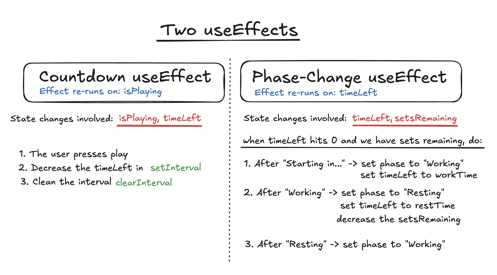

import MissionsDashboard from "@components/pcomponents/post24/MissionsDashboard.tsx"
import TimeFormatter from "@components/pcomponents/post24/TimeFormatter.tsx"

## Intro 


&nbsp;

Inspired by the GNOME app <a class="secondary-a "href= "https://gitlab.gnome.org/World/exercise-timer">Exercise Timer</a>, I decided to 
make custom timers in React continuing the trend of my previous posts that have been leveraging it. 

&nbsp;

In this post, we'll define tasks or activites as <u>Missions</u>, because 
it sounds nice and implies a sense of duty. A Mission constitutes of timed sessions (workTime) with an associated rest (restTime) for a number of sets (remainingSets). I also threw in a preparation time (prepTime), a countdown before the mission starts.

&nbsp;

We'll first create cards that display the general overview of the mission, namely the total time it takes, the set breakdown, etc. Then, we'll give
them life by linking them to a custom timer. Sounds uncomplicated, but there's a lot of intermediate steps to watch out for in between!


&nbsp;

## Making a Mission Card

&nbsp;


### Vanilla Layout

&nbsp;

Our starting point is defining a <span class="bold-rounded">Mission</span> object having the properties below: 

&nbsp;

- an id
- a title
- the work time (in seconds)
- the rest time (in seconds)
- the preparation time (in seconds)
- the number of sets 
- a colour

&nbsp;

It's worth noting that the time units are in seconds, but later formatted properly to time strings for readability. In essence, for 130 seconds, the card should display 2 minutes and 10 seconds. 


&nbsp;

We create an array of <span class="bold-rounded">Missions</span> with arbitrary values. For example, the music session is done in 3 sets of 20 minutes with a 5 minute break between each. As mentioned, the preparation time
acts as a countdown before engaging in the sets.

&nbsp;


<i> Mission Objects </i>
```typescript
const missions = [
  {
    id: 1,
    title: "Quick Coding",
    workTime: 600,
    restTime: 60,
    prepTime: 120,
    sets: 2,
    clr: "#52c22d",
  },
  {
    id: 2,
    title: "Stretching",
    workTime: 30,
    restTime: 15,
    prepTime: 60,
    sets: 3,
    clr: "#2a5ece",
  },
  {
    id: 3,
    title: "Music Session",
    workTime: 1200,
    restTime: 300,
    prepTime: 0,
    sets: 3,
    clr: "#c41c13",
  },
];
```

&nbsp;


Next, we'll make a simple dashboard that presents the missions turned into cards <sup><a class="secondary-a" href="#footnotes">1.</a></sup>.

&nbsp;

<i> Mission Dashboard </i>

```jsx
import MissionCard from "./MissionCard";

export default function MissionsDashboard() {
  const missions = [
    // ...
  ];

  return (
    <div>
      <h3>Missions</h3>

      <div className="mission-container grid md:grid-cols-2 sm:grid-cols-1">
        {missions.map((mission) => {
          return (
          
            <MissionCard
              id={mission.id}
              title={mission.title}
              workTime={mission.workTime}
              restTime={mission.restTime}
              sets={mission.sets}
              clr={mission.clr}
            />
          );
        })}
      </div>
    </div>
  );
}
```

&nbsp;

where the <span class="bold-rounded">MissionCard</span> is defined as: 

&nbsp;

<i> Mission Card (prepTime omitted for this version) </i>
```typescript
interface MissionProps {
  id: number;
  title: string;
  workTime: number;
  restTime: number;
  sets: number;
  clr: string;
}

export default function MissionCard({
  id,
  title,
  workTime,
  restTime,
  sets,
  clr,
}: MissionProps) {
  return (
    <div
      style={{ borderColor: clr }}
      className="border-2 p-2 m-2 rounded-md shadow-md"
    >
      <div className="flex justify-between">
        <h4>{title}</h4>
        <p>{workTime * sets} seconds</p>
      </div>

      <p>
        // We'll deal with plurilization in another version.
        {sets} sets of {workTime} seconds
      </p>
    </div>
  );
}
```


The generated output is:

&nbsp;


<MissionsDashboard version={1} client:load/>


&nbsp;

### Formatting Times 

&nbsp;


Right now, the times shown on the cards are in seconds which isn't user-friendly. To show some decency, we transform them by means of a helper function <span class="bold-rounded">formatTimer</span> that formats seconds into a component separated time string. We'll walk through
how to extract the number of hours, minutes and seconds from the total number of seconds, call it <span class="bold-rounded"> totalSeconds</span>. We proceed accordingly:


&nbsp;


1. We extract our exact hours from <span class="bold-rounded">totalSeconds</span> by flooring <span class="bold-rounded">totalSeconds</span> / 3600

&nbsp;

2. We get a number of seconds that doesn't contain the hours by doing <span class="bold-rounded">totalSeconds</span> % 3600. Call this <span class="bold-rounded">secondsWithoutHours</span>.

&nbsp;

3. We extract our exact minutes by flooring <span class="bold-rounded">secondsWithoutHours</span> / 60

&nbsp;

4. We extract our exact remaining seconds through <span class="bold-rounded">totalSeconds</span> % 60

&nbsp;


&nbsp;


<TimeFormatter client:load/>

 <div className="components-explication">
          <br/>
         The <span class="bold-rounded">flooredHours</span>, <span class="bold-rounded">flooredMinutes</span> and <span class="bold-rounded">remainingSeconds</span> are the variables needed to construct the string above.
         We create a <span class="bold-rounded">components</span> array and push the hours, minutes, and seconds if their value is greater than 0. For example, if we have 3662 total seconds, we push "1 hour", "1 minute" and "2 seconds" to the array. With pluralization taken into consideration, the final string concatenates the component entries with commas and conjunctions based on the number of elements in the array.


</div>


&nbsp;


<i>Implementation of Seconds to H/M/S components</i>


&nbsp;

```typescript
// Skipping a bunch of if statements with a components array
export default function formatMissionTime(totalSeconds: number) {
  // Extract the hour component
  const rawHours = totalSeconds / 3600
  const flooredHours = Math.floor(rawHours)
  // Remove the hours from the seconds and get the minutes
  const secondsWithoutHours = totalSeconds % 3600
  const rawMinutes = secondsWithoutHours / 60
  const flooredMinutes = Math.floor(rawMinutes)
  // Extract the second component
  const remainingSeconds = totalSeconds % 60
  const components = []

  // If the floored value is 0, it gets skipped. 
  // Example: 583 seconds: 
  // 0 flooredHours, 9 minutes and 43 seconds
  if (flooredHours > 0) {
    components.push(`${flooredHours} hour${flooredHours > 1 ? "s" : ""}`)
  }


  if (flooredMinutes > 0) {
    components.push(`${flooredMinutes} minute${flooredMinutes > 1 ? "s" : ""}`)
  }


  if (remainingSeconds > 0) {
    components.push(`${remainingSeconds} second${remainingSeconds > 1 ? "s" : ""}`)
  }

  switch (components.length) {
    case 1:
      return `${components[0]}`
    case 2:
      return `${components[0]} and ${components[1]}`
    case 3:
      return `${components[0]}, ${components[1]} and ${components[2]}`
  }

}

```


&nbsp;

Now that the times on the cards are well formatted, we'll make them interactive in the next section.

&nbsp;


<MissionsDashboard version={2} client:load/>


&nbsp;

## Building the Timer Menu UI

&nbsp;


Focusing purely on cosmetics, a tapped card should reveal a menu containing:

&nbsp;


1. the phase of our timer: are we preparing, working, resting, finished?
2. the time matching the phase we're in.
3. buttons to start and reset the timer
4. an indicator of the number of remaining sets

&nbsp;


The timer's string is constructed with the  <a class="secondary-a "href= "https://developer.mozilla.org/en-US/docs/Web/JavaScript/Reference/Global_Objects/String/padStart">padStart</a> function and the <span class="bold-rounded">flooredHours</span>
<span class="bold-rounded">flooredMinutes</span> and <span class="bold-rounded">remainingSeconds</span>. 

&nbsp;


```typescript
// Formatted string for the timer (initially work time)
export function formatTimerString(totalSeconds: number) {

  const flooredHours = Math.floor(totalSeconds / 3600);
  const secondsWithoutHours = totalSeconds % 3600;
  const flooredMinutes = Math.floor(secondsWithoutHours / 60);
  const remainingSeconds = totalSeconds % 60;

  return `${flooredHours.toString().padStart(2, "0")}:${flooredMinutes
    .toString()
    .padStart(2, "0")}:${remainingSeconds.toString().padStart(2, "0")}`;
}

```
&nbsp;

A <a class="secondary-a "href= "https://github.com/Kangiriyanka/joe-farah-code-extras/blob/main/post-24/TimerMenuV1.tsx"><span class="bold-rounded">TimerMenu</span></a> component sits behind the card. This card version displays the formatted timer string in addition to the list elements above.
At this moment, the buttons don't have any functionality, so our upcoming task is to make a timer that responds to the different mission phases.


&nbsp;


<MissionsDashboard version={3} client:load/>


&nbsp;

## Building the Timer 

&nbsp;


### Defining Phases
&nbsp;

For a number of sets, the main flow our timer should adhere to is: &nbsp;


&nbsp;

<div class="bold-rounded">
<p className="text-center"> (prepping?) → working → resting → working → ... → finished </p> 
</div>

&nbsp;

For clarity, the optional prepping phase happens once, and the working/resting cycles until set completion.
&nbsp;


&nbsp;

On the technical side, we conveniently define a new type <span class="bold-rounded">TimerPhase</span> and the states associated with 
timer functionality.

&nbsp;


<i> TimerPhase Type </i>
```typescript
// Prepping <=> Starting in...
type TimerPhase = "Starting in..." | "Working" | "Resting" | "Finished"
```


&nbsp;

<i> isPlaying, currentPhase, remainingSets and timeLeft states </i>
```typescript
// TimerMenuV2.tsx
interface TimerProps {
    title: string
    workTime: number
    restTime: number
    prepTime: number
    sets: number
    clr: string
}

export default function TimerMenuV2({workTime,r restTime, prepTime, sets, clr}: TimerProps) {
const [isPlaying, setIsPlaying] = useState<boolean>(false)
const [currentPhase, setCurrentPhase] = useState<TimerPhase>("Starting in...")
const [remainingSets, setRemainingSets] = useState<number>(sets)
const [timeLeft, setTimeLeft] = useState(prepTime ? prepTime : workTime)

  return (
    // ...
  )

}
```


&nbsp;

### useEffect Toolbox

&nbsp;


With our types and states in place, we'll be manoeuvering with two <a class="secondary-a "href= "https://react.dev/reference/react/useEffect">useEffect</a> hooks, each manipulating state differently, playing their role in building our timer. 

&nbsp;

<div class="post-img-container p-1">

<i>Figure 1: Countdown and Phase useEffects</i>

&nbsp;



</div>

&nbsp;

The first one, call it the <u>countdown</u> useEffect, oversees that we decrement the <span class="bold-rounded">timeLeft</span> every second. This is done by creating a timer through the <a class="secondary-a "href= "https://developer.mozilla.org/en-US/docs/Web/API/Window/setInterval">setInterval</a> function. That same hook, thanks to <a class="secondary-a "href= "https://developer.mozilla.org/en-US/docs/Web/API/Window/clearInterval">clearInterval</a>,  cleans up the timer (removes it from memory) every time <span class="bold-rounded">isPlaying</span>  changes or if the component unmounts. 

&nbsp;


<i>Countdown useEffect</i>
&nbsp;

```typescript
// Countdown useEffect 
useEffect(() => {
    // (*) Guard here, because useEffect runs regardless 
    // on render regardless of the initial state of isPlaying
    if (!isPlaying) return;

    const timer = setInterval(() => {
        setTimeLeft(prev => prev - 1);
    }, 1000);

    // Every time the effect re-runs 
    // or when the component unmounths, the old timer 
    // gets cleared.
    return () => clearInterval(timer);

}, [isPlaying])
```

Note: When a component mounts, even if the play button wasn't tapped, a <span class="bold-rounded">useEffect</span> by design runs automatically. For this reason, there's a guard statement that returns if <span class="bold-rounded">isPlaying</span> is false. Initially, I made the mistake of not including it, so I saw the sneaky timer fire on its own when displaying the <span class="bold-rounded">TimerMenu</span>.


&nbsp;

The other hook, name it the <u>phase</u> useEffect, switches our phase state when the <span class="bold-rounded">timeLeft</span> hits 0. For example, if we finish a working session (phase) in a <span class="text-[#52c22d]">Quick Coding </span> mission, we modify
the <span class="bold-rounded">currentPhase</span> from "Working" to "Resting"
, and set the <span class="bold-rounded">timeLeft</span> to the restTime of 60 seconds (that's the restTime in the Mission object).  After every work phase, the <span class="bold-rounded">remainingSets</span> are decremented, and upon completion, we configure every affected state back to their default values.

&nbsp;


<i>Phase useEffect</i>
&nbsp;
```typescript
// useEffect for handling phase changes.
useEffect(() => {

    // Edge case: the last work phase
    if (remainingSets == 0) {
        setCurrentPhase(prepTime ? "Starting in..." : "Working")
        setTimeLeft(prepTime ? prepTime : workTime)
        setIsPlaying(false)
        setRemainingSets(sets)
    }

    if (timeLeft != 0) return;

    switch (currentPhase) {

        case "Starting in...":
            setCurrentPhase("Working")
            setTimeLeft(workTime)
            break

        case "Working":
            setCurrentPhase("Resting")
            setTimeLeft(restTime)
            setRemainingSets(prev => prev - 1)
            break;

        case "Resting": 
            setCurrentPhase("Working")
            setTimeLeft(workTime)
            break;

    }

}, [timeLeft])
```
&nbsp;


This updated <a class="secondary-a "href= "https://github.com/Kangiriyanka/joe-farah-code-extras/blob/main/post-24/TimerMenuV2.tsx">Timer Menu</a> integrating the hooks 
captures the core functionality of ticking the timer with respect to the different phases<sup><a class="secondary-a" href="#footnotes">2.</a></sup>, except for the <u>Finished</u> phase will be covered next. 


&nbsp;


&nbsp;


<MissionsDashboard version={4} client:load/>

&nbsp;

Note: Very short sessions are incorporated for testing purposes.


&nbsp;


&nbsp;


### Finished Phase 

&nbsp;

To clearly indicate that the mission is finished, we'll overlay the TimerMenu with a "Well done" text. By introducing a <a class="secondary-a "href= "https://developer.mozilla.org/en-US/docs/Web/API/Window/setTimeout">setTimeout</a> in the <u> phase</u> useEffect, the overlay is shown for 2 seconds once <span class="bold-rounded">remainingSets</span> are 0.

&nbsp;

<i> Introducing setTimeout in the <u>phase</u> useEffect</i>
```typescript
// Somewhere in the phase useEffect 
// (the one with the switch statement)
if (remainingSets == 0) {
    setCurrentPhase("Finished")
    setIsPlaying(false)

    const timeout = setTimeout(() => {
        setCurrentPhase(prepTime ? "Starting in..." : "Working")
        setTimeLeft(prepTime ? prepTime : workTime)
        setIsPlaying(false)
        setRemainingSets(sets)
    }, 2000)

    return () => clearTimeout(timeout)
}
```

&nbsp;


<i>Overlay somewhere inside our revamped <a class="secondary-a "href= "https://github.com/Kangiriyanka/joe-farah-code-extras/blob/main/post-24/TimerMenuV3.tsx">TimerMenu</a> component</i>

```typescript
// Somewhere in TimerMenu
{currentPhase == "Finished" && (
    <div
        style={{ backgroundColor: `${clr}` }}
        className="flex items-center rounded-md justify-center m-auto z-2 absolute h-[100%] w-[100%] text-5xl"
    >
        Well done
    </div>
)}

```

&nbsp;

Run the Test Session no Prep for a swift demonstration.


&nbsp;


<MissionsDashboard version={5} client:load/>

&nbsp;


## Wiring Sound Cues 

&nbsp;

### HTMLAudioElement 


&nbsp;


Alright, the final modification to apply on the cards are sound cues to indicate the end of a phase. 

&nbsp;

I've dropped sample sound files in the public folder that'll pair up with <a class="secondary-a "href= "https://developer.mozilla.org/en-US/docs/Web/API/HTMLAudioElement">HTMLAudioElements</a>. 
We'll need to create audio objects for each sound file, and store them as references with <a class="secondary-a "href= "https://react.dev/reference/react/useRef">useRef</a>, allowing them to persist through renders. A third useEffect is then required to link the audio files to the null HTMLAudioElements. For the record, that's the third useEffect we declared so far.

&nbsp;


<i> HTMLAudioElement references </i>
```typescript
// Persisting Audio objects 
const prepSound = useRef<HTMLAudioElement | null>(null)
const workSound = useRef<HTMLAudioElement | null>(null)
const restSound = useRef<HTMLAudioElement | null>(null)

useEffect(() => {
    // Files in the public folder can be fetched like so:
    // "/<folder_name>/<file>"
    prepSound.current = new Audio("/sounds/prep.wav")
    workSound.current = new Audio("/sounds/work.wav")
    restSound.current = new Audio("/sounds/rest.wav")

    // Stop audio as soon as we unmount
    return () => {
        workSound.current?.pause()
        workSound.current = null

        restSound.current?.pause()
        restSound.current = null

        prepSound.current?.pause()
        prepSound.current = null
    }

}, [])

```

&nbsp;


###  Sounds for Phases

&nbsp;

Borrowing the procedure from the <u>phase</u> useEffect in the <a class="secondary-a "href= "#useeffect-toolbox"> useEffect Toolbox</a> section, we'll create a fourth useEffect that plays a custom sound the last 5 seconds (arbitrary value) of a phase to notify the user that they're about to finish a session. Out of precaution, we guard yet again if <span class="bold-rounded">isPlaying</span> is false and if our <span class="bold-rounded">timeLeft</span>
doesn't fall in range. 


&nbsp;

<i> Different sounds for different phases on the fourth and final useEffect </i>

```typescript
// A lot of useEffects!
useEffect(() => {

    if (!isPlaying || timeLeft > 5 || timeLeft < 1) {
        return
    }

    switch (currentPhase) {

        case "Starting in...":

            if (prepSound.current) {
                prepSound.current.currentTime = 0
                prepSound.current.play()
            }

            break

        case "Working":

            if (workSound.current) {
                workSound.current.currentTime = 0
                workSound.current.play()
            }

            break

        case "Resting":

            if (restSound.current) {
                restSound.current.currentTime = 0
                restSound.current.play()
            }

            break
    }

}, [timeLeft, isPlaying])

```

&nbsp;


We're done! It's <a class="secondary-a "href= "https://en.wiktionary.org/wiki/lovely_jubbly">lovely jubbly</a>.

&nbsp;

<MissionsDashboard version={6} client:load/>


Source code: <a class="secondary-a "href= "https://github.com/Kangiriyanka/joe-farah-code-extras/tree/main/post-24">Fee</a><sup><a class="secondary-a" href="#footnotes">3.</a></sup>.

&nbsp;

## Last Words 

&nbsp;

To talk about improvements, particularily for the sound cues, the GNOME app <a class="secondary-a "href= "https://gitlab.gnome.org/World/exercise-timer">Exercise Timer</a> makes the transitions apparent by ticking twice to signal the start of a phase (prep, work, rest) and ticking thrice
when all sets are finished. In this implementation, sound is only played when the <span class="bold-rounded">timeLeft</span> is under 5 seconds, which is sufficient for the scope of this post. 

&nbsp;

On an ending unrelated note, even when we think the code is simple, it can always surprise us with unexpected behaviours. There's a lot of edge cases 
that creep up on you if you're not careful.

&nbsp;

## Footnotes

&nbsp;


1. Some styling is done in Tailwind CSS, in case you're unfamiliar with longer classnames. Personally, I like to see Tailwind as crazy glue, using it for
finishing touches on padding for example. 

&nbsp;


2. It's easy to slip up when modifying the phase text. When <span class="bold-rounded">remainingSets</span> is 0,
and a mission doesn't have a <span class="bold-rounded">prepTime</span>, 
we need to change the phase text to "Working" instead of "Starting in...". 

&nbsp;


3. It means <a class="secondary-a "href= "https://glosbe.com/en/wo/here">here</a> in Wolof.