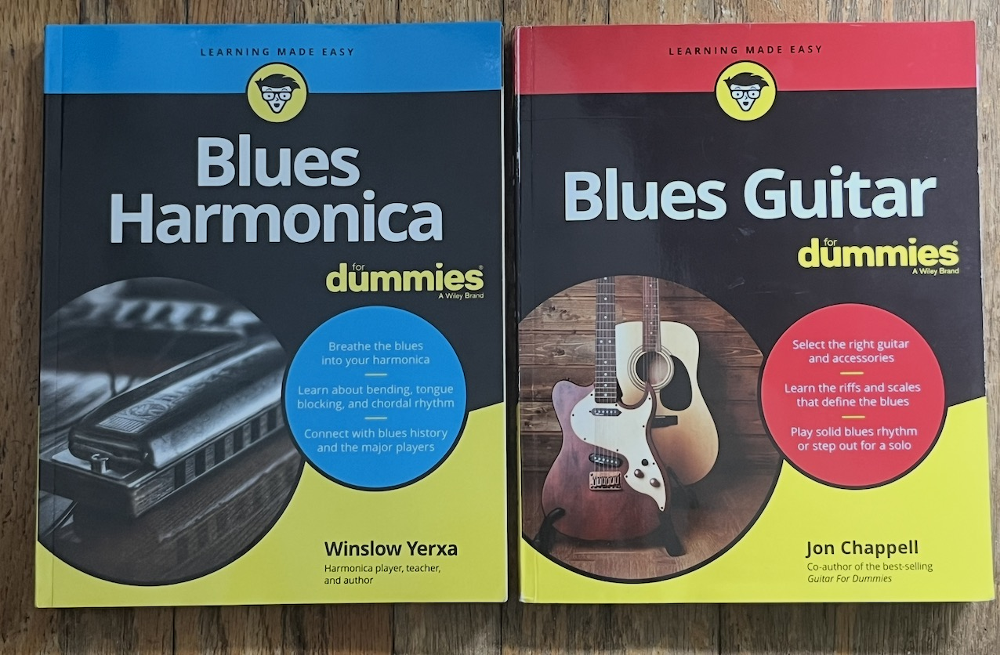

import BluesForm from "@components/pcomponents/post26/BluesForm.tsx"

## Heads up 

&nbsp;

This virtual space<a class="secondary-a" href="#footnotes">2.</a> will serve as a hub for sharing my personal notes on Blues. Thus, the content herein will be better understood with elementary knowledge of music theory, but any brave individual willing to traverse the stretch of Blues hills is welcome!

&nbsp;

## My Blues History

&nbsp;

My introduction to the Blues dates from my teenage years, a time where I bought a C harmonica only to leave it in hanging in the dust up until my mid-twenties. I wanted to pick up an instrument at the time, but I wasn't too serious about it.

&nbsp;

Sometimes, the flow of life steers our life in  directions that make us forget the activities we were once interested in, that is until they resurface again in different parts of our lives.

&nbsp;

As mentioned in my last music <a class="secondary-a "href= "https://joefarah.com/posts/post-2">post</a> (<i>almost a year ago</i>), my re-exposure to Blues, and by extension music, was thanks to crossing paths with colleagues who happened to be musicians. Eventually, I had 
sterling opportunities to jam alongside them, displaying my quasi inexistent skills. 

&nbsp;

Whenever we partaked in a Blues session, I felt absolutely lost playing my rusty old harp, because I hadn't developed my musical intuition enough to know which notes to play over the chords, nor was I aware of the various techniques the harp had to offer. In spite of my struggles, it was great to be in an environment that rekindled my musical flame. It propelled me to start learning  <a class="secondary-a "href= "https://joefarah.com/projects/tk-music/">other instruments</a>, and learn about music in depth.

&nbsp;

## I'm a Dummy!

&nbsp;

 Some time ago, I bought two books to dig deeper into the <a class="secondary-a "href= "https://en.wikipedia.org/wiki/Blues">Blues</a> with the intention of learning how to properly improvise over a progression, and ultimately compose my own track. <a class="secondary-a" href="#footnotes">1.</a> Here's a picture of 
<a class="secondary-a "href= "https://winslowyerxa.com/books/blues-harmonica-for-dummies/">Blues Harmonica For Dummies by Winslow Yerxa</a>
and <a class="secondary-a "href= "https://www.amazon.ca/Blues-Guitar-Dummies-Jon-Chappell/dp/0470049200"> Blues Guitar For Dummies by Jon Chappell</a>. 

&nbsp;

<i>I'm a Blues Dummy!</i>
&nbsp;

&nbsp;

They cover a wide range of topics, from blues history, to techniques, to the breakdown of specific blues styles. What I found enriching from the authors were their wisdom
on what notes work over specific chords, and how to move across and manipulate the instrument to make them sound more bluesy.

&nbsp;

&nbsp;

## Blues Formats

<BluesForm client:load/>

&nbsp;

## Footnotes

&nbsp;

1. I've also been wishiwashi about fully comitting to building an iOS app, since I haven't found the vision yet on what to target. 

&nbsp;

2. Virtual space → This post

