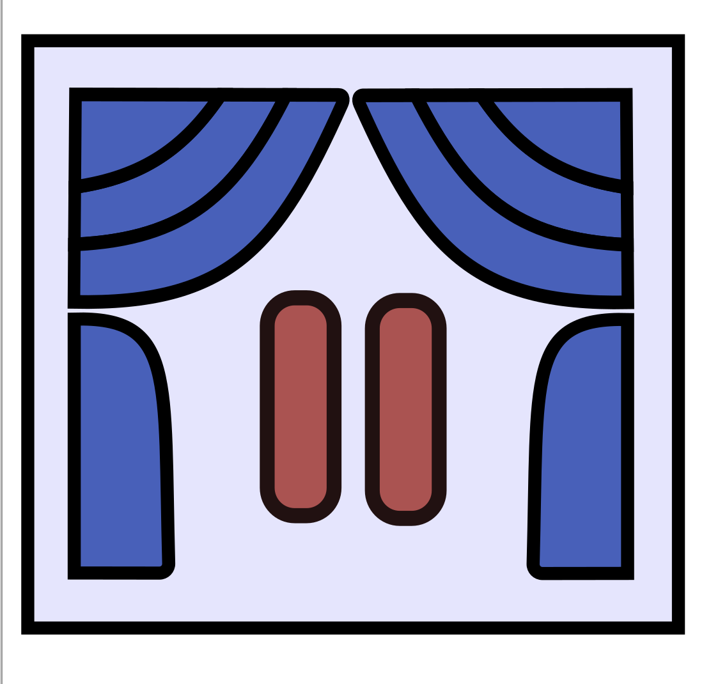

## Releasing Segmance
I haven't written a post in a while as I've been building  <a class="secondary-a" href="https://joefarah.com/projects/segmance/">Segmance</a>. I underestimated how large the project would become, which slowed things down, but the good news is that it's now live on the App Store. On another note, I design logos and icons  (Inkscape) for my apps and their previews (Figma). I'll probably use <a class="secondary-a" href="https://appscreens.com/"> Appscreens </a> next time for the previews after struggling to fit screenshots inside an iPhone bezel.<a href="#footnotes">1.<a> For the logo, I was trying to make it reflect the keywords 'stage', 'segments', 'performance'and  'notes'. I went for a butterfly after realizing the curtains could act as wings.

&nbsp;

## Cooling Down

When I'm not working on a project, I update existing ones or write new posts when there are fleeting ideas to capture. For example, I recently added themes to <a class="secondary-a" href="https://joefarah.com/projects/diary/"> Grid Diary</a> to beautify it a bit. On this site, I've added a copy button to the code snippets and the ability to expand images upon clicking.

&nbsp;

&nbsp;

## About my Apps

If you take a look at the <a class="secondary-a" href="https://joefarah.com/about/"> About </a> page, you'll see an overview of the activities I gravitate towards. The apps I create are based on these interests. I can enjoy programming (or find it tolerable) when it's relevant to my world. Naturally, I don't build an app for everything. Sometimes it's just faster to do it, but a helping hand can make all the difference.<a href="#footnotes">2.<a>
&nbsp;

&nbsp;

 <table class="m-auto">
        <thead>
            <tr>
                <th class="px-6 py-3">Project</th>
                <th class="px-6 py-3">Category</th>
            </tr>
        </thead>
        <tbody>
            <tr class="border-b pro-1 hover:bg-yellow-100 ">
                <td class=" px-6 py-3">Tk-Music</td>
                <td class="px-6 py-3">Music</td>
            </tr>
            <tr class="border-b  pro-2 hover:bg-orange-100">
                <td class=" px-6 py-3">Segmance, K-Count</td>
                <td class="px-6 py-3">Routine (Performance Arts)</td>
            </tr>
            <tr class="border-b  pro-3 hover:bg-pink-100">
                <td class=" px-6 py-3">K-Numbers</td>
                <td class="px-6 py-3">Language</td>
            </tr>
            <tr class="border-b  pro-4 hover:bg-indigo-100">
                <td class=" px-6 py-3">Gameok, Grid Diary</td>
                <td class="px-6 py-3">Memories, Language</td>
            </tr>
        </tbody>
    </table>

&nbsp;

## Next Steps

I mentioned in an old <a class="secondary-a" href="https://joefarah.com/posts/post-4/#combine-your-skills">post </a> that I combine language learning with drawing<a href="#footnotes">3.<a>. This is in the hopes of creating a multilingual cartoon in the future. For some context, drawing is one of those things I believed I sucked at as a kid, and I know many people feel that way. If you think about it, maybe you never practiced enough, met the right people, or simply spent more time doing different activities you were more confident in. You can justify it many ways, but it solves nothing. A lot of things we pedestalize lose their ground when we actively work at them for the sake of enjoyment and improvement. The narrative inside your head can be changed at any moment.

&nbsp;

That being said, I was contemplating building an app to track drawing progress among other ideas. This time, I want to invest more time designing the app thoroughly before going all in. I tend to hastily jump into coding before I’ve planned far enough ahead. It's also a nice way to get back to drawing. 

&nbsp;

 For creative fuel, I downloaded drawing apps to study their design and noted what they do well and what they don't. Overall, ShadowDraw and Paper stood out in terms of aesthetics and functionality. Observing other works is a great way to get fresh ideas and apply new concepts to yours. I often find myself relying on the same animations or colours across projects, so I coined the term ‘Beyond Opacity’ to push myself to try new designs.

&nbsp;

## Ironman Coding 

In this day and age, there’s constant pressure to move fast, which can make it feel like there’s no room to make mistakes or take the time to write code without pleading for the almighty AI's help. Sometimes, my inner voice becomes overly critical telling me that I should figure out how to implement certain features on my own. That's an ego trap. Everyone relies on each other, and often others simply know things you haven’t learned yet. I resonate with Uncle Phil's words in this  <a class="secondary-a" href="https://youtu.be/jCmHfcKUM6k?si=X2F0xZJFxgTo5-a4&t=131">scene</a> from the Fresh Prince of Bel-Air when he tells Will no one does anything without help.

&nbsp;

 I'm aware that results matter a lot in competitive environments, but how do you intentionally slow down? Lately, I’ve been setting aside coding time where I’m not allowed to use AI. When something breaks, I pause and debug the relevant lines myself. It's a way of reminding myself to solve the problem before checking the solution. There are moments when I immediately prompt for the optimal version (completely fine), but the challenge is to delay that impulse.<a href="#footnotes">  4. </a>

&nbsp;

&nbsp;

## Footnotes

1. For a personal project I care about, I refuse to delegate logo creation and art to AI. For inspiration, no problem, but I make it myself. 

&nbsp;

2. I have a lot of respect for the developers below for creating apps that capture simplicity and efficiency immaculately:
&nbsp;

- <a class="secondary-a" href="https://muted.io/"> Muted.io </a>
by Sébastien 

- <a class="secondary-a" href="https://apps.apple.com/us/app/notevision-sight-reading/id874386416"> Notevision </a> by Ryan Newsome

- <a class="secondary-a" href="https://apps.apple.com/ca/app/juggle-pro-siteswap-lab/id1476141988"> Juggle Pro </a>
by Magnus Hansson

&nbsp;

3. I combine skills based on what I'm setting out to accomplish. If I'm writing a post in a different language (writing focus), I probably don't need to draw doodles, and if I'm practicing drawing shape intersections (art focus), then I should just draw them. 

&nbsp;

4. This was inspired by Runescape's <a href="https://oldschool.runescape.wiki/w/Ironman_Mode" class="secondary-a">Ironman Mode</a>. In the regular version of the game, players can use a trading system to exchange resources with each other, but players in Ironman Mode are self-sufficient and have to get every item themselves. It's playing the game with constraints.

