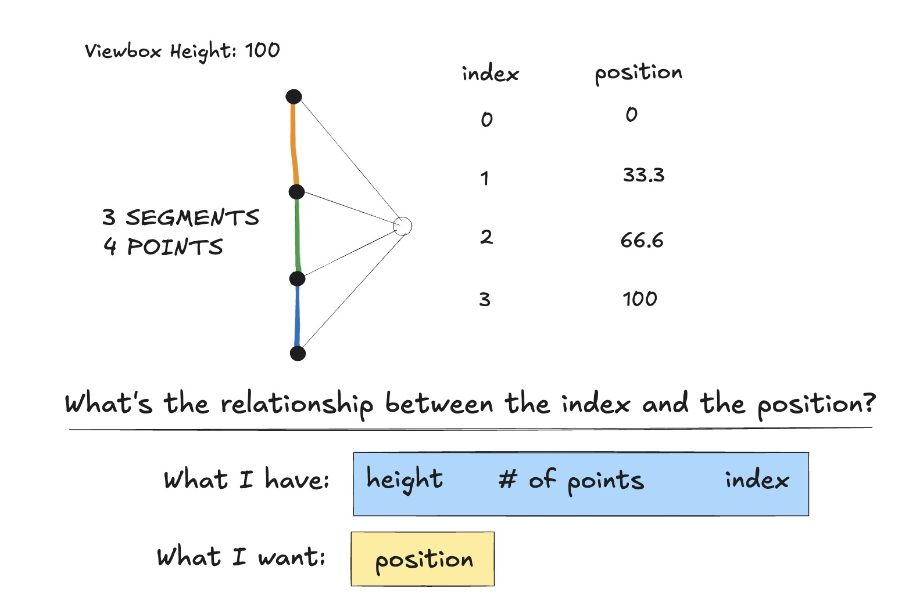

import KoreanLinks from '../pcomponents/post16/KoreanLinks.vue';
import KoreanGrammarCards from '../pcomponents/post16/KoreanGrammarCards.vue';
import KoreanCompositions from '../pcomponents/post16/KoreanCompositions.vue';

## Intro

&nbsp;

Astro allows you to play with various frameworks, and I thought it'd be a good move to turn some language notes into Vue components for fun. In a <a class="secondary-a" href="https://joefarah.com/posts/post-9"> previous </a> post, I stuck solely with CSS and Javascript for text effects, but I wanted more options this time around.  Lately, I haven't been studying Korean or Japanese
as I'm focused on other projects ⁠—<a class="secondary-a" href="#footnotes">1.</a> coding takes up all my brain power. Making these posts does refresh my knowledge though!

&nbsp;

## Word Links

&nbsp;

Before you make sentences, knowing what words can precede and follow each other is an underrated technique for learning them. Tap on the preceding (P) and following (F) buttons to display the word links. I took a crack at making them with SVGs<a class="secondary-a" href="#footnotes">2.</a>,  \
and it was a fun little math challenge to figure out how to arrange the connector lines. 

<KoreanLinks client:load />

&nbsp;

## Grammar

&nbsp;

These grammar points continue to elude my understanding, so I'm adding them as reminders and provide my own explanations of them. **Hover** over the sentences to see the English translation.<a class="secondary-a" href="#footnotes">3.</a> 

&nbsp;

<KoreanGrammarCards/>

&nbsp;

## Written Compositions

&nbsp;

These are texts I wrote for practice to prepare for <a class="secondary-a" href="https://en.wikipedia.org/wiki/Test_of_Proficiency_in_Korean">TOPIK</a>. My dear friends "D" and "S" helped me a lot. 
You can tap the buttons below the text to see the corresponding parts of speech highlighted. For clarification, the highlighted words may include attached particles.  This could become a mini-project on its own, using NLP to label the words accordingly. I'll inform you that not all words have been tagged, and that I left out the more intricate/complex parts of speech. 

&nbsp;

<KoreanCompositions client:load/>

&nbsp;

## Footnotes 

1. Semicolons and em-dashes are tricky; the punctation <a class="secondary-a" href="https://www.thepunctuationguide.com/em-dash.html">guide </a> is a good resource to decypher them. Em dashes are versatile: they can function like commas or parentheses but they also add emphasis or a stronger pause, making the idea stand out more. You can replace semicolons with em dashes, though not the other way around.
Semicolons connect two complete sentences that are closely related, keeping them in one sentence instead of splitting them with a period. I don't know if I use them right half the time.

&nbsp;

2. I've thinking of learning GSAP with this free <a class="secondary-a" href="https://www.creativecodingclub.com/bundles/creative-coding-club">course</a> I found out about. Also, here's a rough sketch on how I mapped the y-coordinates in the
Word Links section.

&nbsp;

3. References for the grammar section:

 - 한국어 배우기 / Learning Korean <a class="secondary-a" href="https://www.youtube.com/watch?v=X1VxEs15la4">channel</a>
 - Studying Korean  blog <a href="https://studying-korean.tistory.com/593" class="secondary-a">post</a> on 있나요/가요
 - Learn Korean with GO! Billy Korean's video on <a class="secondary-a" href="https://www.youtube.com/watch?v=bmFZTolZoz8">더라고 and 더니</a> and this Reddit <a class="secondary-a" href="https://www.reddit.com/r/Korean/comments/lg9fd5/questions_about_%EB%8D%94%EB%9D%BC%EA%B3%A0%EC%9A%94_%EB%8D%94%EB%8B%88_and_%EB%8D%98%EB%8D%B0/?tl=ko"> post</a>.
 

