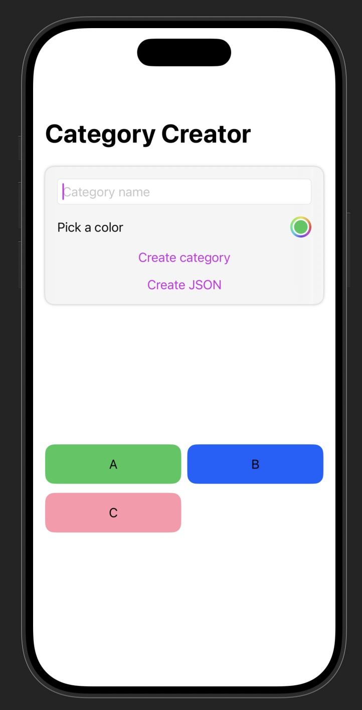
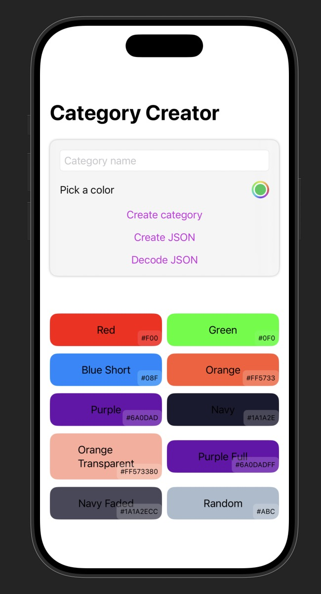

## Intro 

&nbsp;


Imagine you're building an app where the user can set custom colors for certain views inside of it. For example, the user could change the colours of categories or folders through a color picker. The question now is how would we go about implementing this in a way those colors are persisted across launches. More interestingly, how would we go about converting a SwiftUI Color 
to data that can easily be stored in different formats and converted back? After all, we need something storage-friendly such as numbers and strings. Also, to avoid any confusion, I refer to a SwiftUI Color as Color in this post.

&nbsp;

Before anything, I'll introduce a starter view that creates colored categories without considering our initial constraints. The only relevant parts of the snippet are:

&nbsp;

- A category has a Color property (which we will later change).
- A ColorPicker that sets the state of the color we want to create our category with.
- A button that creates categories with a name and color and appends them to a <span class="bold-rounded"> Category </span> array.


&nbsp;

The starting point is getting a Color from the <a href="https://developer.apple.com/documentation/swiftui/colorpicker" class="secondary-a">ColorPicker</a> and creating a category with it. You can paste this code in a playground or skim over it, because what I want to draw your attention to is the how-to behind Color conversions.

```swift
// Paste this in a playground 
import SwiftUI

struct Category: Identifiable {

    let id = UUID()
    var name: String
    var categoryColor: Color     // Focus on this
}

struct CategoryCreatorView: View {

    @State private var categoryColor: Color = .blue    // Focus on this
    @State private var categoryName: String = ""
    @State private var categories: [Category] = []

    var body: some View {
        NavigationStack {
            VStack(spacing: 16) {
                TextField("Category name", text: $categoryName)
                    .textFieldStyle(.roundedBorder)

                ColorPicker("Pick a color", selection: $categoryColor)

                categoryCreatorButton
            }
            .padding()
            .background(.ultraThinMaterial)
            .clipShape(RoundedRectangle(cornerRadius: 12))
            .shadow(radius: 2)
            .padding()

            Spacer()

            categoryGrid

            Spacer()
            .navigationTitle(Text("Category Creator"))
        }
       
    }

    var categoryCreatorButton: some View {
        Button("Create category") {
            let newCategory = Category(name: categoryName, categoryColor: categoryColor)
            categories.append(newCategory)

            categoryName = ""
            categoryColor = .white
        }
    }

    var categoryGrid: some View {
        LazyVGrid(
            columns: Array(repeating: GridItem(.flexible()), count: 2),
            spacing: 12
        ) {
            ForEach(categories) { category in
                HStack {
                    Text(category.name)
                }
                .padding()
                .frame(maxWidth: .infinity)
                .background(category.categoryColor)
                .clipShape(RoundedRectangle(cornerRadius: 12))
            }
        }
        .padding()
    }
}

#Preview {
    CategoryCreatorView()
}
```

&nbsp;


This is great and all, but with the current implementation of Category, we cannot encode it to JSON 
or store it in Core Data or SwiftData, because the Color property is not serializable or persistable. Therefore, we have to change the <span class="bold-rounded"> categoryColor</span> to a suitable format (hint: struct containing color components), and convert it back to a SwiftUI Color. 
To do so, we initially extract the RGBA components of the SwiftUI Color by extending the Color struct. From there, we can either keep the Color in RGBA or convert it to a hex string.


&nbsp;


## Extracting RGBA from a Color

&nbsp;


### Color.resolve and UIColor

Let's create an extension on Color and implement an RGBA extractor. If your app is on iOS 17+, 
you can use the  <span class="bold-rounded">resolve(in environment: <a href="https://developer.apple.com/documentation/swiftui/environmentvalues" class="secondary-a">EnvironmentValues)</a></span> method to 
get a <a class="secondary-a" href="https://developer.apple.com/documentation/swiftui/color/resolved">Color.Resolved</a> struct which has the red, green, blue and alpha components of the Color. The EnvironmentValues are the vanilla environment settings your app provides such as <span class="bold-rounded">colorScheme: light</span> and <span class="bold-rounded">accessibilityContrast = .normal</span>. Essentially, we're getting the Color under standard conditions. 
We'll be returning a tuple containing our RGBA components as they're practical to read. 


```swift

// Compiler directives will be added in another snippet
extension Color {

    // The default RGBA components' types are Float
    // but let's typecast them to CGFloat for consistency 
    // with the next method
    
    func colorExtractor() -> (red: CGFloat, green: CGFloat, blue: CGFloat, alpha: CGFloat) {
        // Signature:
        // public func resolve(in environment EnvironmentValues) 
        // -> Color.Resolved
        let resolved = self.resolve(in: EnvironmentValues())
        return (CGFloat(resolved.red),CGFloat(resolved.green), CGFloat(resolved.blue), CGFloat(resolved.opacity))

    }
}

```

&nbsp;


&nbsp;


For iOS 16 and under,  we need a different approach: casting the Color to a UIColor and accessing the <span class="bold-rounded"><a href= "https://developer.apple.com/documentation/uikit/uicolor/getred(_:green:blue:alpha:)" class="secondary-a">getRed</a></span> property.<sup><a class="secondary-a "href= "#footnotes">1.</a></sup>
Printing the RGBA values per method may differ, since different pipelines are used for extracting the Color. By pipelines, I mean <span class="bold-rounded">resolve</span>  and <span class="bold-rounded">getRed</span> follow two different recipes to obtain the color components.

```swift

extension Color {
    // ... 
    func UIColorExtractor() -> (red: CGFloat, green: CGFloat, blue: CGFloat, alpha: CGFloat) {
            let uiColor = UIColor(self)
            var r: CGFloat = 0
            var g: CGFloat = 0
            var b: CGFloat = 0
            var a: CGFloat = 0
            
            // getRed can directly modify the variables outside of it
            uiColor.getRed(&r, green: &g, blue: &b, alpha: &a)
            
            return (r, g, b, a)
        }
}

```


<span class="font-md bold">Note:  The & (inout) allows modification of variables outside
the function's scope.</span>

&nbsp;


For readability and completeness, we can fuse both functions:

```swift
extension Color {
    func colorExtractor() -> (red: CGFloat, green: CGFloat, blue: CGFloat, alpha: CGFloat){
            // Signature public func resolve(in environment EnvironmentValues) -> Color.Resolved
            if #available(iOS 17.0, *) {
                let resolved = self.resolve(in: EnvironmentValues())
                return (CGFloat(resolved.red), CGFloat(resolved.green), CGFloat(resolved.blue), CGFloat(resolved.opacity))

            } else {
                let uiColor = UIColor(self)
                var r: CGFloat = 0
                var g: CGFloat = 0
                var b: CGFloat = 0
                var a: CGFloat = 0
                
                uiColor.getRed(&r, green: &g, blue: &b, alpha: &a)
                
                return (r, g, b, a)
            }
        
        }
    func sampleRGBAColors() {
                print("Blue:")
                print(Color.blue.colorExtractor())

                print("Green:")
                print(Color.green.colorExtractor())

                print("Pink 50%")
                print(Color.pink.opacity(0.5).colorExtractor())  
        }
}
```


If we run the sampleRGBAColors function, we obtain the following numbers (cut off at 7 decimals) for the provided Colors:


<table class="m-auto">
    <thead>
        <tr>
            <th class="px-6 py-3">Color</th>
            <th class="px-6 py-3">Red</th>
            <th class="px-6 py-3">Green</th>
            <th class="px-6 py-3">Blue</th>
            <th class="px-6 py-3">Opacity</th>
        </tr>
    </thead>
   <tbody>
    <tr class="border-b border-gray-700 hover:bg-blue-900/40">
        <td class="px-6 py-3"><span class="px-2 py-1">Blue</span></td>
        <td class="px-6 py-3">0.0</td>
        <td class="px-6 py-3">0.5333333</td>
        <td class="px-6 py-3">1.0</td>
        <td class="px-6 py-3">1.0</td>
    </tr>

    <tr class="border-b border-gray-700 hover:bg-green-900/40">
        <td class="px-6 py-3"><span class="px-2 py-1">Green</span></td>
        <td class="px-6 py-3">0.2039215</td>
        <td class="px-6 py-3">0.7803921</td>
        <td class="px-6 py-3">0.3490195</td>
        <td class="px-6 py-3">1.0</td>
    </tr>

    <tr class="border-b border-gray-700 hover:bg-pink-900/40">
        <td class="px-6 py-3"><span class="px-2 py-1">Pink (50%)</span></td>
        <td class="px-6 py-3">1.0</td>
        <td class="px-6 py-3">0.1764705</td>
        <td class="px-6 py-3">0.3333333</td>
        <td class="px-6 py-3">0.5</td>
    </tr>
</tbody>
</table>

&nbsp;

In theory, you need at most 32 bits (8 bits per channel) to represent all the color components in RGBA. Both Float and CGFloat are permissible here, but I go with CGFloat, because of SwiftUI calculations.


&nbsp;


### Creating a new type: CategoryColor

We can now borrow this logic to create a new struct called CategoryColor. The CategoryColor can recreate the Color from the RGBA components with the <span class="bold-rounded">getColor</span> computed property. We could directly create RGBA properties inside Category, but it's cleaner to separate it. Why? Because it increases readability by having less properties in Category, and adds possibility for extra manoeuvres.

```swift

struct CategoryColor {
    var red: CGFloat
    var green: CGFloat
    var blue: CGFloat
    var alpha: CGFloat
    
    var getColor : Color {
        Color(red: red, green: green, blue: blue, opacity: alpha)
    }
    
}


```

We can change the button's logic in consequence by calling the colorExtractor on the ColorPicker's Color. Ideally, you'd create a function for the category creation logic, but I'm taking shortcuts.

```swift
 var categoryCreatorButton: some View {
        Button("Create category") {
            let components = categoryColor.colorExtractor()
            let newCategoryColor = CategoryColor(red: components.red, green: components.green, blue: components.blue, alpha: components.alpha)
            let newCategory = Category(name: categoryName, categoryColor: newCategoryColor)
            categories.append(newCategory)

            categoryName = ""
            categoryColor = .green
        }
    }
```


```swift
// ... 
// Changing the background modifier 
// to utilize the getColor from the CategoryColor struct.
HStack {
        Text(category.name)
}
.background(category.categoryColor.getColor())
```

&nbsp;


### Conforming Category to Codable


We can test out if our CategoryColor is storage-friendly by creating a JSON string of our categories. The Category will need to conform to Codable which means CategoryColor must as well. <sup><a class="secondary-a "href= "#footnotes">2.</a></sup>

```swift
struct Category: Identifiable, Codable {
 
    let id = UUID()
    var name: String
    var categoryColor: CategoryColor

    enum CodingKeys: String, CodingKey {
        case id
        case name
        case categoryColor
        
    }
}

struct CategoryColor: Codable {
    
    var red: CGFloat
    var green: CGFloat
    var blue: CGFloat
    var alpha: CGFloat
    
    var getColor : Color {
        Color(red: red, green: green, blue: blue, opacity: alpha)
    }
    
}


```

&nbsp;

We write a function that encodes our Category model. 

```swift
func convertToJSONString() throws -> String {

    let encoder = JSONEncoder()
    // With this outputFormatting, the order could be random
    // i.e., Key order not accounted for
    encoder.outputFormatting = [.prettyPrinted]
        
    let data = try encoder.encode(categories)
    return String(data: data, encoding: .utf8) ?? ""
}

```

&nbsp;

and create a button that prints the JSON String of the categories.


```swift
var jsonStringCreatorButton: some View {
        
        Button("Create JSON") {
            do {
                let jsonString = try convertToJSONString()
                print(jsonString)
            } catch {
                print("Failed to create JSON:", error)
            }
        }
        
    }

// Output:
[
 {
    "categoryColor" : {
      "green" : 0.7803921699523926,
      "blue" : 0.3490195870399475,
      "alpha" : 1,
      "red" : 0.20392152667045593
    },
    "id" : "8657A4D3-9194-4245-9EB4-D254C4492E7E",
    "name" : "A"
  },
  {
    "categoryColor" : {
      "alpha" : 1,
      "green" : 0.3786163032054901,
      "red" : 0.0028839111328125,
      "blue" : 0.9929808974266052
    },
    "id" : "DC08ACC9-096F-4F65-B44E-6F02D56C2DDD",
    "name" : "B"
  },
  {
    "categoryColor" : {
      "alpha" : 0.5,
      "red" : 1,
      "green" : 0.1764678955078125,
      "blue" : 0.3333282172679901
    },
    "id" : "A6044006-3153-4FAD-A265-7452E5E6DF9E",
    "name" : "C"
  }
]


```

P.S. Tap the iPhone in the right corner to see the current progress.
<div class="post-img-container  mt-1 w-13 ml-auto">



</div>

&nbsp;


 An alternative to storing the RGBA components from the color extractor is by means of hex strings. With RGBA, we need to store four different numbers, so it feels redundant. 
 With a hex string, we gain compactness and readability at the cost of precision, which is luckily imperceptible to the human eye — unless you're a cyborg. Nothing prevents you from having both though.


&nbsp;


## Converting RGBA to Hex


&nbsp;


### A bit of theory

Under the hood, the color channels each use 8-bit numbers, because their max value is 255 by convention. Sliding the thumbs below to the end sets all the bits. Since we're accounting for opacity, it also has 8 bits, even though most languages show it as a 0-1 range. SwiftUI uses the 0-1 range for all channels. 


import Binary from '../pcomponents/post17/Binary.svelte';


<Binary client:load/>


&nbsp;


For hexadecimals, every digit (0-F) represents 4 bits, and hex strings can have various length in this color context. If the hex has a length of 8, it means the alpha channel is included. If it's not, then it's 6 by truncating the last 2 hex digits. In CSS, repeating hex digits can be shortened. For instance,  #00FF00 can be shortened to #0F0. 

&nbsp;


<table class="m-auto">
  <thead>
    <tr>
      <th class="px-6 py-3">Color</th>
       <th class="px-6 py-3">Hex length</th>
      <th class="px-6 py-3">Code</th>
   

    </tr>
  </thead>
  <tbody>
    <tr class="border-b border-gray-700 hover:bg-green-900/40">
      <td class="px-6 py-3"><span class="px-2 py-1">Green</span></td>
      <td class="px-6 py-3">8</td>
      <td class="px-6 py-3">#34C759FF</td>
    </tr>

    <tr class="border-b border-gray-700 hover:bg-green-900/40">
      <td class="px-6 py-3"><span class="px-2 py-1">Green</span></td>
      <td class="px-6 py-3">6</td>
      <td class="px-6 py-3">#34C759</td>
    </tr>

    <tr class="border-b border-gray-700 hover:bg-green-900/40">
      <td class="px-6 py-3"><span class="px-2 py-1">Pure Green</span></td>
      <td class="px-6 py-3">3</td>
      <td class="px-6 py-3">#0F0</td>
    </tr>
  </tbody>
</table>
&nbsp;


### String Specifiers for conversion
With our implementation, our goal is to get a string that is of the format <span class=" bold-rounded bolder text-green-500">"#00000000"</span>. Since the RGBA components are from 0 to 1 in SwiftUI, we have to multiply them by 255, cast them to Int, and use String <a class="secondary-a "href= "https://developer.apple.com/library/archive/documentation/Cocoa/Conceptual/Strings/Articles/formatSpecifiers.html">formatting</a> 
with the following specifiers: 

&nbsp;


- #: hash in the beginning to indicate it's hex.
- %X: unsigned 32-bit integer:  Int typecast is necessary in our function to match the format.
- 0 followed by a number: pads with zeros. If your color component is left at 0, then the formatted version is 00.


```swift
extension Color {
    func hexExtractor() -> String {
        // Decimals removed for readability
        // r: 0.20, green: 0.78, blue: 0.35, alpha: 1
        // In hex: #34C759FF
        let components = self.colorExtractor()


        // Typecasting: If you have 32.999
        // Int(32.99) -> 32
        // Int(round(32.99)) -> 33
        return String(
           format: "#%02X%02X%02X%02X",
           Int(round(components.red * 255)),
           Int(round(components.green * 255)),
           Int(round(components.blue * 255)),
           Int(round(components.alpha * 255))
        )
    }
}

```
<span class="font-md bold">Note: I rounded the numbers here in order to see the same hex code inside the ColorPicker. Int(number) removes the decimals without rounding beforehand. Give me my precision back, I can handle things, I'm smart! </span>


&nbsp;

Afterwards, we can add a hex field to CategoryColor, and change our button's logic accordingly (button example omitted for brevity).
Lastly, we need to implement a function that transform hex strings to Color. We proceed by creating an initializer for Color that accepts a hex string and pops out a Color.
It requires a tad of knowledge on bitwise operations. Luckily, I made a few visuals you'll feast your eyes upon shortly.

```swift
struct CategoryColor: Codable {
    // These can be optionally be removed, but I'll leave them for
    // comparison purposes.
    var red: CGFloat
    var green: CGFloat
    var blue: CGFloat
    var alpha: CGFloat
    // New property
    var hex: String
    
    var getColor : Color {
        Color(red: red, green: green, blue: blue, opacity: alpha)
    }
    
    // TO-DO: Implement an initializer to create a Color from hex
    var getColorFromHex: Color {
        Color(hex: self.hex)
    }
}
```

&nbsp;

### Initializing Color with Hex

For this section, we will convert "#34C759FF" to a SwiftUI Color. Please bear in mind that in all cases (various hex code lengths), we will need to provide the R,G,B,A values. The logic below also works for RGB (hex code of length 6), but you have to be wary of your shifts and set alpha to 255 (0xFF). In general, we have to:

&nbsp;

1. Remove the "#": we can use <span class="bold-rounded">trimmingCharacters(in set: CharacterSet )</span> which removes any unwanted characters in the String.
2. Parse the string to a 64-bit integer with a <a class="secondary-a "href= "https://developer.apple.com/documentation/foundation/scanner#overview"> Scanner</a> and its<span class="bold-rounded">scanHextIn64</span> method.
3. Pull out the RGBA components from the obtained 64-bit integer through bitwise operations and store them in variables. See visuals below.
4. Initialize the color with obtained components (r, g, b, a: UInt64)


import Conversion from '../pcomponents/post17/Conversion.svelte';


&nbsp;

Visuals:
<br/>
<Conversion client:load/>

&nbsp;


For hex codes of length 3, we need to find a way to convert them to RGBA format (RRGGBBAA). If we run "#ABC" in <span class="bold-rounded">scanHexInt64</span>, we obtain an integer which we can represent with 12 bits. No animations provided for this one.

<br/>
import ThreeHex from '../pcomponents/post17/ThreeHex.svelte';

<ThreeHex client:load/>

<br/>
The shifting works the same, but we need to duplicate our number to match the 8 bits (e.g., G>GG). Let's double the green component above by shifting
the number right by 4 bits and applying a 4-bit mask this time to isolate the 1011. For doubling, we can multiply the number by 17, which is (n) * (16+1). Multiplying a hexadecimal number by 16 shifts it left by 4 bits, hence we obtain 
1011 0000, and then add the same number from (n*1) resulting in 1011 1011. With everything explored, we can write our color initializer.


&nbsp;

The full code:

```swift
extension Color {
    init(hex: String) {
        let hex = hex.trimmingCharacters(in: CharacterSet.alphanumerics.inverted)
        var int: UInt64 = 0
        // An Int64 is 64 bits.
        // The value just sits in the lower bits 
        // and the rest are zero:
        Scanner(string: hex).scanHexInt64(&int)

        // Result to return
        let r, g, b, a: UInt64

        switch hex.count {
        case 3:
            // shorthand RGB (e.g. ABC → AABBCC)
            (r, g, b, a) = (
                ((int >> 8) & 0xF) * 17,
                ((int >> 4) & 0xF) * 17,
                (int & 0xF) * 17,
                255
            )

        case 6:
            // RRGGBB
            (r, g, b, a) = (
                (int >> 16) & 0xFF,
                (int >> 8) & 0xFF,
                int & 0xFF,
                255
            )

        case 8:
            // RRGGBBAA
            (r, g, b, a) = (
                (int >> 24) & 0xFF,
                (int >> 16) & 0xFF,
                (int >> 8) & 0xFF,
                int & 0xFF
            )

        default:
            (r, g, b, a) = (0, 0, 0, 255)
        }

        self.init(
            .sRGB,
            red: Double(r) / 255,
            green: Double(g) / 255,
            blue: Double(b) / 255,
            opacity: Double(a) / 255
        )
    }
}
```
<span class="font-md bold">Note: .sRGB is a standard color space for allowing colors to have a uniform look across multiple devices. It's also the default color space when you initialize a Color.  </span>


&nbsp;

That's a wrap. You can see the full demo on my <a class="secondary-a "href= "https://github.com/Kangiriyanka/joe-farah-code-extras/tree/main/Swift/CategoryColors.swiftpm">Github</a>, and a preview on the right.

<div class="post-img-container  mt-1 w-13 ml-auto">



</div>
&nbsp;

## Last Words

<br/>
I hope this post is helpful to whoever reads it. Personally, whenever I'm exposed to new concepts, I ask myself too many questions on the tiny details to the extent of preventing myself from moving forwards in my learning. You don't have to understand everything right away, but making a conscious effort to nail it down makes the difference.


&nbsp;

## Footnotes 
 
1. Other tutorials I've seen online extract the color channels with <span class="bold-rounded">cgColor</span>. Tous les chemins mènent à Rome.

<br/>
2. If you're using constants for the id,
you could get this <a class="secondary-a "href= "https://stackoverflow.com/questions/62545594/xcode-warning-immutable-property-will-not-be-decoded-because-it-is-declared-wit">warning</a>. Codable has weird behaviors.


