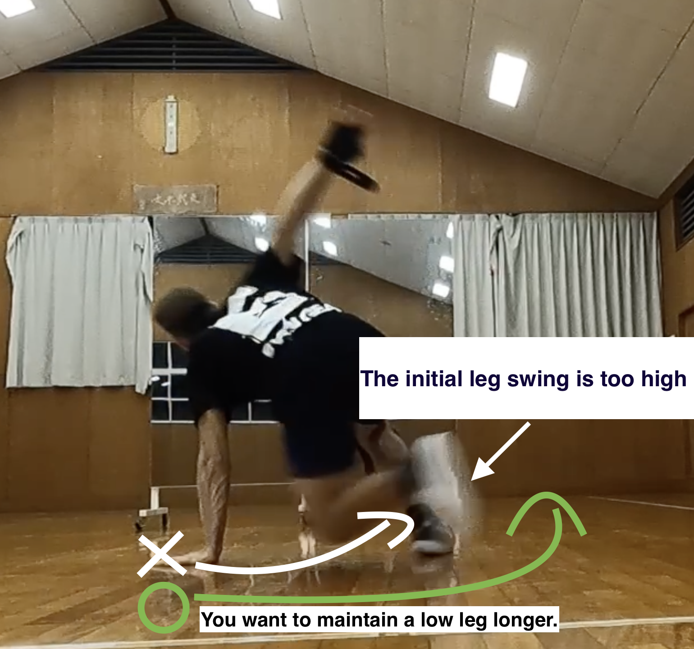
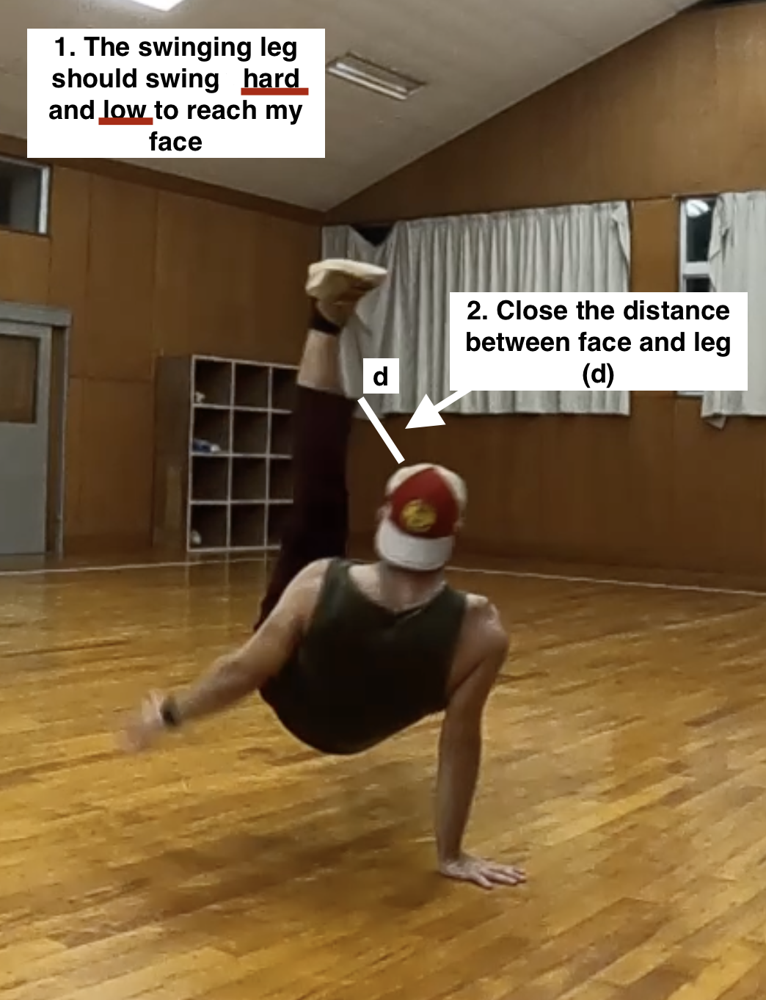

## Heads up

My specialty is breakdance, but feel free to read the parts that are interesting and are applicable to you. I'll be referring to breakdance as: "bboy".   <a href="#Footnotes" class="secondary-a"> 1.</a> 

&nbsp;

## Mindset 

Dancing exposes you to various and unusual body positions. Take pride in every move you do. Those parts of your body that are moving in harmony or chaos belong uniquely to you. Own your style and reach new heights of freedom. 

&nbsp;

## Support

 
### Stretching 

Through b-boying and especially training for flares, I came to truly appreciate stretching as an integral part of my life. Not only does it help you prevent injuries, it makes your moves cleaner. Mobility around the hips is especially important in power moves. I'm pretty tight around the hips, so I like  stretches that target them: pigeons, frogs and butterflies. I am one with nature alright. Also, from what I've seen, I try to aim for 3 sets of 30 seconds per stretch. I don't have a specific stretching routine, but I know the ones I need to target the stiffness I have. For hand stretches, I usually compound them with walking.

&nbsp; 

### Walking and Conditioning 

When you’re not dancing, walking and conditioning exercises are great substitutes. I want to feel light when I dance, so I try to make an effort to keep my weight in check. Walking is top-notch because it’s sustainable for life. I sometimes bring a bright yellow resistance band to stretch my fingers, hands and arms. Take care of your gentle hands, you don't realize the strain you're putting on them. If I have few extra calories to burn, I like to jump rope.  Fun fact, in French, jump rope translates to corde à danser which literally means dance rope.

&nbsp;

## General tips

- Pick a theme to focus on during your practice sessions.
- Name your moves and create combos.
- You don't always have to dance on beat. You listen to the beat and choose the timing that's appropriate for you.
- Record yourself dance and describe what parts you like or want to touch up.
- Watch people of all skill levels.
- Dance around an obstacle. Place a water bottle on the ground and try to dance around it without touching it.

&nbsp; 

## Theme examples

I've based this on footwork, but toprock works too. You can get creative with theme theme you set yourself.

&nbsp;
### Footwork 
- X-Step variations (e.g., 4-step variations).
- Experiment with different types of footwork. Some people like to do their steps close to each other and others like to go  wide. 
- Vary the speeds of your steps.
- Dance around an obstacle. A water bottle is a good one.
- Take space / Restrict space.
- Vary the direction you dance in.
- Restrict certain movements (e.g., no use of knees, spins).
- Practice only one move. 

&nbsp;

One version of a session: 

1. Stretch.
2. Light footwork and toprock warmup.
3. Theme-based drills -  Restricting my left hand.
4. Showcase - Incorporate what I did in 1 minute rounds.
5. Random moves - Have fun dancing.
6. Stretch.

&nbsp;

## Power move: Flare Tips

 It's one of the power moves I truly find captivating. I still can't do them well, but I'll say my piece on them. It's no surprise that 'powers' require a lot of dedication and patience. It's perfectly fine to erupt in frustration when you swing your legs and fall flat on your behind. I've mentioned above that owning your style is a healthy mindset to have, but this is also true for the way you fail. The way your body struggles at flares, and your approach on how to fix them is unique. Checking YouTube videos, analyzing your videos frame by frame, uploading them online for feedback are all valid methods. I recently discovered there was a subreddit for bboy and users post 'what am I doing wrong?' videos. It takes a lot of to courage to actively seek for feedback like that.

 &nbsp;

### Before getting your legs dirty

- Stretch. I recommend improving your pancake stretch mobility. A flexible body goes a long way. 
- Dips, tuck planches and side planks help too. (Variable)
- Wear shoes you don't mind destroying. 
- Don't wear shorts unless you like scraped knees. I'm cool with that.
- Try to count the number of flares you do per session.  I like to count them dramatically or theatrically. When I complete 10, I mark them in a small notebook. The physical act of writing makes it feel more rewarding than typing it on a notes app.

&nbsp;

### 意識ポイント 1: Initial leg swing <a href="#footnotes">  2.  </a>

The very first movement you should turn your attention is your initial leg swing. Swinging  your starting leg <u>**hard**</u> and <u>**low**</u> in a </u> <u> **circular**</u> motion will make a huge difference. If you start too high, you're bound to fall. Try to overshoot how low you can go. Then, you focus on getting the swinging leg as close to your face as possible. Finally, you consciously try to pull your other leg in. It's easier if you focus on your hips though.

&nbsp; 

&nbsp;

### 意識ポイント 2: Hands and Arms

Keep your hands pushing against the ground at all times. It's easy to forget. I try to place my hand at the same time I swing my leg. Furthermore, you always want to use your arms to lean your body in the opposite way of your legs. For example, if your legs are facing the right side, you should learn your body left. The idea comes from <a  class="secondary-a" href="https://www.youtube.com/playlist?list=PLpJRb_Th3m5SK6LaTv4kOTlxPnCX_jojD"> pigmie's flare playlist </a> on Youtube.

 

### 意識ポイント 3:  Hips

When I showed a friend of mine the move, he told me to not hyperfocus on the way I swang my legs, but rather focus more on how I rotate my hips. Initially, I was obsessed in trying to get a decent leg swing, but his advice was golden and changed the way I saw the move. An outsider point of view does great wonders.

&nbsp;

### 意識ポイント 4:  Keep the flare going

Even if you fail the move, don't stop the movement. Quickly  restart the flare from the position where you landed.

&nbsp;

### 意識ポイント 5:  Don't force it.

Don't force it. Slow down, breathe and try again when you're in a calmer state.

&nbsp;

## Footnotes

1. The  <a class="secondary-a"  href="https://en.wikipedia.org/wiki/Breakdancing"> wikipedia </a> page puts the parentheses after the definition (when performed by men) which made me chuckle the first time I read it. You can also use b-girl (when performed by women).

2. 意識ポイント is a term I coined for myself. 意識 (ishiki) means consciousness in Japanese and ポイント is point. It's my way of saying ''point to focus on''. Ishiki is a nice word.