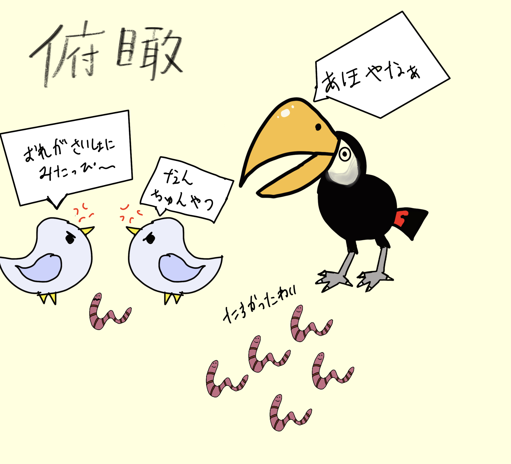
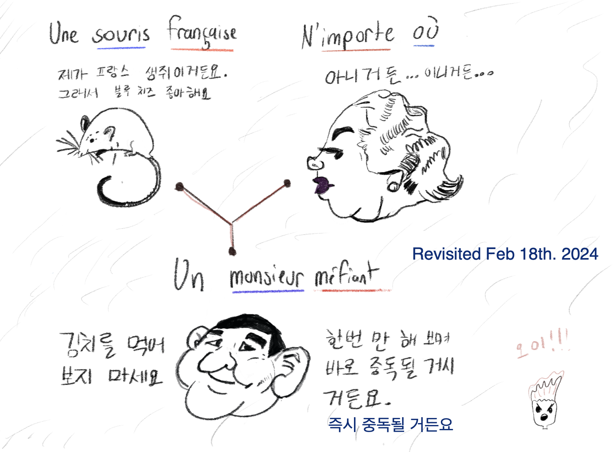

## Heads up
 

 In this post, I want to try to present my views on language learning in an organic way. I feel like anything you want to learn online these days is coated in too much fluff. I understand the appeal of using buzzwords like "hack" and "top XYZ tips" from a business perspective  <a class="secondary-a" href="#footnotes"> 1. </a> . This is the world we live in. However, I'm taking this opportunity to express and organize my ideas on the subject without cheapening the process and overwhelming you.

&nbsp;

## Mindset

It's not supposed to be clear-cut, but try to define the fluency you want to achieve in relation to how you want to use the language. If speaking with locals is enough for you, why not stop there? If you want to read books in your target language, you should perhaps invest time reading and consciously expanding your vocabulary and grammar. How about writing an essay on a topic that touches you?  

&nbsp;

In my experience, I decided to learn Japanese   <a class="secondary-a" href="#footnotes">2. </a>  because I wanted to play games and read manga in their original language. From there, my interest naturally branched out into other areas.

&nbsp;

## What's relevant to you?

 I don't recall any situation in my life where I had to say meerkat in Spanish. I frankly don't care about mentally hoarding vocabulary and expressions unless I'm exposed to a situation in which I have to use them. Although it's not a bad idea to expand your repertoire of essential words, I suggest balancing it out with words that are relevant to your world. A good rule of thumb I use is: "If I had to talk about my day to someone or  describe an experience I want to share, what words and expressions would I need in order to do so?"
 
 &nbsp;

Other examples include  cherry-picking lyrics of a song you like or mimicking funny lines you found on a TV show and making them your own. In my case, there's a Korean cartoon called Hello Jadoo on YouTube and the expressions they use are hilarious. This pushes me to write down new words and just repeat the funny lines. Essentially, consume the media you're attached to actively or passively depending on your energy levels and mood. You'll find the words and expressions you like and want to use. You know what you've become? Curious.  

 &nbsp;

### Let your curiosity guide you: How?

On a fundamental level, it boils down to asking: 

How can I say <b><u>word</u></b> in  <b><u>target language</u></b>?

 
&nbsp;

and then it cascades to : 

How can I say <b><u>sentence</u></b> in  <b><u>target language</u></b>?

 
&nbsp;

Is there another way I can say <b><u>sentence</u></b> in  <b><u>target language</u></b>?

 
&nbsp;

Does  <b><u>word</u></b>  work in  <b><u>context</u></b>?

 

&nbsp;

## Methodology 

### Free recall 

 In the context of language, assume you have 10 words to practice. You memorize them with whatever tricks you have up your sleeve. Then, take out a blank piece of paper write all 10 10 words from memory. Finally, you compare and see which words you missed. You repeat that process until you're satisfied with your results.  <a class="secondary-a" href="#footnotes"> 3. </a>   If you're a musician, you can see it as playing part of a song from memory after reading your score. Down the line and after a lot of practice, you'll have increased your speed of retrieving information and you'll be able to pump out words faster from memory. It's not a hack, it's not a shortcut, it's just a method that works.   <a  class="secondary-a" href="https://www.youtube.com/watch?v=FatnXnlwAc4"> Benjamin Keep </a> demonstrates  <a class="secondary-a" href="https://en.wikipedia.org/wiki/Free_recall"> free recall </a> in a concise manner. 

&nbsp;

Dictations could serve as more complex forms of free recall, since you're relying on language knowledge to write sentences. There's even a certain speed you have to follow. It's challenging and worth trying. If I bring back the music example, it's like playing the measure with a metronome.

&nbsp;

### Flashcards

Flashcard programs like Anki are often used by language learners. I used Anki a lot, and I do feel like I should use it more since it's a nice way to increase vocabulary and cache some sentences into my brain CPU. The downside, unfortunately, is the laziness it can create. You can become overly reliant on flashcards and assume you know the words by skimming through them quickly. Additionally, the act of just filling and customizing your decks can make you feel like you've accomplished something when in reality, it doesn't. If you're honest with your usage, it'll do its job. It's meant to support your learning, not become the main hub of it.  If it doesn't work for you, don't force it.

&nbsp;

### Combine your skills

You don't have to see language as a unit in isolation. 
Back in 2023, I wanted to learn how to draw and it occurred to me that I could turn some of my language notes into drawings.  <a class="secondary-a" href="#footnotes"> 4. </a>  What fun and creative methods can you come up with?

&nbsp;

&nbsp;

###  Write your thoughts
Ultimately, using whatever mental effort it takes to write or say your thoughts on a subject in any language is the toughest and most intriguing  exercise — it's almost never 1:1. Sometimes, you can't directly translate something complex without first considering the context surrounding it. I read the book "Pleased to Meet Me: Genes, Germs, and the Curious Forces That Make Us Who We Are by" by Bill Sullivan in both English and Korean. It must've taken considerable skill to translate the book from English to Korean given its idiosyncratic and lighthearted writing style. Bill Sullivan writes “I’m happy as a clam reading a book about the ocean’s creatures, but others wouldn’t be happy unless they were wrestling sharks.” If you were to translate this to Korean, you'd have to change the "as a clam"  to "very" since the former only exists in English. But, could there be a similar expression in Korean? 

&nbsp;

## Random thoughts

Whenever someone asks, “How many languages do you speak?” I hesitate to answer honestly — because I feel like I’m lacking in all of them. I’d rather answer the question: “What can you do with those languages?” That mindset applies to everything I know. 

&nbsp;

&nbsp;

&nbsp;

## Footnotes

1.  Unless it's part of your job or you're the wizard of polyglots, it's unrealistic to maintain many languages at consistent levels. That's why I roll my eyes (sneer, sometimes) when I see headlines presenting people that speak an <b> implausible number of</b> languages. 

2.  I followed suit for Korean and Spanish because it turned out that I wholeheartedly enjoyed the process. 

3. Your ego is a bee that could decide to sting you if you make a mistake, but that's just part of learning. Reap the honey instead.

4.  One aspiration I have is creating multilingual cartoon skits and voice act different characters. I love linking words from different languages together. 