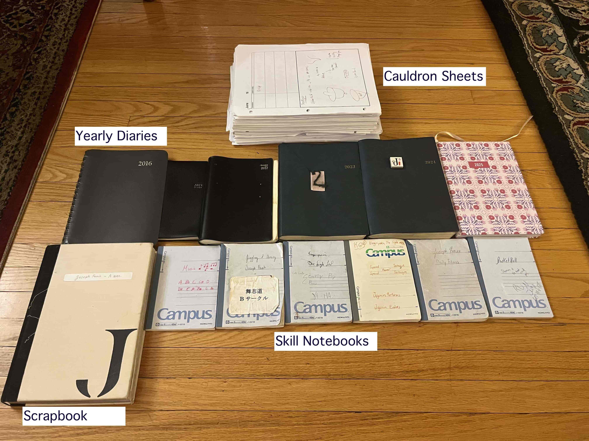

## Writing for myself

I enjoy keeping track of my experiences and memories. There's a big chance in my day that I'll jot down a flash thought or event no matter how small it is. Besides your genetic code, your memories and experiences are what distinguishes you from everyone else. The fact that you're devouring a mind-blowing croissant on August 15th 2025 at 8:45AM will never happen again - only your memories of it will remain. Obviously, there's no obligation to track everything everyday which means that there's no end goal, there's no rule on what you should write — you do it for your sake, because it ever so feels right and liberating. Personally, it was only from 2021 that I progressively started to write more out of necessity. I'm inclined to say that it made sense for who I was as a person.  <a class="secondary-a" href="#footnotes" >1. </a> 
&nbsp;

&nbsp;

## Writing for others

Journaling is very different from blogging. When it comes to writing or talking to myself, I'm a machine, but when it comes to relaying my thoughts through text, I feel like there's a lot more hurdles to overcome. One of the reasons I started blogging was to jump these hurdles and get better at organizing and conveying my thoughts for others. When there's an audience, we have to consider the tone and vocabulary we employ, because it has a direct influence on how others will perceive our message. As a consequence, we have to live with the fact that we won't be able to communicate to the letter everything inside our heads, but that we can get closer and closer through many iterations of practice. I realized that it's about being comfortable leaving out or changing elements and taking risks in your writing. <a class="secondary-a" href="#footnotes" >2. </a> If you ask me, I want to be concise and show my colours through writing, but not at the expense of boring myself with words I always use or sounding like a fancy-pants scholar. 

&nbsp;

##  How I keep track

I'll explain how I journal and how my journaling changed over time through the various medias I use: 
- yearly diaries
- pocket notebooks for skill development
- Scrapbook "JBook" 
- Cauldron sheets

&nbsp;

### Diaries 

My main outlet for writing is my yearly diaries - they act as my second brain.  I experimented  with different formats, but the NOLTY brand I used for 2023 and 2024 takes the cake and any  desserts left on the table <a href="#footnotes">3.</a>.  This year, I'm writing in a Letts of London diary. It's less thick and different than the previous two which forces me to write less for more. 

&nbsp;

### Pocket notebooks 

 I use  pocket notebooks for the skills I  <a  class="secondary-a" href="/about"> train</a>.  For example, when engaging in  activites like juggling or dancing, I'd rather open my notebook and refer to notes about certain movements than take my phone, enter a pin and go on an app — I'm X actions faster with a notebook. Furthermore,  there's more freedom writing with a pen/pencil, since you can use the page however you want by writing wherever, adding doodles, scratching words —  it feels organic. That's not to say that I don't use my phone or computer for note-taking or journaling, I simply mix the strategies based on the scenario I'm in. 

 &nbsp;

Once I fill a notebook or a diary, I summarize the contents on <a href="https://obsidian.md/" class="secondary-a">Obsidian</a>. Before discovering it, having all my writings spread out was overwhelming. I had fragments of overlapping skill advice spread across too many books, so Obsidian was a terrific way of tying them all together. <a href="#footnotes">4.</a>  In brief, I write first and then go digital.

&nbsp;

### J-Book

In 2023, my sister gifted me a chunky notebook, and I had the idea of turning it into a scrapbook. Compared to diaries, there was no preset format - it's about 300 pages of blank sheets where you could go wild. Anything that didn't fit inside my yearly diary would end up in the all-purpose J-Book. I filled it with book and YouTube video summaries, self-analysis, heartwarming messages from students, code, music notes etc.

&nbsp;

###  Nostalgia vs Skill: Cauldron Sheets

As my skill repertoire grew over the years, I had accumulated technical notes scattered across many different notebooks, diaries and files. Diaries are great for managing day flow and general commentary, but I wanted to create an all-encompassing medium where I would exclusively write about what skills I was practicing during my day. The whole point was to separate nostalgia and skill and make my diary less cluttered. 

&nbsp;

From February 2024 to August 2025, I created and experimented with sheets I named "cauldron sheets". The sheet is the "cauldron" where I mix all skills in. They're basically excel sheets I print out with custom row headers. The reason I print them out is because I feel good writing and drawing on them. I use my <a> <a class="secondary-a" href="/projects/diary"> diary </a> app to store the information later on and feed the content to AI to make skill summaries of the months. It would be cool to make my own model though. 

&nbsp;

The latest version I use has a skill code, a main activity and its associated downtime. If I'm working on a programming project and I get stuck, I'll most likely decompress by playing guitar. The code for that is MP: Music and Programming. There's a free section too where I can draw and write extra comments. If it's not enough, I use the back of the sheet. By the way, can you guess what DJ stands for?

&nbsp;

<b><u>Cauldron Sheet Example</u></b>

  <table class="border border-black border-collapse w-full text-left">
    <thead>
      <tr>
        <th class="border border-black px-3 py-2"><u>Code</u></th>
        <th class="border border-black px-3 py-2"><u>Downtimes</u></th>
        <th class="border border-black px-3 py-2"><u>Main Activity</u></th>
      </tr>
    </thead>
    <tbody>
      <tr>
         <td class="border border-black px-3 py-2">MP</td>
        <td class="border border-black px-3 py-2">Practice guitar scales</td>
        <td class="border border-black px-3 py-2">Work on Diary Project Post</td>
      </tr>
      <tr>
         <td class="border border-black px-3 py-2">DJ</td>
        <td class="border border-black px-3 py-2">Stretch hip flexors</td>
        <td class="border border-black px-3 py-2">Breakdance/Juggling session in the park</td>
      </tr>
    </tbody>
  </table>
  Free Section
  

  
  

There are other versions too with the location, tools used, and time spent, but I figured I didn't really care as I experimented.  I don't consistently keep track of the time I put for each activity, but I know I'm working on it and that it's compounding in the shadows. Once you trust yourself and know what you want to work on, you don't need extensive proof of it.

&nbsp;

### Vocal Treasures

In 2023, on a stroll in <a  class="secondary-a" href="https://www.the-kansai-guide.com/en/directory/item/12020/"> Katakami</a> park, I randomly relistened to a recording I found from 2016, and I thought to myself: "Wow, it's amazing to know that a younger version of me knows me really well". The way I talked to myself, and the way I felt about certain things didn't drastically change during those 7 years. It was liberating.

&nbsp;

When I don't have pen and paper, I like to record myself on my Apple watch/phone  when I go on walks for instance.  <a href="#footnotes">5.</a> I know many people don't like listening to their voice, but it's not a problem for me. I call these recordings "Vocal Treasures", and I have over thousands of them that I've organized and relistened to while cleaning or walking. It's a great form of self-therapy and entertainment if you get used to it — it's your very own personal podcast. 

&nbsp;

## Final words

As of today, I'm mainly using my 2025 diary and migrating my cauldron sheets to my diary app. For the cauldron sheets, I'm not sure if I'll keep doing them, since I've accumulated enough evidence of what I like to do, how I should do it and what I should do to push myself to the next level. The way I approach writing is changing every year. Now, I want to focus on blogging.

&nbsp;

## Footnotes

1. Writing fits well with how I'm wired as a human being, because I have a lot of thoughts stuck in my head.
2. The whole inner dialogue inside our heads is surreal when we write — "I should say this that way",  "You know what? I don't like this sentence", "This word's snazzy". 
3. From 2023, I started assigning themes to the years. 2023 was the year of consistency, 2024 was trust and 2025 is feedback. 
5. I try to  keep version of my vault  I find relevant to my current situation i.e. the skills I'm focusing on. Hogging notes just for the sake of having notes holds no real value - if I don't need it right now, I'm ok casting it aside. 
5. I find that it's easier or more accessible to listen to your voice and feel your emotion compared to reading.

