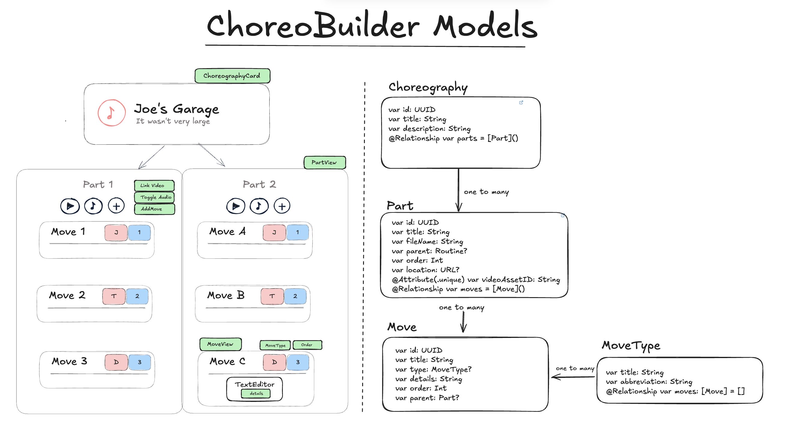

This post is being updated as I work on ChoreoBuilder. Everything below consists of quick drafts of text filled with typos and ideas. This message will disappear once this post will be complete. 

&nbsp;

## Why?

When I was living in Japan, I was given precious opportunities to perform in festivals and community events in the <a href="https://en.wikipedia.org/wiki/Kihoku,_Mie" class="secondary-a"> town </a> I was living in.<sup class="secondary-a" href="#footnotes" >1.</sup>  Whenever I create a choreography for a tune, I split the audio into parts and write notes on my iPad on what moves or transitions I can do. My motivation with ChoreoBuilder was to help performers streamline this process.

&nbsp;


## Main idea

Users create choreographies by uploading audio files of a song they can clip into parts either through their preferred software or the clipper integrated in the app. These parts can be renamed and reordered before finalizing the creation of a choreography. 


&nbsp;

When created, every audio file in the choreography becomes linked a part (PartView) in which users can: 

1. add, rearrange and delete moves of types they specify. Every move comes with a TextEditor.
2. toggle and control the audio specific to that part. 
3. Link a video from their photos library for reference.

&nbsp;


### Process and Terminology

Although we mostly hear the term choreography with dance, I want to specify that in the context of my app, it's interchangeable with routine, performance, act and any other art you create through movement. 


&nbsp;


## Challenges

This is project really challenged me to learn about some of the more advanced Swift mechanics especially concurrency and AVAudioPlayer. I'm putting them in bullet points here, but I took quite a few bullets mentally from trying to implement them.

### Programming
- How to link audio files to each part and delete those parts
- How to reorder parts and update their order with delegates
- Creating an expandable audio player and audio trimmer (AudioPlayerModel and AudioTrimmerModel)
- Utilizing concurrency to manage custom loops, countdown timers, audio trimming


### Design


- Make reordering moves intuitive
- Where to add context menus for deletion, where should the user be able to delete?
- Where to put audio controls


&nbsp;


## Models 




&nbsp;


## Uploading a Choreography

Initially, the main idea of this app is 

- Getting audio files from your Files to create separate parts with them
- Copying files to your sandbox.


&nbsp;

## UI/UX Concerns 

In ChoreoBuilder, inside each part, you can rearrange your moves by holding and dragging them. Every move (MoveView) is associated with an order and a type. To delete the move, you hover on the number to make a context menu appear before. Before I had the context menu on the move itself which made it difficult to drag since the context menu would interfere with it.


&nbsp;

## Playing with AVAudioPlayer


### Cancelling tasks 


Inside the audio player, I've integrated a countdown timer and a custom loop feature. If users have bigger audio files they want to loop through, they can set a custom loop between two marks. The countdown resets every time passes the second mark. However, if the user willing drags the audio past the second mark multiple times, we have to make sure to cancel the loop tasks because otherwise, a stack of delay tasks would happen.
```swift
let task = DispatchWorkItem { [weak self] in
        self?.audioPlayer?.play()  
    }
loopPlayTask = task
DispatchQueue.main.asyncAfter(deadline: .now() + TimeInterval(delay), execute: task)
return
```


### AudioPlayerModel


Every part comes 
```swift
//PartView
if let partURL = part.location {
        AudioPlayerView(audioFileURL: partURL, partTitle: part.title)
    }

```


### Controls 


Besdies the normal functions an audio player has, I wanted to implement a custom loop and delay feature. 
Functions I implemented:

1. play
2. seek forwards and backwords
3. loop
4. custom loop: displaying markers above the player
5. delay with timer 
6. speedRate 


Add a graphic of the separate edge cases here


### Custom Slider


### Extras

2.  Creating a sliding text with two GeometryReaders.

```swift
struct SlidingText: View {
    let text: String
    let speed: Double = 30
    let spacing: CGFloat = 50
    
    @State private var offset: CGFloat = 0
    @State private var needsSliding = false
    @State private var textWidth: CGFloat = 0
    
    var body: some View {
        GeometryReader { geo in
            HStack(spacing: needsSliding ? spacing : 0) {
                Text(text)
                    .fixedSize()
                    .background(
                        GeometryReader { textGeo in
                            Color.clear.onAppear {
                                textWidth = textGeo.size.width
                                needsSliding = textWidth > geo.size.width
                                
                                guard needsSliding else { return }
                                
                                let segmentWidth = textWidth + spacing
                                
                                withAnimation(.linear(duration: segmentWidth / speed).repeatForever(autoreverses: false)) {
                                    offset = -segmentWidth
                                }
                            }
                        }
                    )
                if needsSliding {
                    Text(text).fixedSize()
                }
            }
            .offset(x: offset)
            
        }
        .clipped()
        .frame(height: 20)
    }
}

```


&nbsp;


## Things left to do 

- Make a logo
- Make a nicer backgrounds
- Onboarding view


&nbsp;

## Footnotes

1. For reference, I juggle and dance to tunes I learn. For example, what I like to do is learn a song on piano and then build a dance/juggling choreography with it.
