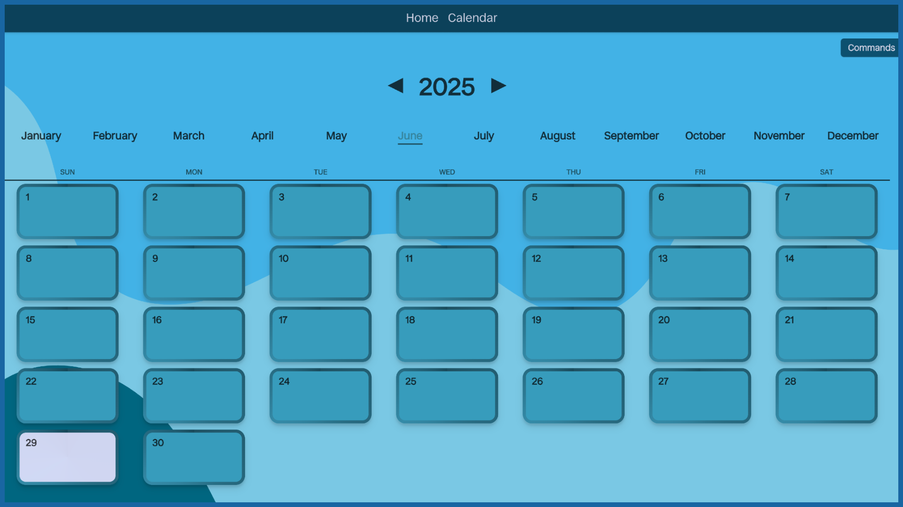
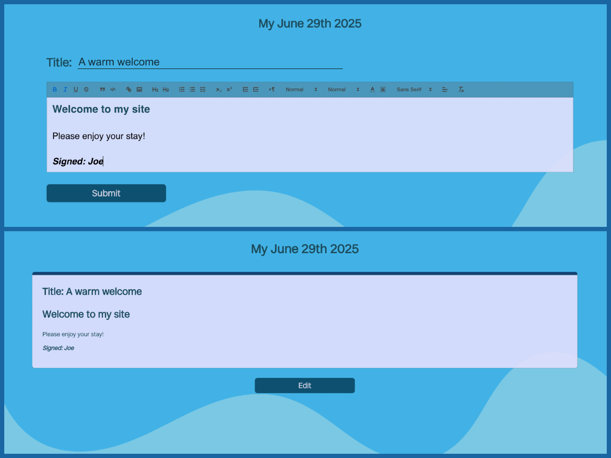
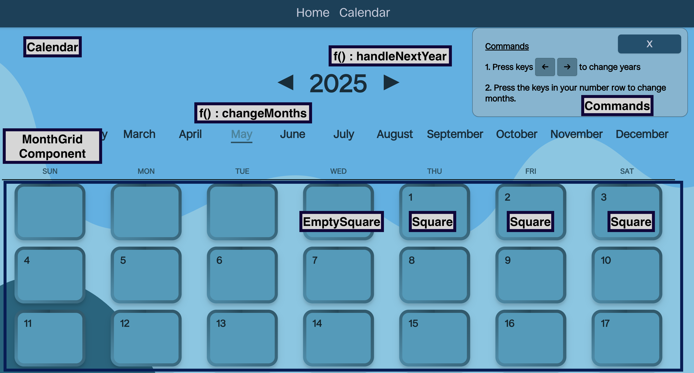
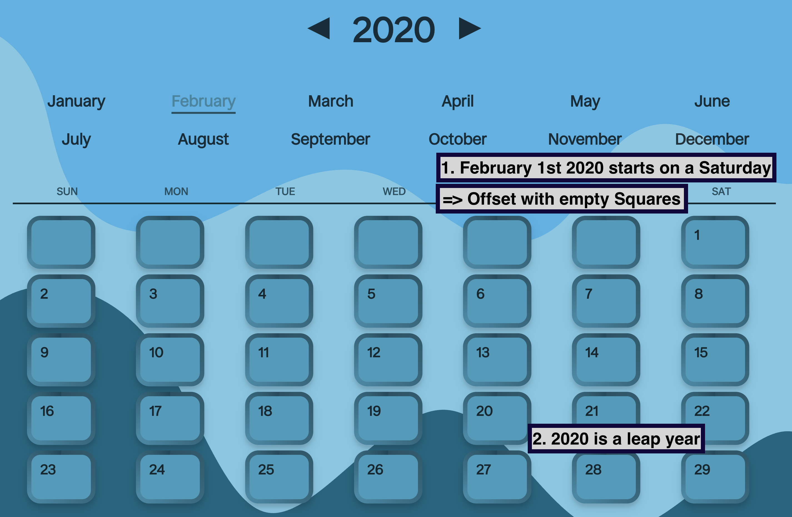
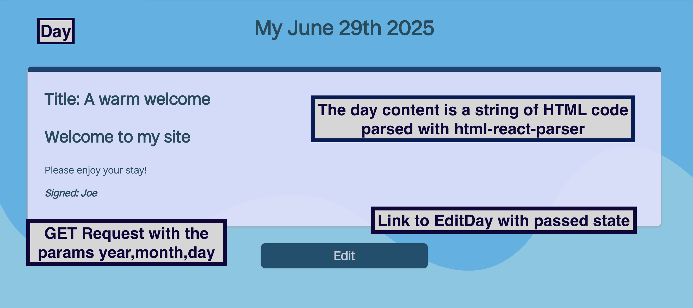
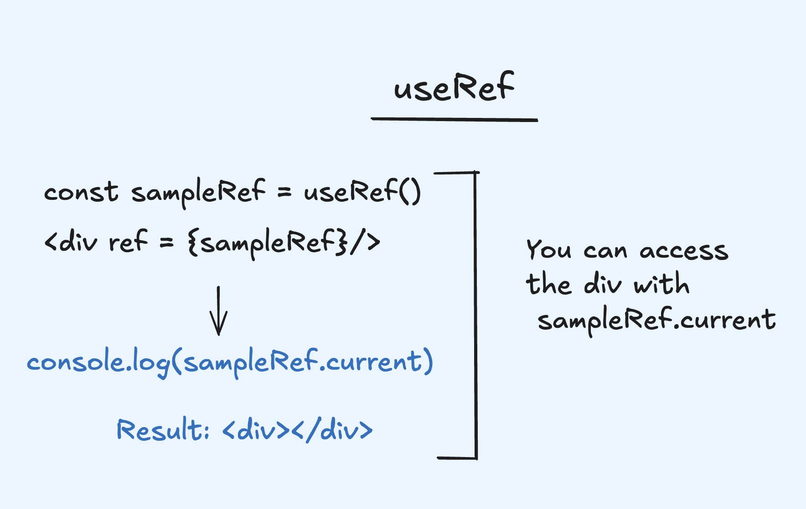
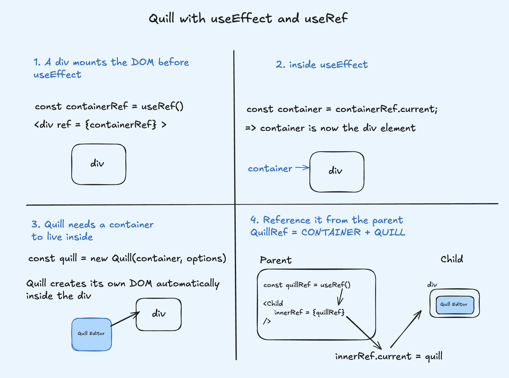
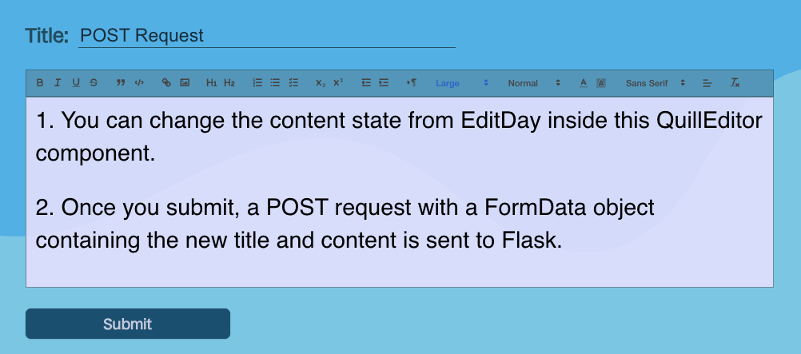
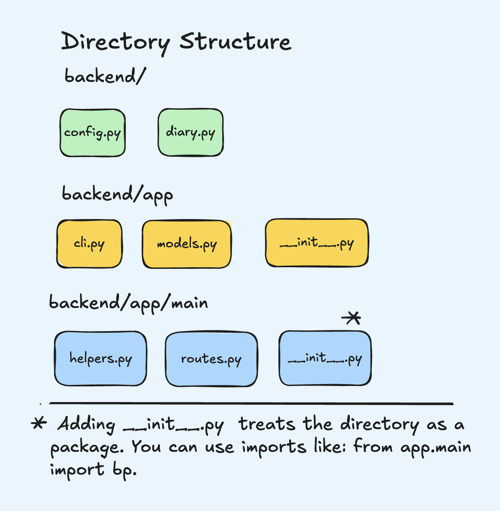
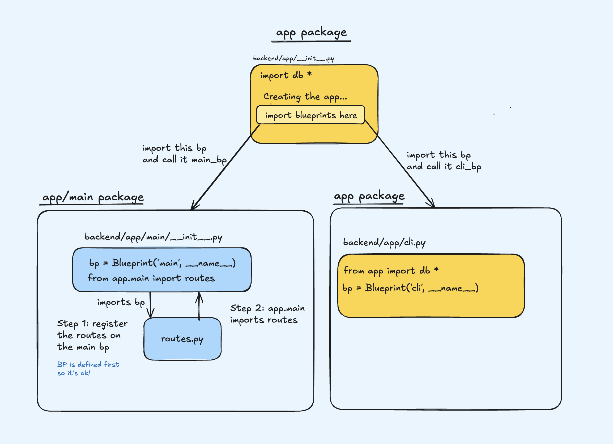

## Quick Glance
A very light blue calendar. &nbsp;

&nbsp;



&nbsp;



&nbsp;


## Why?

I've been journaling with pen and paper ever since 2021, and I thought it would be good idea to make a lightweight journaling app using React and Flask to store some of my thoughts. There’s something whimsical about storing your memories in a SQL database. It was only later that I discovered the power of Obsidian and Astro. Between you and me, I prefer the smell of ink.

&nbsp;


## Routes and Components

In Grid Diary, the main React components I want to discuss are:

1. Calendar: Contains the main functionality to navigate to the appropriate day.
2. Day: Shows the contents of the day parsed to HTML using html-parser.
3. EditDay: Integrates Quill to format text to HTML and send it to Flask.

&nbsp;


These components are rendered on the following routes using the BrowserRouter from React Router. 

```jsx
<div className="App">
  <BrowserRouter>
    <Header />
    <Routes>
      ...
      <Route exact path="/calendar/:year/:month" element={<Calendar />} />
      <Route exact path="/calendar/days/:year/:month/:day" element={<Day />} />
      <Route exact path="/calendar/days/:year/:month/:day/edit" element={<EditDay />} />
    </Routes>
  </BrowserRouter>
</div>
```
&nbsp;


With BrowserRouter, you can:
1. get the URL parameters with the useParams hook. 
2. Pass state around from one component to another: `<Link state = {{...}}>`.
3. Receive the said state with the useLocation hook. 

&nbsp;

Don't worry too much about it, you'll discover their applications as you read (thanks). Without further ado, let's look at how state is handled in the Calendar component.

&nbsp;


### How to think about it?

Reference:



&nbsp;

To manage state inside Calendar, I had to think about:

- How to represent every month of a specific year 
- How to handle state changes for a different year 
- How to handle state changes for a different month
- How to integrate weekdays
- How to navigate to a specific diary entry
- And more...

&nbsp;

For a calendar, the big picture is showing an amount of squares based on the year and month we're on. In my case, Calendar renders a grid component which renders a number of squares. To achieve this,
we start out by declaring a calendar object of month and number of day pairs. 

&nbsp;

```jsx
// Calendar.jsx
const calendar = {
      "January": 31,
      // Leap year edge case 
      "February": isLeapYear(year) ? 29 : 28,
      "March": 31,
      "April":  30,
      "May": 31,
      "June": 30,
      "July": 31,
      "August": 31,
      "September": 30,
      "October": 31,
      "November": 30,
      "December": 31,
  }
```

&nbsp;

 If you have eagle eyes, you may have noticed that February is different. To handle leap years, we convenienly destructure the year with useParams — a hook returning key/value pairs of the route parameters. We then pass it to a helper function to determine if we need 28 or 29 days.  

```jsx
// Route:  '/calendar/2025/June'
const {year,month} = useParams() // year is '2025'
```

&nbsp;

### Handling state for  years and months
Now that we have our calendar object with month and year parameters, we can set any required regular and state variables. Mainly, we have the currentYear and currentMonth state variables. The year parameter is parsed to an int, and Object.keys() turns the calendar's 'months'  into an array. We track month changes with an index.


```jsx
// Calendar.jsx
const months = Object.keys(calendar)
const [currentYear, setCurrentYear] = useState(parseInt(year,10))
const [index, setIndex] = useState(Object.keys(calendar).indexOf(month))
const [currentMonth, setCurrentMonth] = useState(months[index])
const [days, setDays] = useState([])
// And more...
```


&nbsp;


Through either button clicks or <a class="secondary-a" href="#extras">key press</a> events, we manage the states of currentYear and currentMonth with the following functions:

```jsx
// maxYear is new Date().getFullYear()
// minYear = 2000  (Based on my database)
// Watch out for stale closures.
function handleNextYear() {
    setCurrentYear(prev => {
        if (prev + 1 > maxYear) return prev;
        return prev + 1;
    });
}

function handlePreviousYear() {
    setCurrentYear(prev => {
        if (prev - 1 < minYear) return prev;
        return prev - 1;
    });
}

 function changeMonth(newIndex) {
        setIndex(newIndex)
        setCurrentMonth(months[newIndex])
    }

```

&nbsp;


We use functional updates such as setCurrentYear(prev => prev + 1) to increment and decrement currentYear.

&nbsp;

 Early on, I made the mistake of writing setCurrentYear(currentYear + 1). This resulted into a stale closure in my keypress useEffect — the keyboard stopped responding after I pressed the arrow keys because the effect only remembered the old value of currentYear. 


&nbsp;

### From Calendar to Day
The goal is to select a square that shows  a specific a diary entry. For our layout, there are few considerations to make whenever the month or year changes:

1. What weekday the 1st of a given month and year falls on, e.g., February 1st 2020 falls on a Saturday.

2. Setting the number of days for each month while accounting for leap years.

&nbsp;


&nbsp;


This is done with useEffect, because we want to be able to re-render Calendar every time the month or year changes. The getDayOfTheWeek is a helper function that returns a number between 0-6 (Sunday to Friday) for a specific year and month. We set our days state with createDays: a function that returns an array of integers.

```jsx
useEffect(() => {
    const isFebLeap = currentMonth === "February" && isLeapYear(currentYear);
    // Returns any integer from 0 to 6
    setFirstDayOfTheMonth(getDayOfTheWeek(currentYear, index));
    
    // For January, days =  [1, 2 ,3 .... 31]
    setDays(
        isFebLeap
            ? Array.from({ length: 29 }, (_, i) => i + 1)
            : createDays(calendar[currentMonth])
    );
}, [currentMonth, currentYear]);

```

&nbsp;


Finally, we create a MonthGrid component which is just a container that renders the appropriate number of Squares. 

```jsx
<MonthGrid  
    key={currentMonth}
    // If offset is 2, we need 2 empty squares. 
    offset={firstDayOfTheMonth}
    year={currentYear}
    month={currentMonth}
    days={days}
/>

```
&nbsp;

The props are:

- key: the current month we're on. 
- offset: Used to create EmptySquares.
- year: currentYear 
- month: currentMonth
- days: Every day transforms into a Square 

&nbsp;

And in MonthGrid, we map through our days to create the corresponding number of Square components defined as:

```jsx
<Square 
    key={day} 
    day={day} 
    month={props.month} 
    year={props.year} 
/>
```
&nbsp;

We fiddle around and finally  pass down the year, month and appropriate day from Calendar to MonthGrid to Square. The Square is merely a link to a Day component:

```jsx
<Link 
    to={{ 
        pathname: `/calendar/days/${props.year}/${props.month}/${props.day}` 
    }}
>
</Link>
```


&nbsp;


## Day Components

### From Day to EditDay
Once you select a square, you navigate to a Day component. 


&nbsp;

The Day component manages the dayTitle and dayContent states.  We  <a class="secondary-a" href="#get-request"> fetch </a> a diary entry from the database to initially set them. The content is formatted to HTML format using <a class="secondary-a" href="https://www.npmjs.com/package/html-react-parser"> html-react-parser</a>. 

&nbsp;


A diary entry in the <a  class="secondary-a" href="#database--cli"> database </a> has a string field for a day_title and a text field for day_content which are initially set to default_title and default_content. We edit them in the EditDay component. To do so, we rely on Link's state object. 


```jsx
<Link
  to={{ pathname: "edit/" }}
  state={{      
    edit_title: dayTitle,
    edit_content: dayContent
  }}
>
</Link>
```
&nbsp;

and in EditDay, we set the title and content received with useLocation().

```jsx
// EditDay.jsx
// Captures the state object from Link
const location = useLocation() 
const { edit_title, edit_content } = location.state;
const [newTitle, setNewTitle] = useState(edit_title);
const [content, setContent] = useState(edit_content);
```

&nbsp;

### Quill with React 
For editing content, <a  class="secondary-a" href="https://quilljs.com/docs/quickstart"> Quill </a> was a better choice than a boring  textarea. Because Quill  independently handles its own DOM Elements inside the container it attaches itself to, React doesn't need to boss it around. It's the perfect opportunity to wrestle with  <a href="https://react.dev/reference/react/useRefuseRef" class="secondary-a"> useRef</a>. I'll get my chair ready.

&nbsp;

The reference created with useRef() can be seen as tag you ultimately stick to a DOM element. In the figure below, we initialize a sampleRef (tag) and stick it to our div by adding the ref attribute to div. Thankfully, React does the work for us. We can then access the element with sampleRef.current. 



&nbsp;

Inside  EditDay (parent), we instantiate a quillRef which is going to be used to refer to the Quill container (Container + Quill). I want to emphasize that QuillRef is not the Quill instance that lives inside its container; it's the actual combination. In the code block below, the tag has yet to be associated with a DOM element which indicates that quillRef.current is null.

&nbsp;


```jsx
// EditDay.jsx
// This is going to refer directly to my Quill instance
const quillRef= useRef()
<QuillEditor
  innerRef={quillRef} // in React 19, you can just use ref
  content={content}
  onChange={setContent} // Child calls parent's setContent
/>

```

The props are:
- innerRef: gives EditDay (parent) direct access to the Quill instance.
- content: HTML string that can be edited.
- onChange: to call setContent when text changes inside the editor.

&nbsp;

As mentioned, QuillEditor in reality is a container for a Quill instance. Before we give Quill a home, we need to build it. Consider QuillEditor for now as just div that's tagged with a containerRef. The div can be accessed with containerRef.current. 

```jsx
// QuillEditor.jsx 
// This div is now TAGGED with containerRef. 
function QuillEditor({ innerRef, content, onChange }) {
  const containerRef = useRef();
  return <div ref={containerRef} />;
}
```
&nbsp;

Only after React finishes rendering do we need to initialize Quill. This means we need a useEffect hook. We can't manipulate DOM events while the component is rendering. React creates the skeleton (the div tagged with containerRef) and the code inside useEffect gives the Quill instance its home.
```jsx
// QuillEditor.jsx 
// Inside a useEffect
// ...
const container = containerRef.current;
const quill = new Quill(container, options)
// You can only do this after the DOM rendered.
innerRef.current = quill

```

&nbsp;

innerRef then becomes the Container + Quill combo. If you don't need the parent to control the QuillEditor, you can simply create quillRef inside QuillEditor I implemented it both ways, but kept the version where the parent has access. 

&nbsp;


Summary:





&nbsp;

### Quill API

From Quill, I use:  
- text-change: Events API
- getSemanticHTML: Content API
- dangerouslyPasteHTML: Clipboard Module

&nbsp;


Quill's text-change event is triggered whenever the editor content is modified. When this occurs, the new content is converted to HTML with getSemanticHTML and passed to the parent via the onChange prop.  Additionally, since our content is a string of HTML, we want the appropriate formatting shown in the editor. This is done with the dangerouslyPasteHTML method.


&nbsp;

```jsx
// Listen, convert, set
quill.on("text-change", () => {
  const newContent = quill.getSemanticHTML();
  onChange(newContent);
});

// Omitting this editor shows a long HTML string in the editor
quill.clipboard.dangerouslyPasteHTML(0, content);


```

&nbsp;


The final result looks like this. Clicking the submit button sends a POST Request with FormData for containing a new day_title and day_content.




&nbsp;

## Flask and Blueprints

### Backend structure
At first, I had all my routes packed in a backend.py file which was chaotic not to say the least. I discovered how to use Blueprints by reading part XV of Miguel Grinberg's Flask Mega Tutorial<sup> <a class="secondary-a" href="#footnotes">1.</a></sup>. They are pieces of functionality that modularize your app. For example, you can have a CLI blueprint to handle all database related operations. Another blueprint could be used to store the routes that handle GET and POST requests. The figure below is how I organized my backend directory. 


&nbsp;



&nbsp;

diary.py creates an instance of the application inside backend/app/main__init__.py. We set the FLASK_APP=diary.py in a .env file. Fortunately, if you have load_dotenv installed, Flask is considerate enough to look for your environment variables. Anyhow, this is what the create_app function looks like.
&nbsp;
```python
from flask import Flask
from flask_sqlalchemy import SQLAlchemy 
from flask_cors import CORS  
from config import Config

db = SQLAlchemy()
cors = CORS()

# Application Factory called from diary.py
def create_app(config_class = Config):

    # __name__ is app 
    app = Flask(__name__)
    app.config.from_object(config_class)

    # Pair our app with DB and CORS
    db.init_app(app)
    cors.init_app(app)

    # This connects all the functionality inside main_bp to app
    from app.main import bp as main_bp
    app.register_blueprint(main_bp)

    # Same here.
    from app.cli import bp as cli_bp
    app.register_blueprint(cli_bp)

    return app

# This is in the bottom, because only once db is created can we 
# create models ModelName(db.Model)f
from app import models
```
&nbsp;

When working with Blueprints, it's important to understand the order in which you import your modules to avoid circular dependencies. I'll give two examples and include a figure:


1. In app.main.routes, your routes need to be registered on the main blueprint which means they need to import it from app.main. Once that's done, app.main needs to import those routes in order show the Flask app that they exist. There's no circular dependency between app.main and app.main.routes  because bp is already defined by the time you import it to routes. 

2. Inside app (package), we instantiate a db variable (SQLAlchemy instance) that's imported almost everywhere such as in app.cli, app.main.routes. That's why we need import the blueprints inside the create_app function and not on top. If we had put all imports on top, circular dependencies would have been happened between app and every other module that uses db.

&nbsp;



&nbsp;


### Database & CLI

The only table used is DiaryEntry with 4 fields: id, date, day_title and day_content. Initially, I considered using the date as a primary key because of its uniqueness, but I had to reconsider my decision. It would have been fine if I needed only one entry record per day, but what if I eventually needed two diary entries for the same date? Due to uncertainty, I just opted for id as a primary key. The to_json method returns an object of the entry which is useful to create Response objects for GET and POST requests. 

&nbsp;


```python
#models.py
from app import db

# nullable means that the column can't be empty
class DiaryEntry(db.Model):
    __tablename__ = "diary_entries"
    id = db.Column(db.Integer, primary_key=True, autoincrement=True)
    date = db.Column(db.Date, nullable=False)
    day_title = db.Column(db.String(100))
    day_content = db.Column(db.Text)
    
    def to_json(self):
        return {
            "id": self.id,
            "date": self.date,
            "day_title": self.day_title,
            "day_content": self.day_content
        }
```
&nbsp;

With CLI commands, we can easily do the necessary database operations. In the terminal, you run the commands by typing <u>flask cli command-name</u>. This is much more convenient than typing something like <u>localhost:5000/populate-days</u> in the address bar. It's also safe because only you can run it.

&nbsp;

DiaryEntry objects are added from the defined START_DATE to END_DATE. I arbitrarily chose the years from 2000 to 2100 — brimming with excitement to still be journaling at 100 years old. Jokes aside, we can create a date from a tuple in Python and increment dates with the date and timedelta classes from the datetime module. An alternative would have been to set the dates as environmental variables and write code to parse them instead of defining them as Python constants.

&nbsp;


```python
# cli.py
from flask import Blueprint
from datetime import date, timedelta
from app.models import DiaryEntry
from app import db
import click

bp = Blueprint('cli', __name__)
START_DATE = date(2000, 1, 1)
END_DATE = date(2100, 12, 31)

@bp.cli.command("populate-days")
def populate_days():
    """Populate the database with diary entries between 2000 and 2100"""
    start_date = START_DATE
    end_date = END_DATE
    current_date = start_date
    
    click.echo("Populating diary entries... ")
    
    
    while current_date <= end_date: 
        try: 
            new_entry = DiaryEntry(date= current_date, day_title = "default_title", day_content= "default_content")
            db.session.add(new_entry)
            current_date += timedelta(days=1)
            
        except Exception as e:
            click.echo(f"An exception has occured: {str(e)}")
        
        
    db.session.commit()
    click.echo("Succesfully added all the dates")


```

&nbsp;


### GET Request


Inside useEffect again, I can communicate externally with my server using axios to fetch my diary title and content <sup> <a class="secondary-a" href="#footnotes">2.</a></sup>. The GET request is sent once to the api/get_diary_entry route using the parameters obtained from useParams().  


```jsx
// Route: '/calendar/days/:year/:month/:day'
const { year, month, day} = useParams();

useEffect(() => {
  async function fetchDiaryEntry() {
    try {
      const response = await axios.get(`/api/get_diary_entry/${year}/${month}/${day}/`);
      const res = response.data;

      setDayTitle(res["day_title"]);
      setDayContent(res["day_content"]);
      setDate(res["date"]);
    } catch (error) {
      console.log(error.response);
    }
  }

  fetchDiaryEntry();
  // No dependencies, run the effect only once.
}, []);


```
&nbsp;

In Flask, route parameters are declared within angle brackets and then parsed into arguments for the get_diary_entry function. With a helper method, they are then formatted into a tuple used for querying. DiaryEntry is a subclass of db.Model, so we use the query and filter_by methods available to get the corresponding diary_entry. The result is converted to json with the to_json method available in the DiaryEntry class. We fulfill the GET Request by turning it into a Response object using Flask's jsonify. The jsonify turns the result into a Response object. Otherwise, we'd have to create it ourselves. 

 &nbsp;


```python
# Format, Query, Convert to JSON, return a Response

@bp.route("/api/get_diary_entry/<year>/<month>/<day>/",  methods = ["GET"])
def get_diary_entry(year,month,day): 
    
    
    date_to_query = format_date(year, month, day)
    diary_entry = DiaryEntry.query.filter_by(date= date_to_query).first()
    diary_entry = diary_entry.to_json()
   
    return jsonify(diary_entry)

# Without jsonify: Response(diary_entry, mimetype='application/json')  
``` 
&nbsp;


POST works in a similar way; we extract the information from the FormData object on the backend.


&nbsp;


### Migrating from CRA to Vite 

The app was originally created with CRA, but I migrated it to Vite using <a class="secondary-a" href="https://github.com/bhbs/viject"> Viject </a> and did a few touch ups. One difference I learned between CRA and Vite is how they each configure the proxy server differently. In CRA, you add a proxy field in package.json with your server's route. In Vite, you have a server configuration object with your specified route. When running flask, the server address is the 

```js
// CRA: package.json
"proxy": 'http://127.0.0.1:5000',
// VITE: vite.config.mjs
 server: {
      proxy: {
       '/api': 'http://127.0.0.1:5000',
    }
 }
```


&nbsp;

## Extras

### Flask run behind the scenes
This is overly simplified and I could very be wrong, but I'll try to present what I've found from endlessly looking at the flask package.

&nbsp;

What Flask does is create a way for you to run it in the terminal through its Click package.
Inside your flask script file in the virtual environment, you'll find:
```bin
from flask.cli import main
# ...
sys.exit(main())
``` 
&nbsp;

The main method called in that script is actually cli.main(). If we check cli.py in the flask package, we see that cli is an instance of a FlaskGroup, so we're doing FlaskGroup.main(). When initialized, FlaskGroup adds a run_command (Command object) inside a Group. That Command object itself stores a callback function waiting to be called to start the server. Initially, run_command is function that's been transformed into a Command object with the @click.command decorator  <sup> <a class="secondary-a" href="#footnotes">3.</a></sup>.

&nbsp;

There's a long inheritance chain when you look inside the package. FlaskGroup inherits from AppGroup which inherits from a lot of other classes right up to BaseCommand. The main method getting called in FlaskGroup lives inside the BaseCommand class. BaseCommand is in charge of creating a Context object, but in reality, its child MultiCommand is doing most the work. Long story short, MultiCommand parses the arguments from the terminal and checks if there's a matching Command inside Group. In this example:
1. The argument is 'run' 
2. The Command object  with 'run' is found in the Group.
3. The callback associated with it executed. 

&nbsp;

The magic is all in the the invoke method of MultiCommand.

``` python
# self refers to FlaskGroup and that can refer to many classes.
with self.make_context(prog_name, args, **extra) as ctx:
# make_context calls parse_args inside MultiCommand. 
# MultiCommand gets the corresponding Command and calls it inside invoke.
 rv = self.invoke(ctx)
```


&nbsp;


### Keydown with useEffect 


Refresher: the distinction between e.key and e.code is: 

- If you care about what the user is typing, use e.key.
- If you care about where the user is typing,  use e.code. 

&nbsp;


To change the years, the user can  press the left and right arrow keys. You don't have to think about that distinction with arrow keys, since they both output the same value for e.key and e.code ("ArrowLeft", "ArrowRight) across all keyboards. To change the months, the user can press the keys in the number row. It doesn't matter what value they return are as long as they're in the number row.

&nbsp;


 When Calendar mounts, it adds the event listener for  keydown events. When it unmounts, a cleanup function removes that very event listener. 

```jsx
useEffect(() => {
  // Map e.code to the appropriate month index
  const numberRowMap = {
    "Digit1": 0,
    "Digit2": 1,
    "Digit3": 2,
    "Digit4": 3,
    "Digit5": 4,
    "Digit6": 5,
    "Digit7": 6,
    "Digit8": 7,
    "Digit9": 8,
    "Digit0": 9,
    "Minus": 10,
    "Equal": 11,
  };

  const handleKeyDown = (e) => {
    console.log(e.key, e.code);

    if (e.code === "ArrowLeft") {
      handlePreviousYear();
    } else if (e.code === "ArrowRight") {
      handleNextYear();
    } else if (numberRowMap.hasOwnProperty(e.code)) {
      changeMonth(numberRowMap[e.code]);
    }
  };

  window.addEventListener("keydown", handleKeyDown);
  // Cleanup function when the component unmounts
  return () => window.removeEventListener("keydown", handleKeyDown);
  // Only need the effect once
}, []);
```

&nbsp;

### Date Regex

To add the prefix based on the day, we look at the last digit of the number and add edge cases for 11, 12 and 13.
```jsx
function addDayPrefix(day) {
    const firsts = /1$/;
    const seconds = /2$/;
    const thirds = /3$/;

    if (firsts.test(day) && day !== "11") {
        return "st";
    } else if (seconds.test(day) && day !== "12") {
        return "nd";
    } else if (thirds.test(day) && day !== "13") {
        return "rd";
    } else {
        return "th";
    }
}
```

&nbsp;


## Takeaways
- Solidified my understanding of useEffect and useRef. 
- Digging inside the Flask module made me revisit concepts of inheritance.
- Explaining and reading code is as difficult as writing it.

&nbsp;


## Footnotes

1.  Miguel Grinberg's  Flask<a class="secondary-a"  href= "https://blog.miguelgrinberg.com/post/the-flask-mega-tutorial-part-xv-a-better-application-structure" > tutorial </a> is an excellent resource.

2. I could have also used the native API fetch. I didn't know the difference at the time.

3. The conversion from function to Command happens on import. In Python, importing executes the module.

