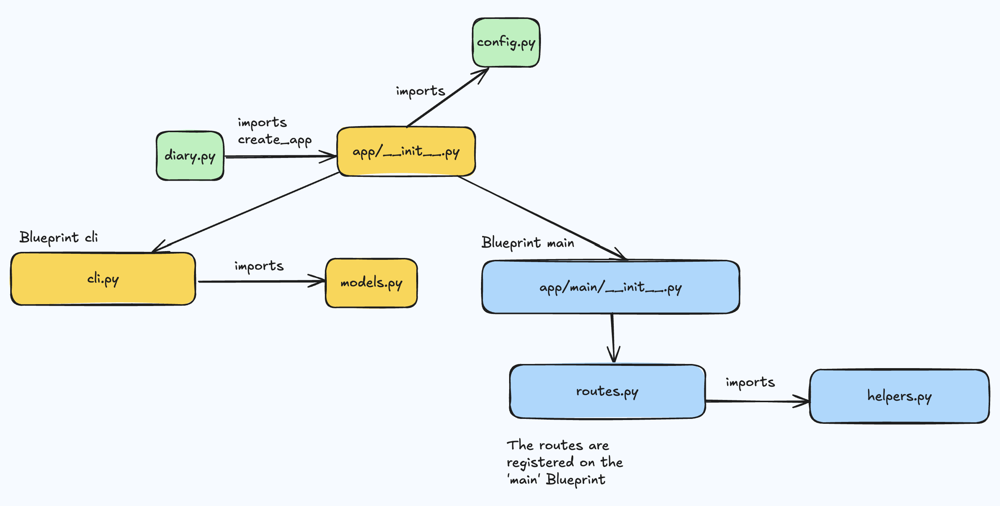

## Why?

I've been journaling consistently from 2021 to now, and I thought it would be good idea to make a lightweight journaling app using React and Flask. It was only later that I discovered the power of  <a  class="secondary-a" href="https://obsidian.md/"> Obsidian</a>.

&nbsp;


## Front-end: Routes

The main React components I want to discuss are the:

- Calendar: Component containing  MonthGrid and Square components
- Day: It shows the contents of the day parsed to html.
- EditDay: 

```jsx
<div className="App">
  <BrowserRouter>
    <Header />
    <Routes>
      <Route exact path="/" element={<Home />} />
      <Route exact path="/404" element={<EmptyView />} />
      <Route exact path="/calendar/:year/:month" element={<Calendar />} />
      <Route exact path="/calendar/days/:year/:month/:day" element={<Day />} />
      <Route exact path="/calendar/days/:year/:month/:day/edit" element={<EditDay />} />
    </Routes>
  </BrowserRouter>
</div>
```


### Overview of Calendar


The Calendar component is composed of a Year
Clicking on any month will generate a MonthGrid. 
Depending on the month, I could have 29, 30 or 31 days represented by Square components.


### Month Grid

An edge to consider when building a The 1st of every month lands on different day. 


```javascript 

function getDayOfTheWeek(year, month) {

    const date = new Date(year, month , 1);
    // Sunday to Saturday: Any integer from 0...6
    return date.getDay();
}

```

### Square


## Day Components


&nbsp;

## Flask and Blueprints


### Backend structure
At first, I had all my routes packed in a backend.py file which was chaotic not to say the least. I discovered how to use Blueprints by reading part XV of Miguel Grinberg's Flask Mega Tutorial.<sup> <a class="secondary-a" href="#footnotes">1.</a></sup> They are pieces of functionality that modularize your app. For example, you can have a CLI blueprint to handle all database related operations. Another blueprint could be used to store the routes that handle GET and POST requests. The image below is how I organized my backend directory. 

&nbsp;


```python
# app/__init__.py
from flask import Flask
from flask_sqlalchemy import SQLAlchemy 
from flask_cors import CORS  
from config import Config

db = SQLAlchemy()
cors = CORS()

# Application Factory
def create_app(config_class = Config):
    
    app = Flask(__name__)
    app.config.from_object(config_class)
    db.init_app(app)
    cors.init_app(app)

    
    from app.main import bp as main_bp
    app.register_blueprint(main_bp)

    from app.cli import bp as cli_bp
    app.register_blueprint(cli_bp)

    return app

# SQLAlchemy needs to know about the models
from app import models


```


&nbsp;




&nbsp;


### Database & CLI

The only table I have is DiaryEntry with 4 fields: id, date, day_title and day_content. Initially, I considered using the date as a primary key because of its uniqueness, but I had to reconsider my decision. It would have been fine if I needed only one entry record per day, but what if I eventually needed two diary entries for the same date? Due to uncertainty, I just opted for id as a primary key. The to_json method returns an object of the entry which is useful to create Response objects for GET and POST requests. 

&nbsp;


```python
#models.py
from app import db

# nullable means that the column can't be empty
class DiaryEntry(db.Model):
    __tablename__ = "diary_entries"
    id = db.Column(db.Integer, primary_key=True, autoincrement=True)
    date = db.Column(db.Date, nullable=False)
    day_title = db.Column(db.String(100))
    day_content = db.Column(db.Text)
    
    def to_json(self):
        return {
            "id": self.id,
            "date": self.date,
            "day_title": self.day_title,
            "day_content": self.day_content
        }
```
&nbsp;

With CLI commands, I can easily do the necessary database operations. In the terminal, you run the commands by typing <u>flask cli command-name</u>. This is much more convenient than typing something like <u>localhost:5000/populate-days</u> in the address bar. It's also safe because only you can run it.

&nbsp;

DiaryEntry objects are added from the defined START_DATE to END_DATE. I arbitrarily chose 2000 and 2100 — brimming with excitement to still be journaling at 100 years old. Jokes aside, you can create a date from a tuple in Python and conveniently increment dates with the date and timedelta classes from the datetime module.

&nbsp;


```python
# cli.py
from flask import Blueprint
from datetime import date, timedelta
from app.models import DiaryEntry
from app import db
import click

bp = Blueprint('cli', __name__)
START_DATE = date(2000, 1, 1)
END_DATE = date(2100, 12, 31)

@bp.cli.command("populate-days")
def populate_days():
    """Populate the database with diary entries between 2000 and 2100"""
    start_date = START_DATE
    end_date = END_DATE
    current_date = start_date
    
    click.echo("Populating diary entries... ")
    
    
    while current_date <= end_date: 
        try: 
            new_entry = DiaryEntry(date= current_date, day_title = "default_title", day_content= "default_content")
            db.session.add(new_entry)
            current_date += timedelta(days=1)
            
        except Exception as e:
            click.echo(f"An exception has occured: {str(e)}")
        
        
    db.session.commit()
    click.echo("Succesfully added all the dates")


```

&nbsp;

### GET Request


With useEffect and axios<sup> <a class="secondary-a" href="#footnotes">2.</a></sup>, I send a GET request  to the get_diary_entry route on the backend using the parameters obtained from useParams(). The useEffect runs only once when the component mounts. You achieve this by adding no dependencies inside the hook  hence the empty brackets [ ].


```jsx

// To be used in the GET Request
const { year, month, day} = useParams();

useEffect(() => {
  async function fetchDiaryEntry() {
    try {
      const response = await axios.get(`/get_diary_entry/${year}/${month}/${day}/`);
      const res = response.data;

      setDayTitle(res["day_title"]);
      setDayContent(res["day_content"]);
      setDate(res["date"]);
    } catch (error) {
      console.log(error.response);
    }
  }

  fetchDiaryEntry();
  // No depedencies
}, []);


```
&nbsp;

In Flask, route parameters are declared within angle brackets and then parsed into arguments for the get_diary_entry function. With a helper method, they are then formatted into a tuple used for querying. DiaryEntry is a subclass of db.Model, so we use the query and filter_by methods available to get the corresponding diary_entry. The result is converted to json with the to_json method available in the DiaryEntry class. We fulfill the GET Request by turning it into a Response object using Flask's jsonify. The jsonify turns the result into a Response object. Otherwise, we'd have to create it ourselves. 

 &nbsp;


```python
# Format, Query, Convert to JSON, return a Response

@bp.route("/get_diary_entry/<year>/<month>/<day>/",  methods = ["GET"])
def get_diary_entry(year,month,day): 
    
    
    date_to_query = format_date(year, month, day)
    diary_entry = DiaryEntry.query.filter_by(date= date_to_query).first()
    diary_entry = diary_entry.to_json()
   
    return jsonify(diary_entry)

# Without jsonify: Response(diary_entry, mimetype='application/json')  
``` 

&nbsp;

## Extras

### Date Regex

To add the prefix based on the day, we just check the last digit of the number and add edge cases for 11, 12 and 13.
```jsx
function addDayPrefix(day) {
    const firsts = /1$/;
    const seconds = /2$/;
    const thirds = /3$/;

    if (firsts.test(day) && day !== 11) {
        return "st";
    } else if (seconds.test(day) && day !== 12) {
        return "nd";
    } else if (thirds.test(day) && day !== 13) {
        return "rd";
    } else {
        return "th";
    }
}

```

## Footnotes

1.  Miguel Grinberg's  Flask<a class="secondary-a"  href= "https://blog.miguelgrinberg.com/post/the-flask-mega-tutorial-part-xv-a-better-application-structure" > tutorial </a> is an excellent resource.

2. I could have also used the native API fetch. I didn't know the difference at the time.