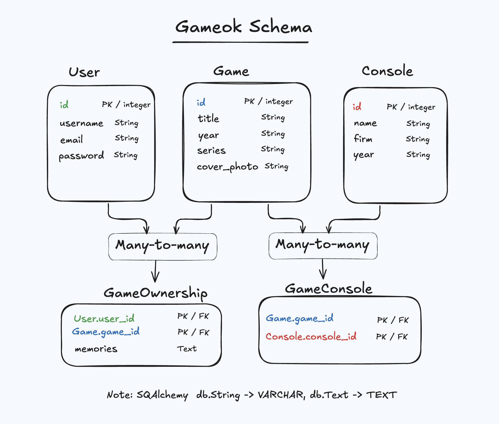
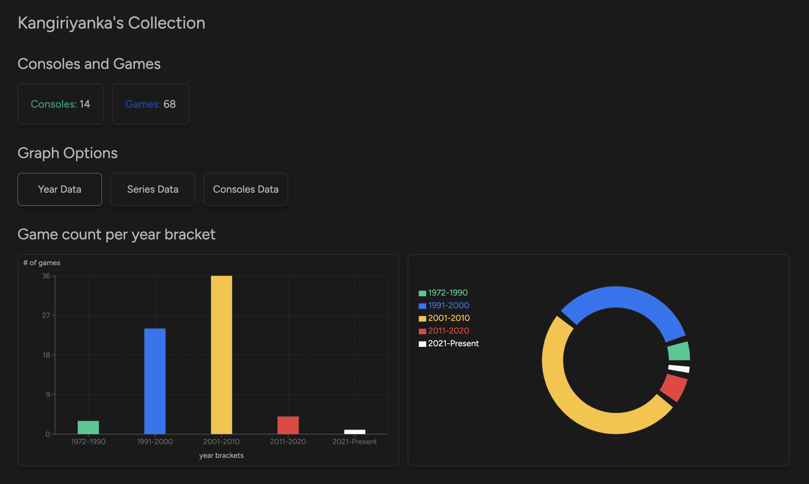
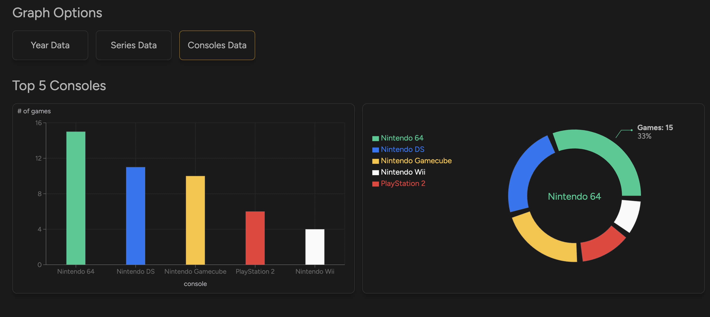
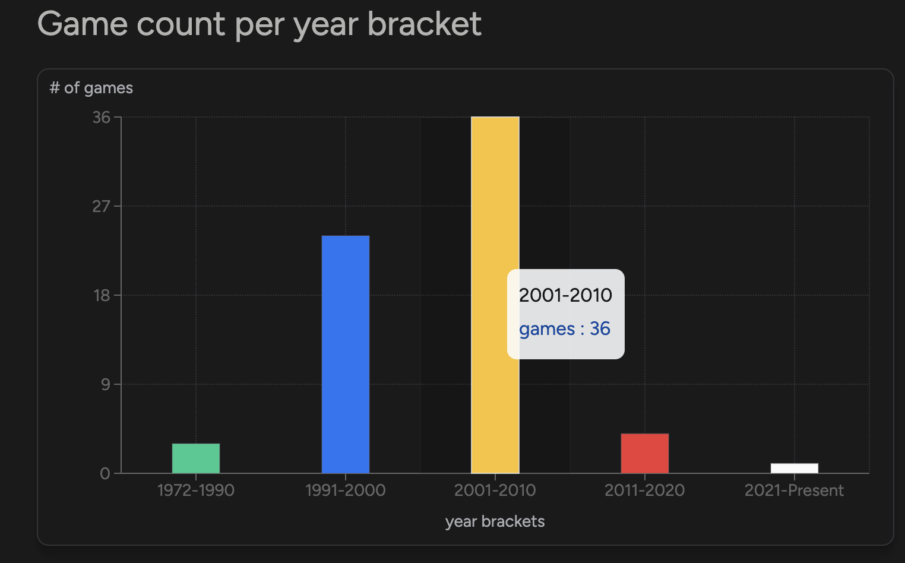

## Navigation and Authentication

### A change of routes

For Gameok, I used the Data mode of React Router. The Declarative mode wasn't enough for the complexity I was aiming for, and I thought it was a decent middle ground if I ever decided to tackle the Framework mode (improbable). Loaders, nesting, outlets,  and error boundaries make the components cleaner and easier to debug. 

```tsx
// App.tsx
return (
  <>
  <RouterProvider router={router} />
  </>

)

// routes.ts
export const router  = createBrowserRouter([
  ...publicRoutes,
  ...protectedRoutes,
  ...adminRoutes
]);

// protected-routes.ts
export  const protectedRoutes = [

  { 
    path: "/dashboard",
    Component: ProtectedRoute,
    children: [
      {
        Component: RootLayout,
        // RootLayout holds a Sidebar component which has extra links for the admin.
        loader: adminLoader,
        ErrorBoundary: ErrorBoundary,
        children: [
          {
            path: "home",  
            Component: Home,
            loader: statsLoader,
            ErrorBoundary: ErrorBoundary,
          },
          {
            path: "consoles",
            Component: Consoles,
            loader: consolesLoader,
            ErrorBoundary : ErrorBoundary,
          },
        ]
        // ... Other components
      }
    ]
  }
]
```
&nbsp;

### React's Context

To begin having sweet dreams (or nightmares) about authentication, we first deal with React's Context. A Context object can be seen as a container that holds information and provides it once wrapped around children. The data passed is whatever you stock inside its value attribute. 

 &nbsp; 

In action now, AuthProvider is itself the Context provider, and by wrapping it around the RouterProvider, all the components defined in the router have access to the context provided. 


```tsx
// Gives access to the context to any component rendered by the router.
<AuthProvider>
    <RouterProvider router={router} />     
</AuthProvider>

```
&nbsp;

where AuthProvider is:

```tsx
import userInfo from '../assets/scripts/userInfo.ts';
// 1. This is the data we want our components to access when they use the context (consume its data).
type AuthTools = {
    storedUserInfo: string | null;
    setUserInfo: (username: string) => void;
}

type Props = { children: React.ReactNode }

const AuthContext = createContext<AuthTools | undefined>(undefined);

export function AuthProvider({ children }: Props) {
    // setUserInfo 
    const { storedUserInfo, setUserInfo } = userInfo();

    return (
        // Pass the values to the AuthContext provider
        // In React 19, you don't need to add .provider (makes it even more confusing if you ask me)
        <AuthContext value={{ storedUserInfo, setUserInfo }}>
            {children}
        </AuthContext>
    );
}
// This is the function a component can call to access storedUserInfo or setUserInfo.
// If a component that isn't wrapped by the AuthProvider tries to access the context, it throws an error.
export function useAuthContext() {
    const authTools = useContext(AuthContext);
    if (authTools === undefined) {
        throw new Error("useAuthContext must be used within an AuthContext");
    }

    return authTools;
}
```
&nbsp;

- AuthTools are the data provided by the context: a username and a function that sets it.  

- The useAuthContext is a function that can be called inside any component wrapped inside the AuthProvider. Otherwise, it'll throw an error.

&nbsp;


If a user successfully logs in, the server sends a response with their username inside. Then, with the useAuthContext function, we destructure the 'setUserInfo' function from the context. This will allow to set the state of the app with the logged in user's username.


&nbsp; 

Once there is stored information about the user, we can open the gates of nerdiness and allow the to access Protected Routes.
```tsx
 // storedUserInfo is set if the user logs in succesfully.
 const {storedUserInfo} = useAuthContext();
   if (!storedUserInfo) return <Navigate to="/" replace />;
    return <Outlet />;

```

&nbsp;

## Authentication

Now, with the knowledge of React contexts in mind, how do we go about sending requests with tokens, cookies?  The first option to consider  would be to set the authentication token in localStorage when the user first logs in. This is not ideal because an evil wrongdoer can write a Javascript function in the browser that can steals your token,  and adds lame games to your game collection. An even worse fate is for the programmer extracting tokens from the AuthContext and appending them with every request. 
 ```tsx
 Authorization: 'Bearer ' + token
 ```

&nbsp;


## Database

The backend uses SQLAlchemy and Flask with Blueprints similar to what I did in my  <a class="secondary-a" href="/projects/diary/#backend-structure"> Diary project</a>. Here's a picture of the Gameok schema. 



&nbsp;

As you can see, there are 3 main tables and 2 relationship tables:
- User:  id as primary key, username, email and password.
- Game:  id as primary key, title, year, series, cover_photo 
- Console: id as primary key, name, firm year
- GameOwnership: Foreign key of User.id and Game.id as primary keys
- GameConsole: Foreign key of Game.id and Console.id as primary keys


&nbsp; 


A game can be owned by many users and vice-versa which means it's a many-to-many relationship with the Game table. For those, we need another table to User and Game. That's the purpose of the GameOwnership table which has an extra column 'memories' for a user to store the unique memories associated with the game.The same type of relationship exists between Game and Console: A console can have many games and a game can be on many consoles. We represent this relationship with the GameConsole table. 
&nbsp;


&nbsp;


## Home Page


The home component first displays the number of consoles and games the user has. Graph data is also available to see the user's game count across 3 different categories: 
-  game count per year bracket
-  game count  per series (Top 5)
-  game count of per consoles  (Top 5)

&nbsp; 

The graphs have been created with <a class="secondary-a" href="https://recharts.org/en-US">Recharts</a>. It was a much simpler alternative to D3 which I initially considered.   


&nbsp;






## 