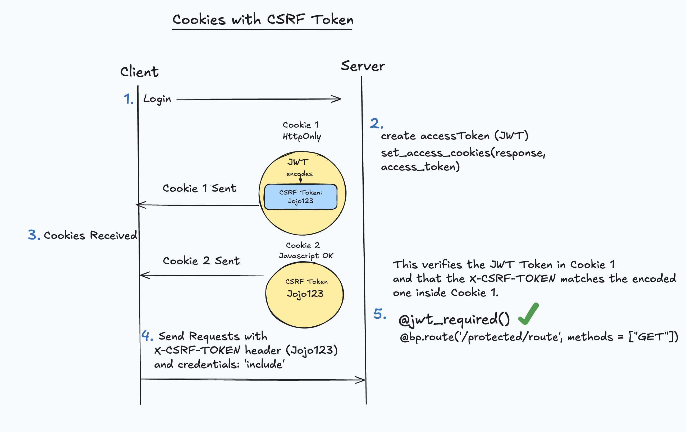

## Why? 

Gameok is a game library based on a user's memories of the games they played. As we get older, life gets in the way, and we don't have much time to pick up a controller or even feel guilty about doing so. I wanted to create a place where users can write about their relationship to the games they played and feel some magic from reminiscing about the games they played, or purely browsing their collection. I based the main colors on the N64 gray controllers, because it's the console I feel attached to the most.

&nbsp;

## Overview 

### What? 

The basic flow goes is as follows:

- Admin creates consoles and games in the database
- Users then select consoles, and the games they own/played on it.
- Users can add/edit/delete memories about their games.

&nbsp;


###  Home Page


The home component first displays the number of consoles and games the user has. Graph data is also available to see the user's game count across 3 different categories: 
-  game count per year bracket
-  game count  per series (Top 5)
-  game count of per consoles  (Top 5)

&nbsp; 

The graphs have been created with <a class="secondary-a" href="https://recharts.org/en-US">Recharts</a>. It was a much simpler alternative to D3 which I initially considered. If you look at my data, you'll notice that I'm stuck in past.


&nbsp;


&nbsp;

### Consoles Page

The consoles page displays all the consoles the user has. When a user selects a console, they can see all the games they have memories about/own inside of it. I've added an example of N64 games I own. All the covers are taken from various wiki sources, and I don't own rights to any of the images shown.


&nbsp;


&nbsp;

Once you select game, you can see the notes/memories you have about it. The content is all formatted in Markdown using ReactMarkdown, and the editor is <a href="https://mdxeditor.dev/" class="secondary-a"> MDXEditor</a>. 


&nbsp;


&nbsp;


### Games Page

Instead of consoles, you can see all your games in a powerful data table created following this <a class="secondary-a" href="https://ui.shadcn.com/docs/components/data-table"> Shadcn's data table guide </a>. You can filter the rows, access the game's memories and delete games from it. 


&nbsp;

### Add Game Page 

A user can add games to their collection by selecting a console, and their game. I want to add Pokemon Emerald on the Game Boy Advance!


### Authentication Components

There are some basic authentication components. 


### Admin Components

The admin has reserved pages to add consoles and pages.


</div>


&nbsp;

## Navigation

### A change of routes

For Gameok, I used the Data mode of React Router. The Declarative mode wasn't enough for the complexity I was aiming for, and I thought it was a decent middle ground if I ever decided to tackle the Framework mode (improbable). Loaders, nesting, outlets,  and error boundaries make the components cleaner and easier to debug. 

```tsx
// App.tsx
return (
  <>
  <RouterProvider router={router} />
  </>

)

// routes.ts
export const router  = createBrowserRouter([
  ...publicRoutes,
  ...protectedRoutes,
  ...adminRoutes
]);

// protected-routes.ts
export  const protectedRoutes = [

  { 
    path: "/dashboard",
    Component: ProtectedRoute,
    children: [
      {
        Component: RootLayout,
        // RootLayout holds a Sidebar component which has extra links for the admin.
        loader: adminLoader,
        ErrorBoundary: ErrorBoundary,
        children: [
          {
            path: "home",  
            Component: Home,
            loader: statsLoader,
            ErrorBoundary: ErrorBoundary,
          },
          {
            path: "consoles",
            Component: Consoles,
            loader: consolesLoader,
            ErrorBoundary : ErrorBoundary,
          },
        ]
        // ... Other components
      }
    ]
  }
]
```
&nbsp;


### React's Context

To begin having sweet dreams (or nightmares) about authentication, we first deal with React's Context. A Context object can be seen as a container that holds information and provides it once wrapped around children. When creating the context, we define the type of data it can hold and pass the actual values through the provider's value attribute. I reiterate that the confusing part is understanding that Context you define can be USED as the provider.

 &nbsp; 

In action now, we define an AuthProvider function and wrap it around the RouterProvider. All the components defined in the router have access to the context provided inside AuthProvider.


```tsx
// Gives access to the context to any component rendered by the router.
<AuthProvider>
    <RouterProvider router={router} />     
</AuthProvider>

```
&nbsp;

where AuthProvider is:

```tsx
import userInfo from '../assets/scripts/userInfo.ts';
// 1. This is the data we want our components to access when they use the context (consume its data).
type AuthTools = {
    storedUserInfo: string | null;
    setUserInfo: (username: string) => void;
}

type Props = { children: React.ReactNode }

// AuthContext defined to be later used as a provider *.
const AuthContext = createContext<AuthTools | undefined>(undefined);

export function AuthProvider({ children }: Props) {
    // setUserInfo 
    const { storedUserInfo, setUserInfo } = userInfo();

    return (
        // Pass the values to the AuthContext provider *.
        // In React 19, you don't need to add .provider (makes it even more confusing if you ask me)
        <AuthContext value={{ storedUserInfo, setUserInfo }}>
            {children}
        </AuthContext>
    );
}
// This is the function a component can call to access storedUserInfo or setUserInfo.
// If a component that isn't wrapped by the AuthProvider tries to access the context, it throws an error.
export function useAuthContext() {
    const authTools = useContext(AuthContext);
    if (authTools === undefined) {
        throw new Error("useAuthContext must be used within an AuthContext");
    }

    return authTools;
}
```
&nbsp;

- AuthTools are the data provided by the context: a username and a function that sets it.  

- The useAuthContext is a function that can be called inside any component wrapped inside the AuthProvider. Otherwise, it'll throw an error.

&nbsp;


An application of this would be allowing only authenticated users inside protected routes. When a user successfully logs in, the server sends back a response to the client with a username inside. Then, with the useAuthContext function, we destructure the 'setUserInfo' function from the AuthContext and call it with the received username. This changes the state of the app to match the logged in user's username. Furthermore, for the scale of this app, contexts are also useful if you want to save the state of a component and navigate back to it.  I have a ConsoleContext that keeps my games open for a console if I navigate back to the consoles page. On a side note, if I eventually do another React project, I think I'll learn Zustand.

 &nbsp;


&nbsp; 

As a result, once there is stored information about the user, we can open the gates of nerdiness and permit access to the Protected Routes.
```tsx
// ProtectedRoute.tsx
// storedUserInfo is set if the user logs in succesfully.
 const {storedUserInfo} = useAuthContext();
   if (!storedUserInfo) return <Navigate to="/" replace />;
// A store of components ;)
    return <Outlet />;

```

&nbsp;

## Authentication

I extensively used Flask <a href="https://flask-jwt-extended.readthedocs.io/en/stable/basic_usage.html" class="secondary-a"> Flask-JWT-Extended </a> for authentication. 
&nbsp;

### Local Storage approach
Now, with the knowledge of React contexts in mind, how does an authenticated user send requests to the server? The first option to consider would be to set an authentication token received from the server in localStorage. For sensitive information, this is not ideal because an evil wrongdoer can write a Javascript function in the browser that can steal your token (XSS). With it, they can add lame games to your collection - the horror. It's also tedious to append the token everywhere in your request headers. This would require setting the token inside the AuthContext and extracting it for every component that needs to send a request. It's not the ideal choice if you have loaders as well. 

 ```tsx
 // You'd need the token everywhere to make requests.
 Authorization: 'Bearer ' + token
 ```

&nbsp;


### Cookies and CSRF Token.

A cooler approach would be to use cookies with a CSRF token. Cookies alone are vulnerable to CSRF, but if you add a CRSF token to the client's requests, the server has more evidence ti know that your client's domain is the one it should accept the request from. We shouldn't blindly trust the browser's cookies too much! Personally, what's more interesting is how we implement it with the server. From what I understand, the basic idea in Flask-JWT-Extended is: 

1. User logs in.
2. The server generates the access token (JWT). Within that JWT, there's another CSRF token encoded for an extra layer of security.
3. Flask sends back 2 cookies: an Http Cookie containg that JWT token, and another one you can manipulate with Javascript.
4. The second one allows the client to extract the CSRF token and plug it in the headers for a request.
5. Whenever a request is made, Flask verifies the JWT (@jwt_required), and if the CSRF token sent by the client matches the encoded one inside the JWT.



&nbsp;

The requests are tailored like so: 
```tsx
export const fetchWithCSRF = async (url: string, options: RequestInit = {}) => {
  const csrfToken = getCookie("csrf_access_token");
  const headers = {
    ...(options.headers || {}),
    "X-CSRF-TOKEN": csrfToken || "",
  };

  return fetch(url, {
    ...options,
    headers,
    credentials: "include",
  });
};
```

where getCookie is:

```tsx
export const getCookie = (name: string): string | undefined => {

  // You add the semicolon in the beginning, so that the first cookie  gets extracted when you split the string.
  const value = `; ${document.cookie}`;

  // ; Cookie 1=Value; Cookie 2=Value; CSRFCookie=Value

  // Isolate the csrfToken
  const parts = value.split(`; ${name}=`);

  if (parts.length === 2) return parts.pop()
};
```

&nbsp;

To be more specific about step 4 above, Flask adds an extra cookie for you with the very value of the CSRF token. With cookies as opposed to tokens, you can add  <b class= "bold-rounded">'credentials: include'</b> instead of passing the token everywhere. How reassuring.

&nbsp;

### Session Expired
 The last thing I want to mention concerning authentication is handling token expiry with loaders. If a user stays inactive for the token's lifespan, and tries to make a request with the expired token, we can leverage the Context, React Router's loaders and ErrorBoundary to log a user out.

  &nbsp;

 Let's say I want to fetch all my game titles with an expired token. Bummer, the server sends back a 401 error (Unauthorized). Inside the loader, you can throw back the Response to an ErrorBoundary component. Note that you don't need the CSRF token for GET requests.

 ```tsx
//gamesLoader.ts
type GameTitle = string;
export  async function gamesLoader() {
  
      const response = await fetch("/api/game/get_all_game_titles", {
        method: "GET",
         credentials: "include",
      });
       if (response.status === 401) {
        // TO BE CAUGHT ErrorBoundary
        throw new Response("Unauthorized to fetch all game titles", { status: response.status });
      }

      else if (!response.ok) {
        
        throw new Response("Failed to fetch all game titles", { status: response.status });
      }
      const games = await response.json();
      return games as GameTitle[];
  
  }

 ```
 &nbsp;


The 401 error is handled with <b class= "bold-rounded">useRouteError</b> and <b class= "bold-rounded">useRouteError</b>. The first one simply catches the error, and the second one identifies it from the response status. We can then redirect the user back to the login page. This is done by setting the storedUser's state to null. In Gameok, a user is logged if their username is set.
```tsx
// ErrorBoundary.tsx
import { useRouteError, isRouteErrorResponse, Navigate } from "react-router-dom";
import { useEffect, useState } from "react";
import { useAuthContext } from "@/context/AuthContext";

export default function ErrorBoundary() {
  const error = useRouteError();
  const [shouldRedirect, setShouldRedirect] = useState(false);
  const {setUserInfo} = useAuthContext()
  useEffect(() => {

    if (isRouteErrorResponse(error) && (error.status === 401 || error.status === 422)) {
    
      setUserInfo("")
      setShouldRedirect(true);
     
    }
    // Run the effect when an error happens.
  }, [error]);

  if (shouldRedirect) {
    // Replace -> No more back button.
    return <Navigate to="/" replace />;
  }

  return <h1 className= "p-3">Unexpected error occurred  :(. <br/>Your session could have  expired. </h1>;
}

```


&nbsp;


## Database

### Schema
The backend uses Flask with Blueprints and SQLAchemy similar to what I did in my  <a class="secondary-a" href="/projects/diary/#backend-structure"> Diary project</a>.  Here's a picture of the Gameok schema. I tried to keep it simple by restricing some fields like hours player, genres etc.


&nbsp;

As you can see, there are 3 main models and 2 association models:
- User:  id as primary key, username, email and password.
- Game:  id as primary key, title, year, series, cover_photo 
- Console: id as primary key, name, firm year
- GameOwnership: Foreign key of User.id and Game.id as primary keys
- GameConsole: Foreign key of Game.id and Console.id as primary keys


&nbsp; 


A game can be owned by many users and vice-versa which means it's a many-to-many relationship with the Game table. With many-to-many, we need a relationship table that links User and Game. That's the purpose of the GameOwnership table which has an extra column 'memories' for a user to store the unique memories associated with the game. The same type of relationship exists between Game and Console: a Console can have many games and a game can be on many consoles. We represent this relationship with the GameConsole table. In SQLAlchemy, you use relationship.back_populates to represent those assocations. &nbsp;

&nbsp;

On my part, one design weakness is not adding the relationship between a User and a Console. A trivial consequence of that would be having to do 4 joins to get the consoles owned by the user which was something I needed to do in my app.


&nbsp;

### Useful Queries

My queries in the actual project use the legacy version(1.x) of SQLAlchemy, but I'll show the 2.x version here. 

&nbsp;


1. Getting all games with their consoles.

```python
# Join Game to GameConsole on the game id, and then join Console.
stmt = select(Game, Console) \
    .join(GameConsole, GameConsole.game_id == Game.id) \
    .join(Console, Console.id == GameConsole.console_id)
```

&nbsp;

2. Getting all the consoles owned by the user.
```python
# Join Party 
stmt = select(Console).join(GameConsole, Console.id == GameConsole.console_id) \
    .join(Game, Game.id == GameConsole.game_id) \
    .join(GameOwnership, GameOwnership.game_id == Game.id) \
    .filter(GameOwnership.user_id == user_id)
```
&nbsp;

3. Getting the number of games of each owned console.

```python
stmt = (
    select(Console.name, func.count(Console.name))
    .join(GameConsole, GameConsole.console_id == Console.id)
    .join(Game, Game.id == GameConsole.game_id)
    .join(GameOwnership, GameOwnership.game_id == Game.id)
    .filter(GameOwnership.user_id == user_id)
    .group_by(Console.name)
)
```


&nbsp;


## Extras

### Animations with Motion

I've tinkered with <a class="secondary-a" href="https://motion.dev/"> motion.dev </a> to do most of the very basic animations. I spent a lot of time trying to figure out how to implement exit animations for page transitions, but I eventually dropped the idea. It turns out that AnimatePresence wrapped around an Outlet in the data router doesn't work too well with loaders. Besides that, the library is useful for all sorts of things like adding error messages that disappear after a certain time. I did a lot of mistakes with it, and it taught me a lot on where to place the components to have them removed from the DOM. A reminder for myself is: Don't forget to wrap the keys and to turn your components into motion components and really see where they're being removed.
&nbsp;


```tsx
// UserAddGame.tsx
// User tries to add a game that already exists 
// ...
 <ErrorBox key={count} handleDismiss={() => setResponse('')} response = {response} count= {count}/>

// ErrorBox.tsx 
import { AnimatePresence, easeInOut, motion } from "motion/react";
import {useState, useEffect} from "react"

type ErrorBoxProps = {
  handleDismiss: () => void;
  response: string;
  // Count is really useful for making the component exit.
  count?: number; 
};
const errorTransitionVariants = {
  initial: { opacity: 0 },
  animate: { opacity: 1 },
  exit: { opacity: 0 },
  transition : {duration: 0.2 , easeInOut}
};

export default function ErrorBox({ handleDismiss, response, count = 0 }: ErrorBoxProps) {

  const [visible, setVisible] = useState(true)

  // Remove the error message after 2 seconds
  // Set the visible again to true for the next animation.
  useEffect(() => {
    const timer = setTimeout(() => {
      setVisible(false)
      handleDismiss();
      
    }, 2000)

    setVisible(true)
    return () => clearTimeout(timer)
  },[])
  
  return (

    <AnimatePresence mode="wait"> 
    
    {visible &&

    <motion.div
      key= {count}
      variants={errorTransitionVariants}
      initial="initial"
      animate="animate"
      exit="exit"
      className={"error-message"}
      transition={{ duration: 0.3, ease: "easeOut" }}
    >
      <p>{response}</p>
    </motion.div>
    }
    </AnimatePresence>
  )
```


&nbsp;


### Uploading Images

A Game object has a cover_photo field that holds the location of its image. When the admin adds a game to the database,   file uploads</a>, we proceed to: 

1. See if the image exist.
2. Check its format. (also file size, but not shown here).
3. Clean the filename for security.
4. Add a unique id to it.
5. Define the filepath with <b class="bold-rounded"> os.path </b> .
6. Save the file in our desired path.


```python
# config.py 
# In my case, basedir: backend/covers
UPLOAD_FOLDER = os.path.join(basedir, 'covers')
basedir = os.path.abspath(os.path.dirname(__file__))
```

&nbsp;


```python
# admin_routes.py
cover_photo = request.files['coverPhoto']
# Check if the cover photo exists and if it's either in a jpg or jpeg format.
if cover_photo and allowed_file(cover_photo.filename):
    # Clean and generate a unique filename.
    filename = secure_filename(cover_photo.filename)
    filename = f"{str(uuid.uuid4())}-{filename}"
    # Save to backend/covers.
    filepath = os.path.abspath(
        os.path.join(current_app.config["UPLOAD_FOLDER"], filename)
    )
    cover_photo.save(filepath)
```

&nbsp;


```python
def fetch_image(a_game_title):
     filename = Game.query.filter_by(title=a_game_title).first().cover_photo
     return send_from_directory(current_app.config["UPLOAD_FOLDER"], filename)
```

You can load the image in the client like so:

```tsx
const gameTitle = "Banjo Kazooie"
const imageSource = `/api/game/fetch_cover/${game_title}/`
 

```
     


&nbsp;

## Takeaways


If I were to take Gameok to the next level, I would like to and learn how to implement:

-  Sending a confirmation e-mail to the registering user.
-  A cloud server that users  can upload pictures too, and not my PC. 
-  Managing the UI and UX there's a lot of games and consoles to add.
-  Polishing the general look, and learning more about animations.
-  Adding more columns to the database models e.g. genres for games.
- A fullstack application has A LOT of edge cases.
-  And honestly a lot more :).


