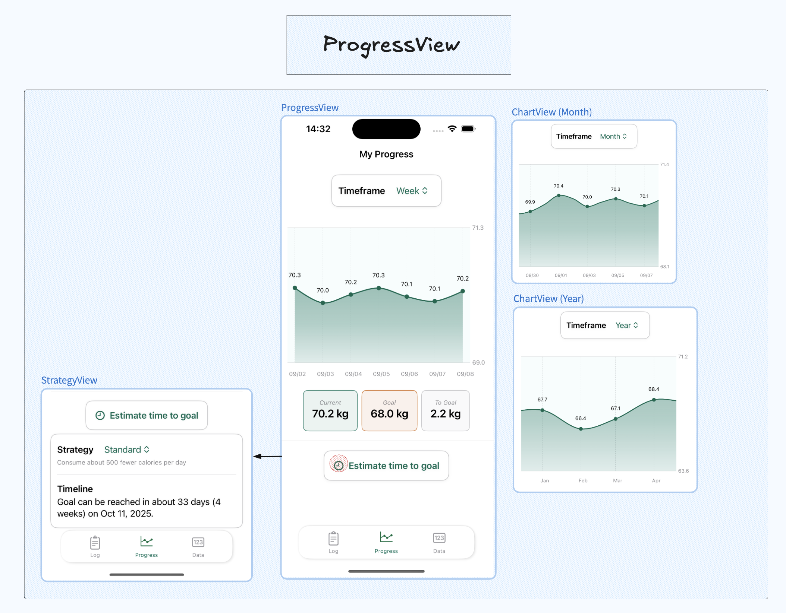
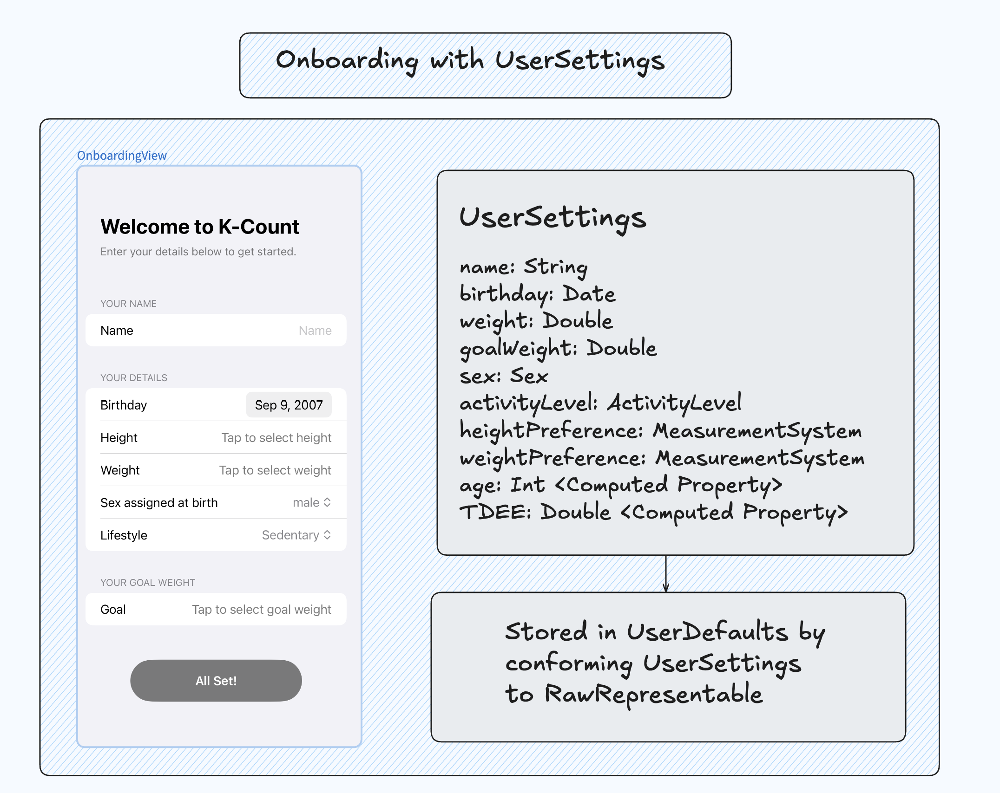
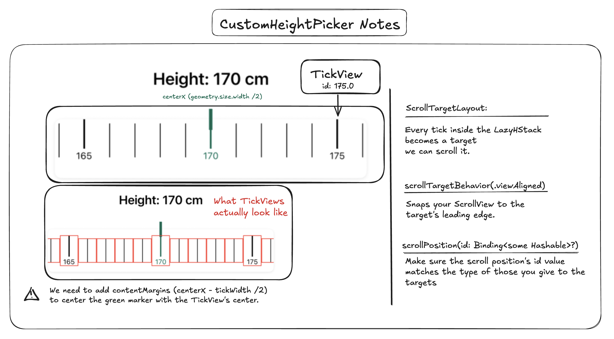

## Why?

There are countless fitness apps on the App Store with great features. You can track macros, share workouts in a community and log your water intake and sleep. Personally, I feel a bit overwhelmed when I see a lot of features condensed into one app. This gave me the idea to create an app that focuses mostly on tracking weight and calories without the extra fluff. 


&nbsp;

## Design considerations


Drawing inspiration from "MyFitnessPal" and "Lose It!", I designed K-Count to let users focus on logging their weight and calories in a simplified way: &nbsp;


1. There are no exercise or workout features.
2. A food database is not included: users create the foods themselves.
3. Foods don't include macros.
4. Designed for a single user.


&nbsp;


Potential drawbacks of this design include putting responsibility on the user to create foods and the risk of feeling too plain due to fewer features. Some users may prefer an all-in-one app that combines workouts and nutrition, while others may enjoy detailed nutritional breakdowns with colorful charts. My philosophy, however, is that if you’re not an athlete or fitness enthusiast, it’s enough to keep things simple and focus on calories in versus calories out.

&nbsp;


An important point I’ve realized is that simple doesn’t just mean bare-bones or minimal—I used to think that. With something as mundane as tracking weight and calories, you could stop there, but it would feel too mechanical. Adding mini-goals or charts makes the process more organic and engaging. The real challenge then becomes: where do I stop adding features, which ones truly make a difference, and how can I reduce friction so that functionality stays easy to use?<sup> <a class="secondary-a" href="#footnotes"> 1.  </a></sup>


&nbsp;

## Navigating the Structure

The app is separated into 3 main views:

1. LogView: Allows the user to enter their weight for a day and what they've eaten.
2. ProgressView: Displays weight graph over a selected time period and the estimated time to reach a goal weight based on a set strategy. 
3. DataView:  Allows the user to see all their days and foods and change their profile settings.


&nbsp;


## LogView

&nbsp;


&nbsp;


### DayView


The LogView is initialized with today's date as the selected date. Every day renders a different DayView which is created by picking a date inside the DayPickerView. When the view appears, we check to see if a Day object already exists for the selected date and create one otherwise.

&nbsp;

A DayView displays the user's weight for the day. Tapping the DayInfoView (NavigationLink) takes them to the EditWeightView. It also displays their maintenance calories. Users can add what they ate by tapping the fork-and-knife  symbol  which opens the AddFoodView in a sheet. Once foods are added, they appear as rows of food entries, and users can adjust portions directly from there. Let's look at the AddFoodView now.

&nbsp;
### AddFoodView


&nbsp;


&nbsp;


In the AddFoodView, users see a list of all the foods they’ve created. Tapping a row lets them add the servings they ate which can be seen in the FoodsAddedView (the basket). Users can also create new foods by specifying a name, calorie count, serving type  and the serving size.

&nbsp;


Programmatically, the added foods are stored in an array of FoodEntry objects, each containing a Food and servingSize. Let's examine the models to see exactly how they're used in the aforementioned views.

&nbsp;

### Models

&nbsp;


<sup class="bold">Note that I haven't included all the specific functions and protocols inside the figure to avoid clutter.</sup>

 What's important to note is the following: 


- Food and Day have a one to many relationship to a FoodEntry. You only need to specify the relationship on one side with SwiftData.
- Deleting a Food will delete all the related FoodEntries that reference it. 
- The FoodEntry has an optional Day. This is because we want to be able to populate a FoodEntry array before linking it to a day. 
- Dates are unique. (I could have also enforced uniqueness on the Food’s name).
- SwiftData automatically assigns an id to the models.


&nbsp;


The AddFoodView is initialized with an empty array of FoodEntry objects  which is passed as a binding to both NewFoodView and FoodView. This allows changes made in those views (like adding a new food or updating serving sizes) to be reflected in the original FoodEntry array in AddFoodView.

&nbsp;

In the NewFoodView, creating a food happens after validating TextFields and checking for duplicates (name). The new Food is first saved to the Food model, and then a FoodEntry is made from it and  appended to the <span class="bold-rounded"> foodsAdded</span> array. 

&nbsp;

```swift
// NewFoodView
// ...
@Binding var foodsAdded: [FoodEntry]
@Query var foods: [Food]

// ...
private func saveFood() {

    // Check for naughty user inputs
    guard areFieldsValid() else { return }
    let trimmedName = foodName.trimmingCharacters(in: .whitespacesAndNewlines)
    let newFood = Food(
        name: trimmedName,
        calories: Double(calories) ?? 0.0,
        servingType: selectedServingType.rawValue
    )
    
    // Check for duplicates
    if foods.contains(where: { $0.name.lowercased() == newFood.name.lowercased() }) {
        duplicateFoodPresented = true
        return
    }
    
    // Add the food to the model
    modelContext.insert(newFood)
    try? modelContext.save()
    
    // Append it to the FoodEntry array
    foodsAdded.append(
        FoodEntry(
            food: newFood,
            servingSize: Double(servingSize) ?? 0
        )
    )
}
```

&nbsp;

In the FoodView, adding an existing food follows the same logic. However, in the case where a user adds the same food twice with a different serving size, we modify the FoodEntry's serving size at the existing index.

&nbsp;

```swift
// FoodView
@Binding var foodsAdded: [FoodEntry]

// ...
private func updateFoodEntries() {
    if let existingIndex = foodsAdded.firstIndex(where: { $0.food.name == food.name }) {
        foodsAdded[existingIndex].servingSize = Double(servingSize) ?? 1
    } else {
        foodsAdded.append(
            FoodEntry(food: food, servingSize: Double(servingSize) ?? 1)
        )
    }
}
```


&nbsp;


After the user presses Done, we link all FoodEntries from the array to the Day. We have to explicitly define the relationship from FoodEntry to Day when linking them.<sup class="secondary-a"> <a href="#footnotes">2.</a></sup> This is yet another quirk of SwiftData. Furthermore, since both models reference each other (FoodEntry has an optional Day, and Day contains a FoodEntry array), SwiftData will automatically sync and save both sides of the relationship <a class="secondary-a" href="https://www.hackingwithswift.com/quick-start/swiftdata/how-to-save-a-swiftdata-object"> implicitly</a>. I'll explore another quirk about <a  class="secondary-a" href="#all-foods-and-days">cascade deleting</a> when I cover the DataView.

&nbsp;

```swift
private func updateDayFoodEntries() {
    for entry in foodsAdded {
        if !day.foodEntries.contains(where: { $0.food == entry.food }) {
            // SwiftData Bug/Quirk: Explicitly define FoodEntry --> Day 
            entry.day = day
            day.foodEntries.append(entry)
        } else {
            day.foodEntries.first(where: { $0.food == entry.food })?.servingSize = entry.servingSize
        }
    }
}
```

&nbsp;


### Pesky edge cases


- If a user changes their weight today, we have to update it everywhere inside the app. I'll explain that in the DataView section. 
- When creating a Day, I stripped the time component so that all entries for the same calendar date are treated as the same day. Without this, different times on the same date would be considered distinct days in Swift.
- Handling plural forms of serving types with a ServingType enum.
- Limiting digits and decimals inside TextFields.
- Adding ContentUnavailableViews.


&nbsp;


## ProgressView

&nbsp;



&nbsp;


### ChartView


The ProgressView displays a ChartView for the user's weight across time with 3 different time periods:

- Week: Displays 7 data points for the week.
- Month: Displays 30 data points for the month.
- Year: Displays the average weight per month.

&nbsp;

Data calculation starts by selecting a period to filter the days: week (7 days), month (30 days), and year (365 days).

&nbsp;


```swift
// ChartView
private enum Period: String, CaseIterable {
    case week = "week"
    case month = "month"
    case year = "year"
    
    var days: Int {
        switch self {
        case .week: return 7
        case .month: return 30
        case .year: return 365
        }
    }
}
// More code... 
@State private var selectedPeriod: Period = .week
```

&nbsp;

We then need to filter our days based on the selected period. We could naively do something like <span class="bold-rounded"> days.suffix(selectedPeriod.days)</span>, but that just fetches the last days the user logged regardless of whether they were consecutive or not.  For example, if today is September 8th, and I stopped logging my weight on August 29th, I wouldn't want to display August 29th's weight when "Week" is selected. To fix this, we can add a cutoff date. The downside is that it won't show any graph data for days we forgot. There's a lot of room for improvement on my part though.

&nbsp;


```swift
private var filteredDays: [Day] {
    let cutoffDate = Calendar.current.date(
        byAdding: .day,
        value: -selectedPeriod.days,
        to: Date()
    ) ?? Date()
    

    let filtered = days.filter { 
        $0.date >= cutoffDate 
    }
    
    switch selectedPeriod {
    case .week, .month:
        return filtered.sorted { $0.date < $1.date }
    // Get the average weight per month over a year.
    case .year:
        return averageWeightPerMonth(from: filtered)
    }
}
```

&nbsp;

The next scenario to consider is how to go about dealing with 365 data points for the year. We wouldn't want to display them all,  because it's too computationally expensive (365 LineMarks yikes). Instead, we can get all the days associated with a month and get an average weight for that month. 

```swift
// Returns 12 Dates
private func averageWeightPerMonth(from days: [Day]) -> [Day] {
    let calendar = Calendar.current
    
    // Creates something like [ 2025-01-01: [day A,day B,day C],  2025-02-01: [day X, day Y, day Z]]
    let groupedMonths = Dictionary(grouping: days) { day in
        calendar.date(from: calendar.dateComponents([.year, .month], from: day.date))!
    }
    
    // Compute average weight per month
    return groupedMonths.map { (monthDate, daysInMonth) in
   
        let total = daysInMonth.reduce(0) { $0 + $1.weight }
        let avg = total / Double(daysInMonth.count)
        return Day(date: monthDate, weight: avg, foodEntries: [])
    }
    .sorted { $0.date < $1.date }
}
```

&nbsp;


For the general look, I've based some of it on Renpho which made me learn and incorporate the following:

- The Y axis gets a custom range (filteredDays), but only displays the minimum and maximum (with padding) on the axis.
- PointMarks are used to show the weight with an .annotation modifier. Annotations are handled differently for months (per 2 days) to avoid clutter on the X axis.
- Adding yStart and yEnd to Area marks fixes gradient issues.
- Adding interpolation .catmullRoll.
- Other cool features like <span class="bold-rounded"> preset: .aligned</span> for the X axis and  <span class="bold-rounded">chartScrollableAxes</span>.

&nbsp;

Here's a part of my ChartView  with a lot of pieces left out, you may skip it (don't take orders from me!) it as I put it for personal reference:
```swift
//ChartView
private var customWeightRange: ClosedRange<Double> {
        let recentWeights = filteredDays.map { $0.weight }
        
        
        guard let min = recentWeights.min(), let max = recentWeights.max() else {
            return userSettings.weight-1...userSettings.weight+1
        }

        let padding = [(max-min) * 0.1 , 1.0].max() ?? 1.0
        return (min - padding)...(max + padding)
 }


// ... 
Chart(filteredDays.indices, id: \.self) { index in
    let day = filteredDays[index]
    
    AreaMark(
        x: .value("Date", day.date),
        yStart: .value("Baseline", customWeightRange.lowerBound),
        yEnd: .value("Weight", day.weight)
    )
    .interpolationMethod(.catmullRom)
    .foregroundStyle(linearGradient)
    
    LineMark(
        x: .value("Date", day.date),
        y: .value("Weight", day.weight)
    )
    .interpolationMethod(.catmullRom)
    

    if (index % annotationStep) == 0 {
        PointMark(
            x: .value("Date", day.date),
            y: .value("Weight", day.weight)
        )
        // Add the weights 
        .annotation(position: .top, spacing: 10) {
            let weightValue = WeightValue.metric(day.weight)
            Text(weightValue.graphDisplay(for: userSettings.weightPreference))
                .font(.caption2)
                .padding(2)
        }
    }
}
.chartXAxis {
    chartXAxis(filteredDays: filteredDays)
}
.chartYAxis {
    chartYAxis(range: customWeightRange)
}

.chartYScale(domain: customWeightRange)
```


&nbsp;

### StrategyView


Users can estimate the date they will reach their goal based on selected strategies. Based on the assumption that 3500 calories is 1 pound,  I've included 3 strategies if the user wants to gain or lose weight:

- stable: Cut/consume 250 calories a day to lose/gain 0.5lbs a week.
- standard: Cut/consume 500 calories a day to lose/gain 1lb a week.
- hardcore: Cut/consume 750 calories a day to lose/gain 1.5lbs a week (not recommended).

&nbsp;


## DataView


&nbsp;


&nbsp;


### All Foods and Days


Besides the LogView, users can comprehensively see all the foods and days they've created, edit them and export them to JSON or csv. This can be done by extending <a class="secondary-a" href="#things-i-learned"> FileManager </a> with export functions for the desired formats. The returned URL is used inside a ShareLink. 

&nbsp;

There's also the option to delete the foods, but not days. One major issue I ran into was deleting a Food object with <span class="bold-rounded">deleteRule: .cascade</span>. In SwiftData, this rule sets all related objects’ references to nil when the parent is deleted. Since FoodEntry has a non-optional Food property, deleting the Food would set this property to nil causing a crash. There's a workwaround where you can set Food  to an optional in FoodEntry, but for convenience and sanity, I manually delete all related FoodEntry objects before deleting the Food.

&nbsp;
```swift
// EditFoodDataView
private func deleteFood(food: Food) {
    // Manually delete all entries first
    let entriesToDelete = food.entries
    for entry in entriesToDelete {
        modelContext.delete(entry)
    }
    
    // Save the entry deletions
    try? modelContext.save()
    
    // Delete the food
    modelContext.delete(food)
    try? modelContext.save()
    
    dismiss()
}
```


&nbsp;


### UserProfileView 

&nbsp;


&nbsp;

The UserProfileView allows modification of profile details like changing their goals or lifestyle (for TDEE calculations). Users can also choose between the imperial and metric system to display their weight and height. All these fields are loaded from a UserSettings struct stored in @AppStorage created during an OnboardingView.<sup> <a class="secondary-a" href="#footnotes"> 3. </a> </sup>

&nbsp;


### From environment to AppStorage

One attempt at storing a User was decoding a user.json into a User object and then injecting it in the environment. If we didn't use the environment, we'd have to initialize views with a User for every view that needs it. It becomes too tedious to manage.


&nbsp;
```swift
// ContentView
@State private var user: User = FileManager.default.decode("user.json")
@State private var selectedTab = 0

var body: some View {
    ZStack {
        TabView(selection: $selectedTab)

        ViewA()
            .tag(0)
        ViewB()
            .tag(1)
        ViewC()
            .tag(2)
    }
    .environment(user)
}


// ViewA
@Environment(User.self) var user

```
&nbsp;

With the implementation above, we'd have to write to the JSON file every time a user updates their information. It's an ok solution, but I later learned that I could store the user's information inside UserDefaults and access it with AppStorage. AppStorage is normally used for basic value types, but you can  <a class="secondary-a" href="#things-i-learned"> store </a> a struct as long as it doesn't contain any sensitive information.<sup> <a class="secondary-a" href="#footnotes"> 4. </a> </sup> In K-Count, I changed the name from User to UserSettings.  

&nbsp;




&nbsp;


### Enums galore


The maintenance calories, TDEE, are roughly calculated with the Harris-Benedict equation. I use the user's ActivityLevel, Sex, weight and age to do the calculations.

&nbsp;

```swift
 func calculateTDEE(using weight: Double) -> Double {
        let bmr: Double
        switch sex {
        case .female:
            bmr = 10 * weight + 6.25 * height - 5 * Double(age) - 161
        case .male:
            bmr = 10 * weight + 6.25 * height - 5 * Double(age) + 5
        }
        // Multipliers from : https://www.inchcalculator.com/harris-benedict-calculator/
        return bmr * activityLevel.multiplier
    }

```

&nbsp;

The user's weight and height is stored as a Double inside UserSettings. In the views, I use a HeightValue and WeightValue enum for conversions, custom  <a class="secondary-a" href=" https://github.com/Kangiriyanka/K-Count/tree/main/K-Count/Pickers">pickers</a>, and displaying data in Text views. They've saved me a lot of trouble.

&nbsp;


```swift
enum HeightValue: Equatable, Hashable {
    case metric(Double)
    case imperial(FootInches)
    
    struct FootInches: Equatable, Hashable {
        let foot: Int
        let inches: Int
        var totalInches: Double { Double(foot * 12 + inches) }
    }
    
    var asCentimeters: Double {
        switch self {
        case .metric(let value): return value
        case .imperial(let fi): return (Double(fi.foot) * 30.48) + (Double(fi.inches) * 2.54)
        }
    }
    
    var asFeetInches: FootInches {
        switch self {
        case .imperial(let fi): return fi
        case .metric(let value):
            let totalInches = (value / 2.54).rounded()
            return FootInches(foot: Int(totalInches) / 12, inches: Int(totalInches) % 12)
        }
    }
    
    var centimetersDescription: String { String(format: "%.0f cm", asCentimeters) }
    var feetInchesDescription: String { "\(asFeetInches.foot)' \(asFeetInches.inches)''" }
}

enum WeightValue: Equatable {
    case metric(Double)
    case imperial(Double)
    
    var asKilograms: Double {
        switch self {
        case .metric(let value): return value
        case .imperial(let value): return value / 2.20462
        }
    }
    
    var asPounds: Double {
        switch self {
        case .imperial(let value): return value
        case .metric(let value): return value * 2.20462
        }
    }
    
    var kilogramsDescription: String { String(format: "%.1f kg", asKilograms) }
    var kilogramsDescriptionShort: String { String(format: "%.1f", asKilograms) }
    var poundsDescription: String { String(format: "%.1f lbs", asPounds) }
    var poundsDescriptionShort: String { String(format: "%.1f", asPounds) }
    
    func display(for preference: MeasurementSystem) -> String {
        switch preference {
        case .metric: return kilogramsDescription
        case .imperial: return poundsDescription
        }
    }
    
    func graphDisplay(for preference: MeasurementSystem) -> String {
        switch preference {
        case .metric: return kilogramsDescriptionShort
        case .imperial: return poundsDescriptionShort
        }
    }
}

```


&nbsp;


## Extras


### Things I learned 


1. Using ShareLinks and exporting data to different formats

&nbsp;

```swift
// FileManagerExtensions
// ... 
// Generate a fileURL which we can use in ShareLink
func saveCSVFile(csvString: String, filename: String) throws -> URL? {
    guard let documentsURL = self.urls(for: .documentDirectory, in: .userDomainMask).first else {
        throw FileSaveError.noDocumentsDirectory
    }
    
    let fileURL = documentsURL.appendingPathComponent(filename)
    
    do {
        try csvString.write(to: fileURL, atomically: true, encoding: .utf8)
        return fileURL
    } catch {
        throw FileSaveError.writingFailed(error)
    }
}

// The object passed is either a Food or Day array both of which conform to Codable.
func saveJSONFile<T: Encodable>(object: T, filename: String) throws -> URL {
    guard let documentsURL = FileManager.default.urls(for: .documentDirectory, in: .userDomainMask).first else {
        throw FileSaveError.noDocumentsDirectory
    }
    
    let fileURL = documentsURL.appendingPathComponent(filename)
    
    do {
        let formatter = DateFormatter()
        formatter.dateFormat = "yyyy-MM-dd"
        
        let encoder = JSONEncoder()
        encoder.outputFormatting = [.sortedKeys]
        encoder.dateEncodingStrategy = .formatted(formatter)
        
        let data = try encoder.encode(object)
        try data.write(to: fileURL, options: .atomic)
        
        return fileURL
    } catch let error as EncodingError {
        throw FileSaveError.encodingFailed(error)
    } catch {
        throw FileSaveError.writingFailed(error)
    }
}


```

&nbsp;


2. Storing a custom object in UserDefaults<sup class="secondary-a"><a href="#footnotes">5.</a></sup>

&nbsp;


```swift
extension UserSettings: RawRepresentable {
    // The raw value is what is stored in AppStorage.
    // What you save to App Storage.
    var rawValue: String {
        guard let data = try? JSONEncoder().encode(self),
              let userSettingsString = String(data: data, encoding: .utf8)
                
        else {
            return "{}"
        }
        return userSettingsString
    }
    
    // App Storage extracts this behind the scenes
    init?(rawValue: String) {
        guard let data = rawValue.data(using: .utf8),
              let userSettings = try? JSONDecoder().decode(UserSettings.self, from: data)
        else {return nil}
    
    // Assign the decoded information to the UserSettings being instantiated.
    // Instead of doing self.name = userSettings.name, self.birthday = userSettings.birthday
    // You can simply do self = <what you're decoding>
        self = userSettings
    }
}
```


&nbsp;

3. Controlling numbers and decimals in a TextField with Regex.

&nbsp;

```swift
func limitDecimals(_ number: Binding<String>, decimalLimit: Int, prefix: Int) -> some View {
    self.onChange(of: number.wrappedValue) {
        // Clean input: allow only digits and one decimal point
        let cleanedInput = number.wrappedValue
            .replacingOccurrences(of: "\\.{2,}", with: ".", options: .regularExpression) 
            .replacingOccurrences(of: "^(0)(?!\\.)", with: "", options: .regularExpression) 
            .replacingOccurrences(of: "[^0-9.]", with: "", options: .regularExpression)

        number.wrappedValue = cleanedInput
        let components = cleanedInput.components(separatedBy: ".")

        // 24 -> 1 component,  340.22 -> 2 components
        if components.count == 1 {
            
            number.wrappedValue = String(number.wrappedValue.prefix(prefix))
        } else {
           
            let integerPart = components[0]
            let totalLimit = integerPart.count + decimalLimit + 1 // +1 for the decimal point
            number.wrappedValue = String(number.wrappedValue.prefix(totalLimit))
        }
    }
}
```


&nbsp;

4. Customizing ranges inside a DatePicker and getting future dates. 

&nbsp;

```swift
 private let yearRange: ClosedRange<Date> = {
        let calendar = Calendar.current
        let minDate = calendar.date(byAdding: .year, value: -10, to: .now)!
        let maxDate = calendar.date(from: calendar.dateComponents([.year, .month, .day], from: .now))!
        return minDate...maxDate
    }()

let futureDate = Calendar.current.date(byAdding: .day, value: Int(days), to: today)!
```


&nbsp;

5. Auto-focusing a field when the user wants to edit a field using onAppear and DispatchQueue. This is neat UX I saw on MyFitnessPal when you need to edit your weight for the day. 

&nbsp;

```swift
 @FocusState private var isFocused: Bool
.focused($isFocused)
.onAppear {
    DispatchQueue.main.asyncAfter(deadline: .now() + 0.1) {
        isFocused = true
    }
}
```

&nbsp;

6. Learning about the scrollTargetLayout, contentMargins, scrollPosition modifiers when I was making the custom pickers. Here are some notes.

&nbsp;



&nbsp;


## Takeaways


- The functionality will interfere with the design. An example of this is trying to use MatchGeometry inside a List. 
- The complexity of an app balloons without you noticing.
- You really don't know for sure when you're done.


&nbsp;


## Footnotes

1. Progress pictures are a great feature that I chose not to integrate. Maybe I'll change my mind.
2. I discovered this because of the error: Illegal attempt to map a relationship containing temporary objects to its identifiers.
3. I make sure to copy the struct from @AppStorage to a new @State variable. This way, changes in the UI don’t immediately overwrite the stored value. If I were to bind fields directly to the @AppStorage property, every edit would be saved right away.
4. I'm going to expose your weight to the whole world.
5. I followed <a class="secondary-a" href="https://www.youtube.com/watch?v=LRlSjdTuHWY/"> Stewart Lynch's </a> tutorial. Highly recommended.
