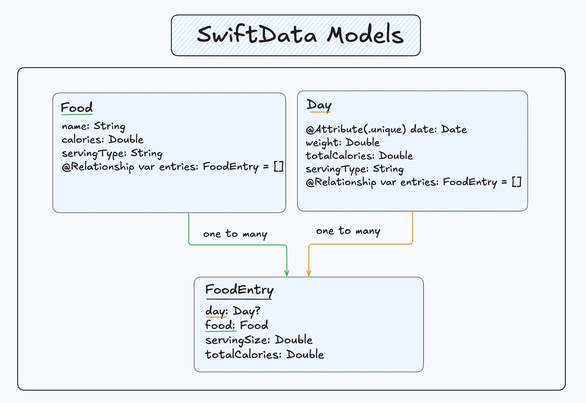
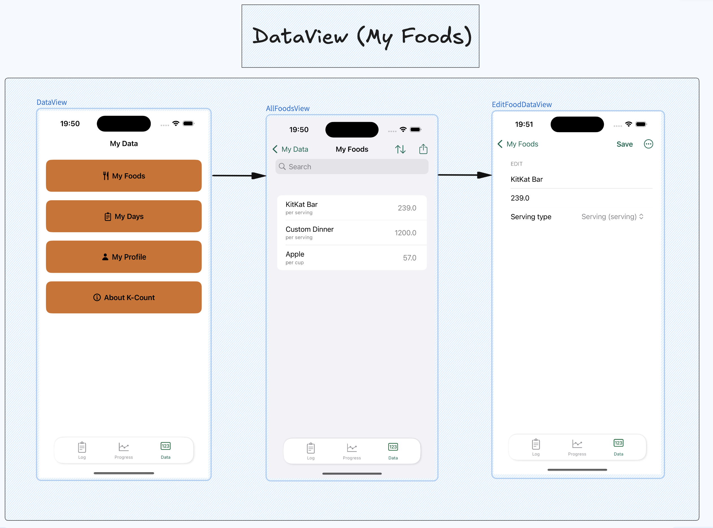
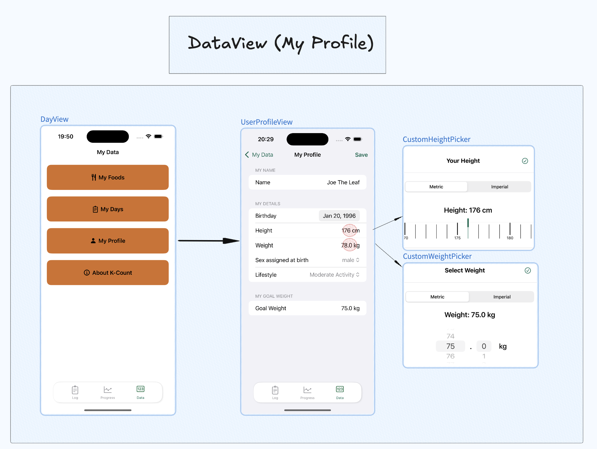

This post is being updated progressively.


## Why?

There are countless fitness apps on the App Store packed with great features. You can track macros, share workouts within a community, and even log water intake and sleep. Personally, I feel a bit overwhelmed seeing a lot of features condensed into one app. This made me want to create an app that focuses mostly on tracking weight and calories without the extra fluff.


&nbsp;

## Design considerations


Drawing inspiration from “MyFitnessPal” and “Lose It!”, I designed this app with the intention of letting an average person. 


- There are no exercise or workout features.
- A food database is not included; users create the foods themselves which they can later export.
- Foods don't include macros. 
- Only one user on the app.
- Users can set weight/height preference


&nbsp;

## Navigating the Structure

The app is separated into 3 main views:

1. LogView: allows the user to enter their weight for the day and what they've eaten.
2. ProgressView: Shows graph of weight over time and estimates time to goal
3. DataView:  See all the data the users have about themselves, their days and the foods they created.


&nbsp;

## SwiftData Models




Note that I haven't included all the specifics inside the figure to avoid clutter. What's important to note is the following: 

- Deleting a Food deletes all related FoodEntries
- Deleting a Day deletes all related FoodEntries
- In SwiftData, you specify the relationship only on one side in SwiftData.


## OnboardingView

### Useful Enums for conversion

```swift
enum HeightValue: Equatable, Hashable {

    case metric(Double)
    case imperial(FootInches)
    
 
    struct FootInches: Equatable, Hashable {
        let foot: Int
        let inches: Int
        
        var totalInches: Double {
            Double(foot * 12 + inches)
            }
    }
    
    var asCentimeters: Double {
        switch self {
        case .metric(let value): return value
        case .imperial(let fi): return (Double(fi.foot) * 30.48) + (Double(fi.inches) * 2.54)
        }
    }
    
    var asFeetInches: FootInches {
        switch self {
        case .imperial(let fi): return fi
        case .metric(let value):
            let totalInches = value / 2.54
            let f = Int(totalInches) / 12
            let i = Int(totalInches) % 12
            return FootInches(foot: f, inches: i)
        }
    }
    
    var centimetersDescription: String {
        
        String(format: "%.0f cm", asCentimeters)
    }
    
    var feetInchesDescription: String {
        "\(asFeetInches.foot)' \(asFeetInches.inches)''"
    }
}
```


```swift

enum WeightValue: Equatable {
    case metric(Double)
    case imperial(Double)
    
    var asKilograms: Double {
        switch self {
        case .metric(let value): return value
        case .imperial(let value): return value / 2.20462
        }
    }
    
    var asPounds: Double {
        switch self {
        case .imperial(let value): return value
        case .metric(let value): return value * 2.20462
        }
    }
    
    var kilogramsDescription: String {
        String(format: "%.1f kg", asKilograms)
    }
    
    var poundsDescription: String {
        String(format: "%.1f lbs", asPounds)
    }

    
    // Useful for Text View's 
    func display(for preference: MeasurementSystem) -> String {
           switch preference {
           case .metric: return kilogramsDescription
           case .imperial: return poundsDescription
           }
       }
}


```

## From environment to UserDefaults

The initial way I tried to store a user was to decode a user.json into a User object and inject into in the environment. 

```swift
// ContentView

@State private var user: User = FileManager.default.decode("user.json")
@State private var selectedTab = 0

var body: some View {
    ZStack {
        TabView(selection: $selectedTab)

        ViewA()
            .tag(0)
        ViewB()
            .tag(1)
        ViewC()
            .tag(2)
    }
    .environment(user)
}


// ViewA
@Environment(User.self) var user

```
With this implementation, we'd have to update user.json file every time a user updates their daily weight.


Before the user starts using the app, they need to enter their physical stats for some calculations.

I had to change strategies though, one reason is letting the user choose their units.
Another way is to store the user's information inside UserDefaults and access it with AppStorage. AppStorage is normally used for simple types, but you can actually encode a struct. 


## LogView


&nbsp;

The LogView is initialized with a calendar and the current date. Every day represents a different DayView which is created by picking a date on the calendar. When the view appears, we check to see if we already have a Day entry for that date, otherwise we create it. In this manner, we only create Day objects. 


### Edge cases

- If a user change their weight today, we have to update it everywhere inside the app. 
- When creating a day, we have to strip time otherwise it will create 2 day entries for the same day.


### Day View

In the DayView, there's the DayInfoView on top where you can see your current weight of the day and the calories needed to maintain it. It's a NavigationLink to the EditCurrentWeightView which allows you to enter a new weight for the day. 


### Hidden 
When a user update updates their weight on the current day, we should update it the UserDefaults

## ProgressView


### Graph 


1. Have to think about which points to annotate -> use enumerated in ForEach and check  our multiple


### Charts


## DataView


### All Foods and Days

For now, Users can export their foods and days to json or csv. To do so, you have to write extension on FileManager.



&nbsp;





### User preferences

We want the user to be able to change their information. We need a save button too to avoid mistakes. The cleanest way to go about this is to make a copy of our userSettings when the view appears (onAppear). 


### Days and Foods Data


## Extra


### Problems I've encoutered:

Illegal attempt to map a relationship containing temporary objects to its identifiers. 
Solution: Explicitly entry.day = Entry 


Failed to delete food: Multiple validation errors occurred.
SwiftData/ModelCoders.swift:1762: Fatal error: Passed nil for a non-optional keypath \Food.name

When you delete a SwiftData object with the view still present, 

&nbsp;


### Things I learned

Storing a custom object in UserDefaults<sup class="secondary-a"><a href="#footnotes">3.</a></sup>

```swift
extension UserSettings: RawRepresentable {
    // The raw value is what is stored in AppStorage.
    // What you save to App Storage.
    var rawValue: String {
        guard let data = try? JSONEncoder().encode(self),
              let userSettingsString = String(data: data, encoding: .utf8)
                
        else {
            return "{}"
        }
        return userSettingsString
    }
    
    // App Storage extracts this behind the scenes
    init?(rawValue: String) {
        guard let data = rawValue.data(using: .utf8),
              let userSettings = try? JSONDecoder().decode(UserSettings.self, from: data)
        else {return nil}
        
        self = userSettings
    }
}
```


&nbsp;

 Customizing ranges inside a DatePicker.
```swift
 private let yearRange: ClosedRange<Date> = {
        let calendar = Calendar.current
        let minDate = calendar.date(byAdding: .year, value: -10, to: .now)!
        let maxDate = calendar.date(from: calendar.dateComponents([.year, .month, .day], from: .now))!
        return minDate...maxDate
    }()
```

&nbsp;

Auto-focusing a field when the user wants to edit a field using onAppear and DispatchQueue.

```swift
 @FocusState private var isFocused: Bool
.focused($isFocused)
.onAppear {
    DispatchQueue.main.asyncAfter(deadline: .now() + 0.1) {
        isFocused = true
    }
}
```


## Takeaways

- Because I'm using a list I may have to drop a certain design.
- The functionality will interfere the design 
- Sometimes things don't work because the initial implementation of them interferes (Lists have their own thing)


## Footnotes

1. 
2. It's similar to MyFitnessPal's diary view. 
3. 
2. I followed <a href="youtube.com/watch?v=LRlSjdTuHWY"> Stewart Lynch's </a> tutorial to learn how.
