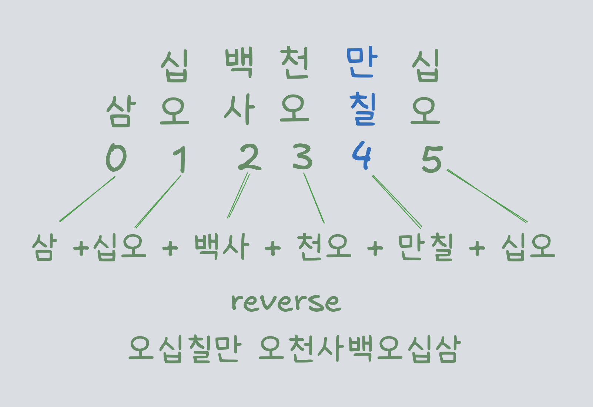

## Quick glance


A minimal app to practice Korean numbers by setting the range of numbers you want to practice.


 


## Why?


During my short 5-day trip to Korea, I felt embarassed that I could understand what people told me, but when came the time to 
pay for something, my brain would hit a maximum call stack exceeded because I sucked with numbers. I wanted to create a number generator for Korean to redeem myself and practice. 


 
## Brief Lesson 


In Korean, you have two different and essential systems for numbers.


1. **Sino-Korean Numbers**: used for dates, time, money etc. 
2. **Native-Korean Numbers**:  used for stating age and quantities.  Used only from 0-99. 

If your curiosity knows no bounds, you can check the <a  class="secondary-a" href="https://en.wikipedia.org/wiki/Korean_numerals>"> wikipedia  </a> page.


&nbsp;

### 1. Sino-Korean Numbers

For starters, to read Korean numbers below 9,999, you read the digit name + the place value. For example, let's decompose 358.

<br/>


<br/>

If the leftmost digit of the number is 1, only the place value is used. For example, 100 is only 백, not 일백.  It's a bit different with big numbers.
In daily conversation, 10 000 could just be said as 만, but formally it's 일만. I had to keep that in my mind when building the app. 

&nbsp;

For big numbers, we group them in 4's as opposed to English where it's in 3's.
For example, take the number 675,453.
We split it into two parts: 67 | 5453 — grouping every four digits from the right.
- 67 corresponds to the 만 (10⁴) unit → 육십칠만
- 5453 is just read as-is → 오천사백오십삼


&nbsp;


### 2. Native-Korean Numbers

It's much less of a hassle than Sino-Korean numbers since we're only interested in numbers from 0 to 99, thus we just combine the tens and the ones together. To get 31,  we know that 30 is  서른 and  one is 하나, so their combination is 서른하나.

&nbsp;

## Thinking about the code

&nbsp;

### Native-Korean numbers
```swift
// Two arrays for the tens and the ones
// Note that index 0 of each array is an empty string. This way, the index matches the number.
let ones = ["", "하나", "둘", "셋", "넷", "다섯", "여섯", "일곱", "여덟", "아홉"]
let tens = ["", "열", "스물", "서른", "마흔", "쉰", "예순", "일흔", "여든", "아흔"] 
var convertedNumber = ""
```
&nbsp;

The rough idea is:

1. Generate a number from 0 to 99 and cast it to a String.  (e.g., '31')
2. If the number is less than 10, use it directly as an index into the ones array. 
3. Otherwise, use the first digit to get the tens value and the second one for the ones value.
4. Concatenate! 🧥🐈

&nbsp;

```swift
convertedNumber = tens[3] + ones[1] 
convertedNumber = "서른하나"
```

&nbsp;

### Sino-Korean numbers 
Korean uses a base-10⁴ grouping system, meaning we reuse the same place values (십, 백, 천) inside each group of 4 digits, and only introduce a new large unit (like 만, 억, 조) every time the digit position reaches a power of 10 that is a multiple of 4 — starting at 10⁴ (만).  We use a group index to help us achieve that. With this in mind, we build the number from 
<a href="#challenges-and-considerations" class="secondary-a"> right to left</a>. 

&nbsp;


```swift
let ones = ["", "일","이", "삼", "사", "오", "육", "칠", "팔", "구"]
let placeValues = ["", "십","백","천","만","억","조"]
let groupIndex = 0
var convertedNumber = ""

```
&nbsp;

To get our converted number,
the not so rough idea for numbers above 10 becomes:

1. Get the names of each digit, store them in an array and reverse it because we want to go from right to left.


&nbsp;


&nbsp;

2. Loop through the digits and check 
 - If the index % 4 and index > 0, concatenate  placeValues[4 + groupIndex] + digit name, increment the groupIndex.
 This makes sure that the next time we hit a multiple of 4, the appropriate place value is used. In this case, after 만, we use 
  조. That's my nickname!

- You would just use placeValues[index % 4 ] + digit name otherwise.


&nbsp;
 

 &nbsp;


 - If the digit is 1, concatenate only placeValues[index % 4]. Otherwise, add the placeValues[index % 4] + digit name. Edge case spotted.

&nbsp;

3. Combine the final result and reverse it. 

&nbsp;


&nbsp;

### Challenges and considerations 

1.  Having to consider edge cases such as:
    - 1 being the leftmost digit.
    - 0 being the current digit.
    - Using an empty spot in the arrays to match directly an index with a number.

2. Why do we go from right to left?
 
    - If I start from the left, how would I know the X digits to my right  — or rather how would I know the number of groups of 4 I have ? I wouldn't be able to determine the place value easily. Therefore, I want to count my groups of 4 from the right and continue to the left. It's easier for calculations.

&nbsp;


## SwiftUI Puzzle Pieces

### 1. Native-Korean View
To build the app, the first piece we need is a segmented picker for the number type. 
The Native-Korean selection displays 2 menu pickers for the range the user wants to practice.
When generating the number, we alert the user if they have selected a higher value for the minimum than the maximum.

&nbsp;


### 2. The Sino-Korean View

We use two TextFields for the minimum and maximum. We have to limit the number of digits inputted to prevent any index out of bounds error.
It's a neat function you can use in any app actually. I learned that we use wrappedValue because onChange needs to observe the changes in a <a class="secondary-a" href="https://developer.apple.com/documentation/swiftui/view/onchange(of:initial:_:)-8wgw9"> value </a>, not the wrapper. 

```swift
  func limitDigits(_ number: Binding<Int>, to digitLimit: Int) -> some View {
        self
            .onChange(of: number.wrappedValue) {
                let numberString = String(number.wrappedValue)
                if numberString.count > digitLimit {
                    let shortenedNumber = String(numberString.prefix(digitLimit))
                    
                    number.wrappedValue  = Int(shortenedNumber) ?? 0
                }
            }
    }

```
&nbsp; 

Another consideration to make is the user inputting negative numbers. Luckily, we can prevent such sneaky users by simply adding  .keyboardType(.numberPad) to the TextField.


### 3. Writing mini tests

Since the conversion logic was originally embedded in the SwiftUI views, I refactored the number conversion logic into two separate files: SinoKoreanConverter and NativeKoreanConverter. At some point, I forgot to reset the number string to "0" when an alert was thrown i.e. when the user inputs a bigger minimum than maximum. That would reset my number string to "" and I'd get a Swift Fatal Error.


```swift
import XCTest
@testable import KoreanNumbers

final class KoreanNumbersTests: XCTestCase {

    func testConvertNumberSingleDigit() {
        XCTAssertEqual(SinoKoreanConverter(sinoKoreanNumber: "1").convertNumber(), "일")
        XCTAssertEqual(SinoKoreanConverter(sinoKoreanNumber: "0").convertNumber(), "영")
    }

    func testConvertNumberTens() {
        XCTAssertEqual(SinoKoreanConverter(sinoKoreanNumber: "10").convertNumber(), "십")
        XCTAssertEqual(SinoKoreanConverter(sinoKoreanNumber: "11").convertNumber(), "십일")
        XCTAssertEqual(SinoKoreanConverter(sinoKoreanNumber: "21").convertNumber(), "이십일")
    }

    func testConvertNativeKoreanNumberTens() {
        
        XCTAssertEqual(NativeKoreanConverter(nativeKoreanNumber: "43" ).convertNumber(), "만흔셋")
        XCTAssertEqual(SinoKoreanConverter(sinoKoreanNumber: "99").convertNumber(), "아흔아홉")
        XCTAssertEqual(SinoKoreanConverter(sinoKoreanNumber: "27").convertNumber(), "스물일곱")
        
    }

     func testConvertSinoKoreanEdgeCases() {
        XCTAssertEqual(SinoKoreanConverter(sinoKoreanNumber: "0001").convertNumber(), "일") //
        XCTAssertEqual(SinoKoreanConverter(sinoKoreanNumber: "").convertNumber(), "영")
    }
    // And more...
```


&nbsp;


&nbsp;

## Takeaways

- Using .scrollContentBackground(.hidden) in lists is nice. 
- Learning limiting digits in a TextField
- Gamify it in an unknown future.
- Add an accessibility label for the Korean numbers in VoiceOver.
- Remembering that I cannot underestimate even the slightest piece of functionality. It's a small app, but I still have to be thorough.


