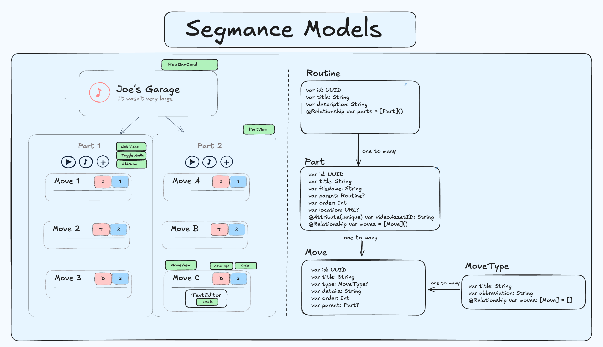
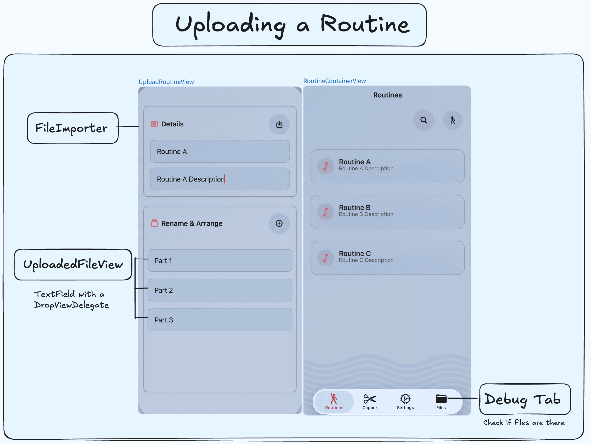
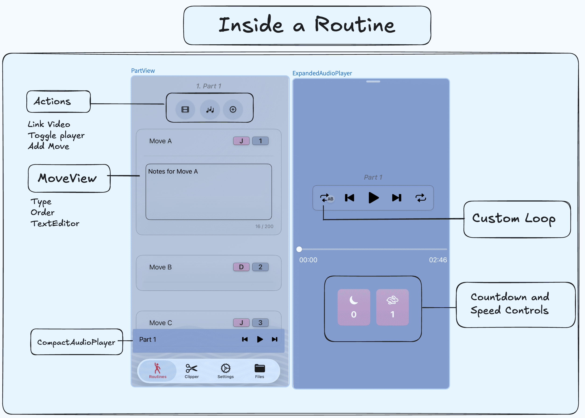
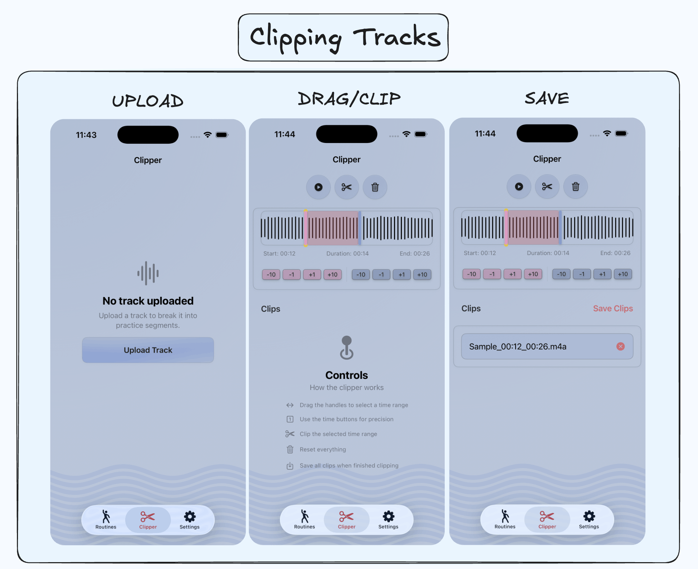

This post is being updated as I work on Segmance. Everything below consists of quick drafts of text filled with typos and ideas. This message will disappear once this post will be complete. 

&nbsp;

## Why?

When I was living in Japan, I was given precious opportunities to perform in festivals and community events in the <a href="https://en.wikipedia.org/wiki/Kihoku,_Mie" class="secondary-a"> town </a> I was living in.<sup class="secondary-a" href="#footnotes" >1.</sup> To create a performance routine, I split the audio of my target song into parts and write notes on my iPad on what moves or transitions I can do. However, it gets tedious to always switch between the audio files to play, and take notes simulatenously when a good idea pops up. I wanted to create a simple tool that combines audio and notes tailored for practicing performing arts. Granted, the creative process is different for everyone. Some people take long videos and edit out the parts they like to memorize them, and others take simple notes in their notebooks. Shaped by my own experience, my motivation with Segmance <sup class="secondary-a" href="#footnotes" >2.</sup> was to provide an intuitive way for performers to streamline the creation of a performance.

&nbsp;


## Overview

Users create routines by uploading audio files of a song they can clip into parts either through their preferred software or the clipper integrated in the app. These parts can be renamed and reordered before finalizing the creation of a routine. 


&nbsp;

When created, every audio file in the choreography becomes linked a part (PartView) in which users can: 

1. add, rearrange and delete moves of types they specify. Every move comes with a TextEditor.
2. toggle and control the audio specific to that part. 
3. Link a video from their photos library for reference.

&nbsp;


&nbsp;


### Models 

&nbsp;


<div class="post-img-container">


</div>

&nbsp;


###  Uploading a Routine


Once a user has clipped all parts of a song they want to practice, they can upload a routine. The files are then copied to the app's sandbox and transformed into Part models inside a routine. Each part has a location (URL) attribute that refers the uploaded file. This way, users can swipe through them and play the dedicated audio. I had to create a Files debug view to test the removal and 

&nbsp;

<div class="post-img-container">



</div>

&nbsp;


###  Inside a Routine


Once a user has clipped all parts of a song they want to practice, they can upload a routine. The files are then copied to the app's sandbox and transformed into Part models inside a routine. Each part has a location (URL) attribute that refers the uploaded file. This way, users can swipe through them and play the dedicated audio. I had to create a Files debug view to test the removal and 

&nbsp;

<div class="post-img-container">



</div>


### Clipping audio 




&nbsp;

## Playing with AVAudioPlayer


### Controls 


Besides the usual functions an audio player has, I wanted to implement a custom loop and countdown feature. For one, users could simply choose to upload the full song inside the routine.
1. play
2. seek forwards and backwards
3. loop
4. custom loop: displaying markers above the player
5. countdown with a timer


&nbsp;

### Cancelling tasks 


Inside the audio player, I've integrated a countdown timer and a custom loop feature. If users have bigger audio files they want to loop through, they can set a custom loop between two marks. The countdown resets every time passes the second mark. However, if the user willing drags the audio past the second mark multiple times, we have to make sure to cancel the loop tasks because otherwise, a stack of delay tasks would happen.
```swift
let task = DispatchWorkItem { [weak self] in
        self?.audioPlayer?.play()  
    }
loopPlayTask = task
DispatchQueue.main.asyncAfter(deadline: .now() + TimeInterval(delay), execute: task)
return
```


### AudioPlayerModel


Every part comes 
```swift
//PartView
if let partURL = part.location {
        AudioPlayerView(audioFileURL: partURL, partTitle: part.title)
    }

```

&nbsp;


### Expanding the player

I followed Kavsoft's <a class="secondary-a" href="https://www.youtube.com/watch?v=vqPK8qFsoBg"> tutorial </a> to implement this


&nbsp;


## Extras

### Custom Slider
2.  Creating a sliding text with two GeometryReaders.

```swift
struct SlidingText: View {
    let text: String
    let speed: Double = 30
    let spacing: CGFloat = 50
    
    @State private var offset: CGFloat = 0
    @State private var needsSliding = false
    @State private var textWidth: CGFloat = 0
    
    var body: some View {
        GeometryReader { geo in
            HStack(spacing: needsSliding ? spacing : 0) {
                Text(text)
                    .fixedSize()
                    .background(
                        GeometryReader { textGeo in
                            Color.clear.onAppear {
                                textWidth = textGeo.size.width
                                needsSliding = textWidth > geo.size.width
                                
                                guard needsSliding else { return }
                                
                                let segmentWidth = textWidth + spacing
                                
                                withAnimation(.linear(duration: segmentWidth / speed).repeatForever(autoreverses: false)) {
                                    offset = -segmentWidth
                                }
                            }
                        }
                    )
                if needsSliding {
                    Text(text).fixedSize()
                }
            }
            .offset(x: offset)
            
        }
        .clipped()
        .frame(height: 20)
    }
}

```


&nbsp;

## Challenges

This project really challenged me to deepen about my undertstanding of some of the more advanced Swift mechanics especially concurrency and AVAudioPlayer. I'm putting them in bullet points here, but I took quite a few bullets mentally from trying to implement them.

&nbsp;


### Programming
- How to link audio files to each part and delete those parts
- How to reorder parts and update their order with delegates
- Creating an expandable audio player and audio trimmer (AudioPlayerModel and AudioTrimmerModel)
- Utilizing concurrency to manage custom loops, countdown timers, audio trimming

&nbsp;


### UI/UX Concerns

Here were a few of my concerns during development: 

- Make reordering moves intuitive
- Where to add context menus for deletion, where should the user be able to delete?
- Where to put audio controls

&nbsp;


Inside the PartView, you can rearrange your moves by holding and dragging them. Every move (MoveView) is associated with an order and a type. To delete the move, you hover on the number to display a context menu. Having the context menu on the MoveView isn't a good idea, because as the user holds and drags to reorder, the context menu could interfere. 

&nbsp;


I use the tips from TipKit to inform the user about any subtle functionality, and I've also included a UsageGuide view in the Settings for clarification.
&nbsp;


&nbsp;


## Footnotes

1. For reference, I juggle and dance to tunes I learn. For example, what I like to do is learn a song on piano and then build a dance/juggling choreography with it.


2. Segmance is a portmanteau of Segment and Performance. It was named ChoreoBuilder before, but I didn't want people to strictly associate the app with dance. I've cycled through names like StageNote, SegForm, CueNote, but most were already taken or didn't capture the app's essence.


<style>

  

</style>