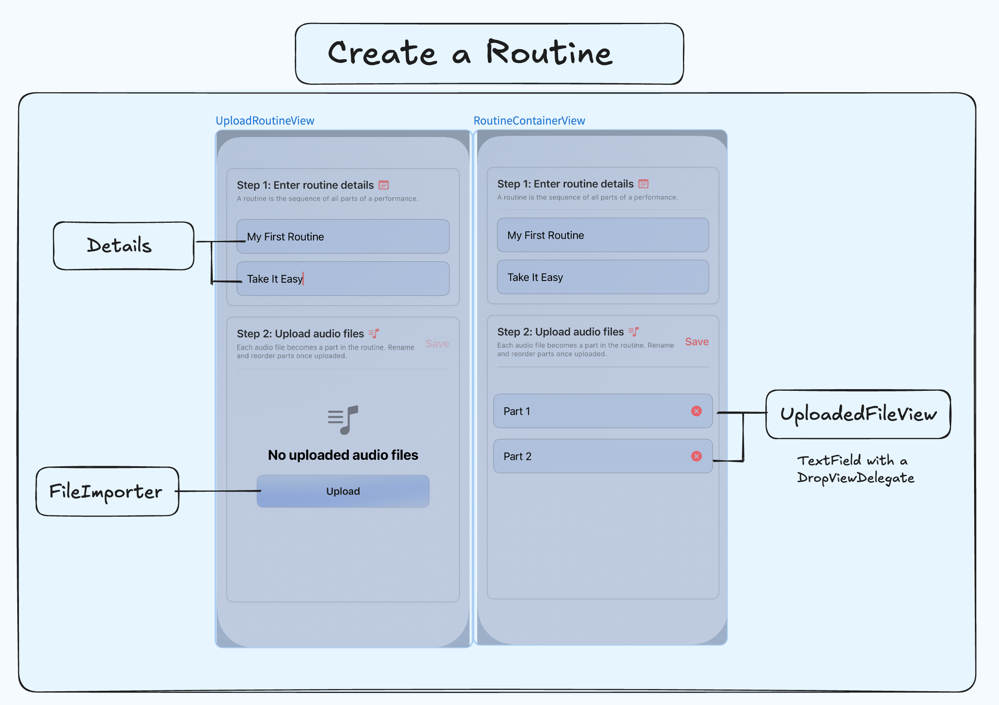
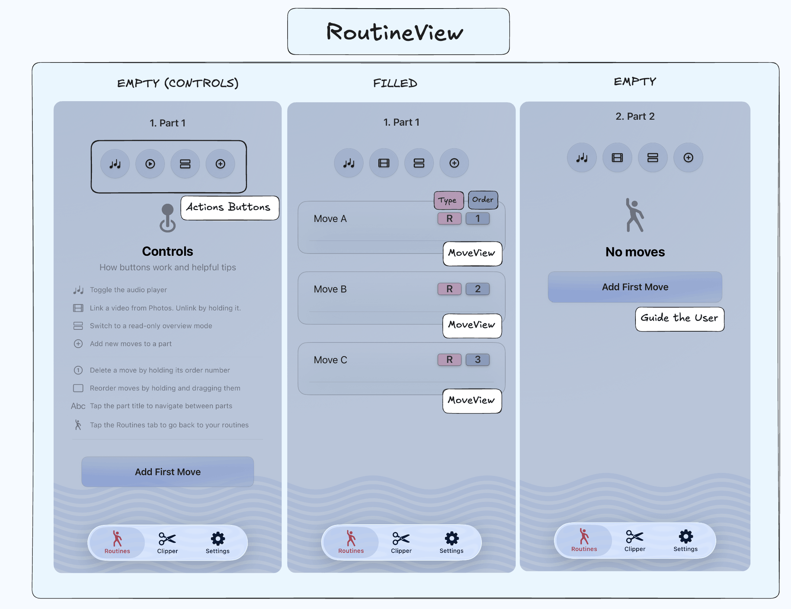
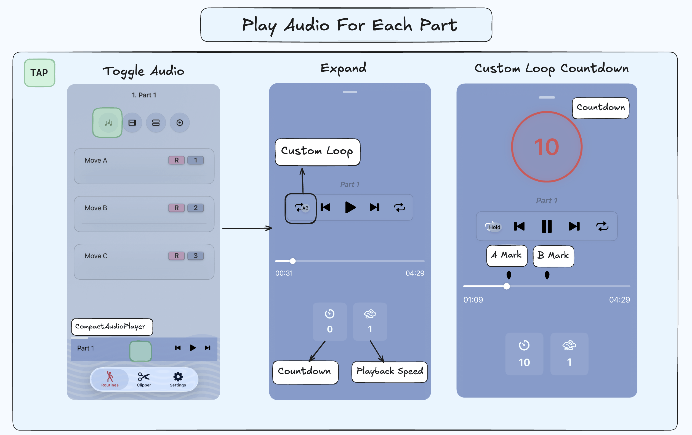
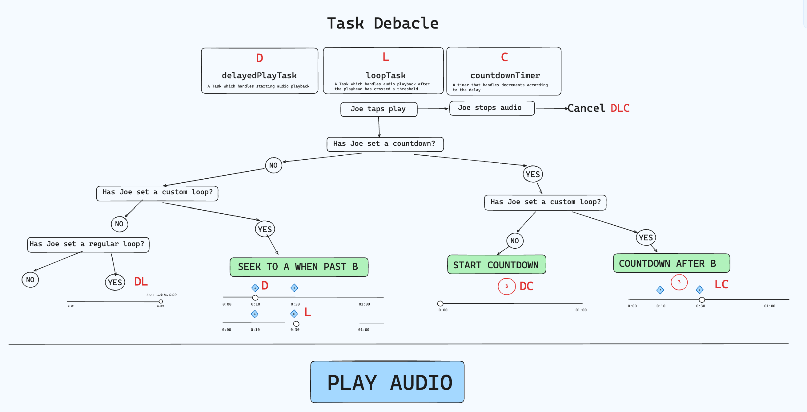
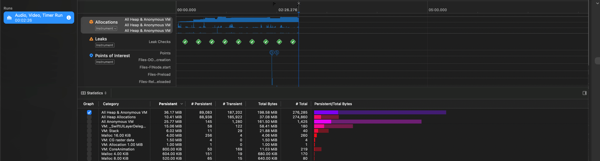
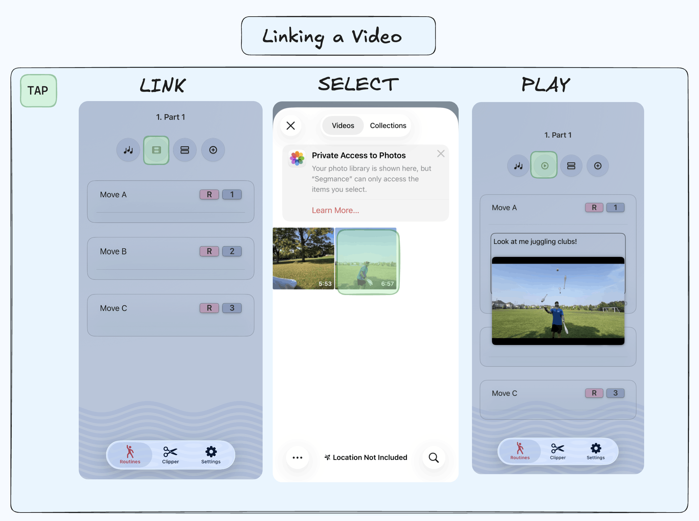
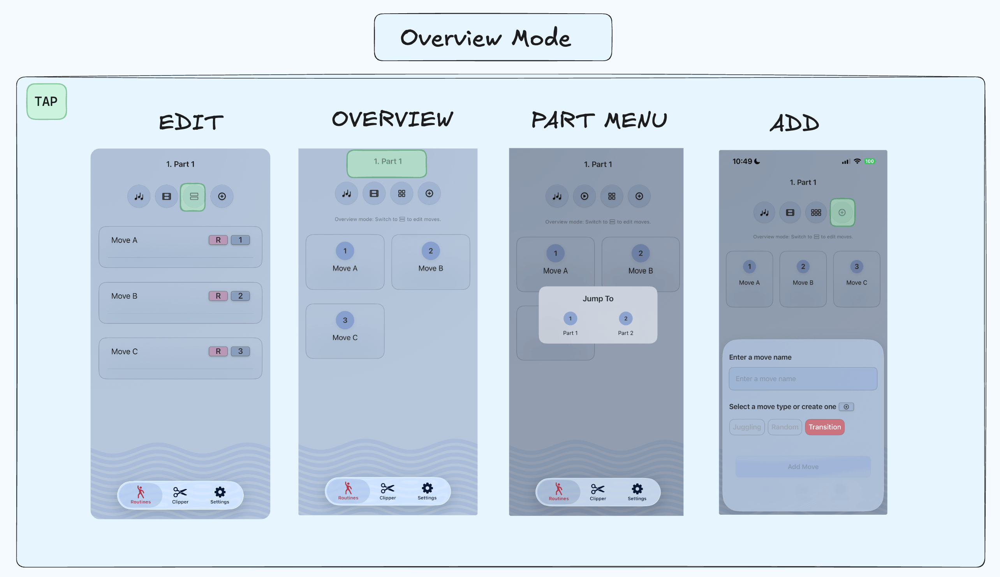
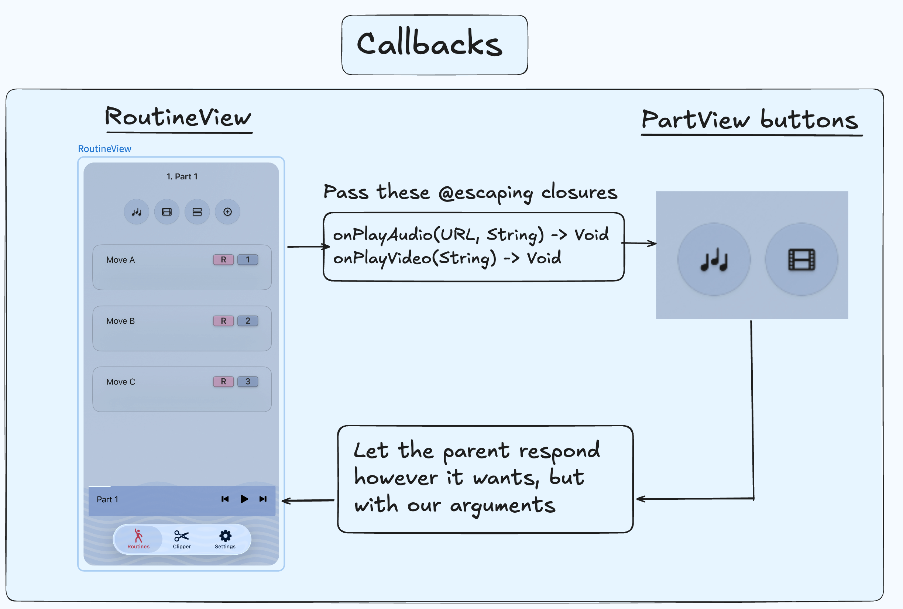
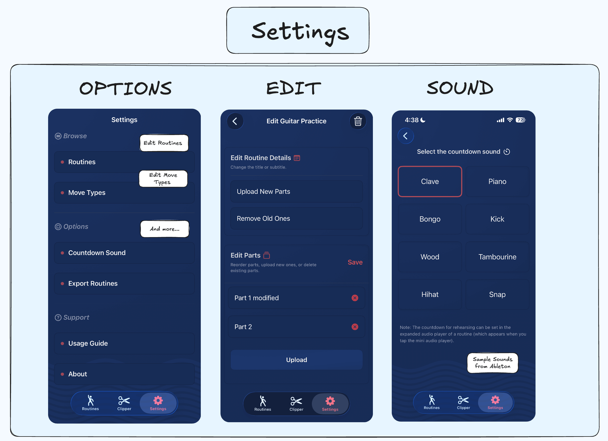

<!-- Link bank -->
<!-- <a  class="secondary-a" href="https://en.wikipedia.org/wiki/Performing_arts"> performing arts</a> -->
<!-- DI Benefits:  It's a very useful technique for testing, since it allows dependencies to be mocked or stubbed out. -->


&nbsp;

## Why?

In Japan, I was given precious opportunities to perform in festivals and community events in the <a href="https://en.wikipedia.org/wiki/Kihoku,_Mie" class="secondary-a"> town </a> I was living in.<sup class="secondary-a"> <a href="#footnotes" >1.</a></sup> Generally, to create a performance routine, I split the audio of my target song into parts and write notes on what moves I want to execute inside them. As a developer, my desire was to create a tool tailored for combining audio and notes to practice and structure performances easily.  Granted, the creative process is different for everyone. Some people take long videos to extract footage they'll use,  and others jot down notes in a notebook. Shaped by my own experience, my motivation with Segmance <sup class="secondary-a"> <a href="#footnotes" >2.</a></sup> was to provide a structured way for performers to streamline performance creation, or at least lay the initial building blocks for them.

&nbsp;


## What?

Not surprisingly, breaking things down into smaller parts is a fundamental way to start anything. For example, when learning a musical piece, you practice measure by measure to play longer sections and eventually the entirety of it. In juggling, you break complex patterns into manageable ones (5 -> 552 or 5551).

&nbsp;


Following that principle, I wanted to enable users to practice performances in parts, wherever and whenever they wanted. I designed Segmance in a way that every part has associated audio, reference video and moves. Moves are an abstract unit of action depending on the art performed. For a ballet dancer, that might be a pirouette, and for a breakdancer, a freeze.

&nbsp;


 <table class="m-auto">
        <thead>
            <tr>
                <th class="px-6 py-3">Part</th>
                <th class="px-6 py-3">Moves</th>
                <th class="px-6 py-3">Audio</th>
                <th class="px-6 py-3">Video</th>
            </tr>
        </thead>
        <tbody>
            <tr class="border-b  pro-3 dark:hover:bg-pink-400 hover:bg-pink-100">
                <td class=" px-6 py-3"><span class="px-2 py-1">P1 </span></td>
                  <td class=" px-6 py-3"><span class="px-2 py-1">A,B,C</span></td>
                  <td class=" px-6 py-3"><span class="px-2 py-1"> P1 Audio</span></td>
                   <td class=" px-6 py-3"><span class="px-2 py-1"> P1 Video</span></td>
            </tr>
            </tr>
             <tr class="border-b  pro-3 dark:hover:bg-pink-400 hover:bg-pink-100">
              <td class=" px-6 py-3"><span class="px-2 py-1">P2</span></td>
                <td class=" px-6 py-3"><span class="px-2 py-1">D,E,F</span></td>
                 <td class=" px-6 py-3"><span class="px-2 py-1"> P2 Audio</span></td>
                  <td class=" px-6 py-3"><span class="px-2 py-1"> P2 Video</span></td>
            </tr>
           <tr class="border-b  pro-3 dark:hover:bg-pink-400 hover:bg-pink-100">
              <td class=" px-6 py-3"><span class="px-2 py-1">P3</span></td>
                <td class=" px-6 py-3"><span class="px-2 py-1">G,H,I</span></td>
                 <td class=" px-6 py-3"><span class="px-2 py-1"> P3 Audio</span></td>
                  <td class=" px-6 py-3"><span class="px-2 py-1"> P3 Video</span></td>
            </tr>
        </tbody>
    </table>


&nbsp;


## Creating a Routine


&nbsp;

<div class="post-img-container">



</div>

&nbsp;

For starters, users create routines by first entering a title and subtitle for it. Afterwards, they upload audio files of the song they want to rehearse with. Each audio file becomes a part within the routine which can be renamed and reordered before creation. If users forget to upload a file, want to delete a part, or need to update the routine's title, they can manage everything via the Settings. Users provide their own audio files and create audio clips using Segmance’s built-in clipper or any external audio software. 

&nbsp;


On a technical level, audio files are copied into the app's sandbox and converted into Part objects within a routine. Each part stores a <span class="bold-rounded">fileName</span> which is used by a computed <span class="bold-rounded">location</span> property to resolve the file's URL. When a part is created, it's automatically associated with its corresponding audio file.

```swift
// Part.swift
class Part {
 // Other properties...
 var fileName: String
 var location: URL? {
        
        let fileManager = FileManager.default
        guard let documentsDirectory = fileManager.urls(for: .documentDirectory, in: .userDomainMask).first else {
            return nil
        }
        return documentsDirectory.appendingPathComponent(fileName)
        
    }
}
```


&nbsp;


##  Inside a Routine

The heart of the app is the routine (RoutineView) which acts as a container for its parts (PartView). Each part comes with 4 main action buttons (we'll explore them) and their moves, which can be created, dragged and deleted. In the first part of any routine, I include some helpful general tips to guide the user appropriately. 


&nbsp;

<div class="post-img-container">



</div>

&nbsp;


Let's look at each action button next. You'll see a green highlight on the screenshots which indicates a "tap" gesture. Some sections may have additional elaboration on intricate features (the ones I found interesting or that gave me a tough time).

&nbsp;

### Audio 

The first button is the audio button. You can toggle the audio player (AudioPlayerView) through it and expand it on tap.<sup class="secondary-a"> <a href="#footnotes" >3.</a></sup>


&nbsp;

<div class="post-img-container">



</div>

&nbsp;

The audio player includes these commands: 

1. play/pause (oh, indeed)
2. seek forwards and backwards
3. loop
4. custom loop: displaying markers above the audio progress bar
5. countdown to set up before rehearsing


&nbsp;


Before rehearsing a part, performers may need time to set up or might want to practice a specific section of a long audio. To support this, I've integrated a countdown timer and a custom loop feature. The countdown is self-explanatory, and the custom loop is indicated by two markers above the audio progress bar. When the playhead passes the rightmost marker (B), the playhead jumps back to the leftmost marker (A) and restarts. 


&nbsp;

#### AudioPlayerModel 


Audio playback is managed by a custom class, <span class="bold-rounded"> <a class="secondary-a" href="https://github.com/Kangiriyanka/Segmance/blob/main/Segmance/Audio/AudioPlayerModel.swift"> AudioPlayerModel</a></span>, which conforms to the  AudioPlayerDelegate protocol. This provides the <span class="bold underline"> audioPlayerDidFinishPlaying</span>  method, allowing the <span class="bold-rounded"> AudioPlayerModel</span> to respond a certain way after audio finishes. This is where you would find looping logic for instance.

&nbsp;


Quick reference: 
```swift
// You can only use AVAudioPlayerDelegate with NSObject (Objective-C)
@Observable
class AudioPlayerModel: NSObject, AVAudioPlayerDelegate {

    var isPlaying: Bool = false
    var audioFileURL: URL?
    var isLooping: Bool = false
    var isCustomLooping: Bool = false
    // ...

    // Using a protocol here would decouple AudioPlayerModel from AVAudioPlayer,
    // making it easier to test and replace with a mock implementation
    private var audioPlayer: AVAudioPlayer?

    func setupAudio() {
        do {
            // Bluetooth Support
            let audioSession = AVAudioSession.sharedInstance()
            try audioSession.setCategory(.playback, mode: .default, options: [.mixWithOthers])
            try audioSession.setActive(true)

            // Audio Player
            guard let audioFileUrl = audioFileURL else {
                errorMessage = "Invalid audio file URL"
                showError = true
                return
            }

            audioPlayer = try AVAudioPlayer(contentsOf: audioFileUrl)
            audioPlayer?.prepareToPlay()
            audioPlayer?.enableRate = true
            totalTime = audioPlayer?.duration ?? 0.0

            // AVAudioPlayer's delegate is the AudioPlayerModel.
            // When audio finishes playing, the AVAudioPlayer tells
            // the AudioPlayerModel to do something.
            audioPlayer?.delegate = self

        } catch {
            // Take whatever error we throw and put it into our custom one
            errorMessage = AudioPlayerError.initializationFailed(error).errorDescription
            showError = true
        }
    }

    // This only gets called when the playhead reaches the end
    func audioPlayerDidFinishPlaying(_ player: AVAudioPlayer, successfully flag: Bool) {
        if !isLooping {
            isPlaying = false
        }
        // Do something that calls playAudio...
    }
}
```


&nbsp;

Taking into account playback with a possible delay (countdown) and custom looping functionalities, I had to create:

1. A task that handles audio playback with delay: <span class="bold-rounded"> delayedPlayTask </span>
2. A loop task that regulates regular or custom looping: <span class="bold-rounded"> loopTask </span> 
3. A timer that plays a custom tick sound: <span class="bold-rounded"> countdownTimer </span> 

&nbsp;

Note: The loop task solely exists to replay the audio without user interaction, i.e,  when the playhead reaches the end time or the rightmost marker.
&nbsp;


&nbsp;


Graphically, this is how the logic is represented; it can be drastically improved. The <span class="text-[red]"> red </span> letters indicate where the task would be set. There could be missing logic, but this goes to show how things can get complicated.

&nbsp;
&nbsp;

<div class="post-img-container">



</div>

&nbsp;


&nbsp;

There's not much value in pasting the whole code, but the key is making the tasks sleep before audio playback.

&nbsp;


GCD
```swift
@Observable
class AudioPlayerModel: NSObject, AVAudioPlayerDelegate {

var isPlaying: Bool
var countdownRemaining: Double = 0.0
var isCountingDown: Bool = false
// Tasks
private var delayedPlayTask: DispatchWorkItem?
private var loopTask: DispatchWorkItem?

func playAudio() {
    // Change between play and pause images
    // self is implicit
    isPlaying = true

    if delay > 0 {
        countdownRemaining = Double(delay)
        isCountingDown = true
        // This is what decrements
        startCountdown()
    }

    // This gets executed 
    let task = DispatchWorkItem { [weak self] in
        self?.audioPlayer?.play()
    }

    delayedPlayTask = task

    // here
    DispatchQueue.main.asyncAfter(deadline: .now() + TimeInterval(delay), execute: task)
}
```

Tasks

```swift
// ...
private var delayedPlayTask: Task<Void,Never>?
private var loopTask: Task<Void,Never>?

func playAudio() {
    self.isPlaying = true
    delayedPlayTask?.cancel()
    
    let delaySeconds = delay

    if delaySeconds > 0 {
        countdownRemaining = Double(delay)
        // self is implicit here, but you have to use them inside closures
        isCountingDown = true
        startCountdown()
    }

    // This closure captures self (AudioPlayerModel), but if we deallocate the AudioPlayerModel, 
    // we don't want to keep the Task referencing the AudioPlayerModel. 
    // An unwanted side effect would be hearing the countdown ticking sound when you've completely dismissed the AudioPlayerModel
    // and switched views
    delayedPlayTask = Task { [weak self] in

        // Proceed if the AudioPlayerModel is still in memory.
        // Swift treats weak values as optionals
        guard let self = self else { return }

        try? await Task.sleep(nanoseconds: UInt64(TimeInterval(delaySeconds * 1_000_000_000)))

        // Proceed if this task isn't cancelled anywhere else
        guard !Task.isCancelled else { return }

        _ = await MainActor.run {
            self.audioPlayer?.play()
        }
    }
}

```
The trailing closure inside the <span class="bold-rounded"> delayedPlayTask</span> "weakly" captures the  <span class="bold-rounded"> AudioPlayerModel</span>. Closures, by default, strongly capture the values they reference meaning that they keep those objects alive. Suppose we don’t use weak and the user navigates away from the audio player view. An unwanted side effect of that would be hearing audio play somewhere else in the app when you're not supposed to. The AudioPlayerModel never disappeared because the delayedPlayTask is keeping it alive (retain cycle). Declaring "weak" to capture the AudioPlayerModel ensures that the task is torn down when the model goes away, that is, deallocated.<sup class="secondary-a"> <a href="#footnotes" >4.</a></sup> This real-world application alone taught me a great lesson on those concepts.


&nbsp;


You can use Xcode Instruments to detect memory leaks. A leak happens when objects remain in memory (just when think you got rid of it), because something is still holding a reference to them, even though they’re no longer needed. The consequence is increased memory usage, which can degrade performance and eventually cause the app to crash. A persistent user could very well create 10 timer instances by spam tapping play/pause had I not considered defining my capture lists. 

&nbsp;


<div class="post-img-container">



</div>

&nbsp;


Edge cases: 


1. Changing the play/pause symbols when audio finishes
2. Disabling a regular loop if a custom loop is on
3. Restarting the timer with the countdown if the audio ends
4. Preventing the user from seeking past custom loop markers
5. Knowing where to cancel tasks and how to properly deinit


&nbsp;


### Video

The second button is a film button which opens the PhotosPicker and lets the user select a video to watch within the RoutineView. When linked, the button's image changes to a play symbol. A good application of this would be watching a video you filmed for a specific part. The video player is draggable and expandable. 


&nbsp;

<div class="post-img-container">



</div>

&nbsp;


Programmatically, since each <span class="bold-rounded"> PhotosPickerItem</span> has an <span class="bold-rounded"> itemIdentifier</span>, you can store it into a part's videoAssetID (<a class="secondary-a" href="#data-models">Data Models</a>). You can fetch a video with the part's videoAssetID through <span class="bold-rounded"> PHImageManager</span>. Before doing all that, we must kindly ask for permission.

&nbsp;


On first access to the photos library, the user receives a prompt for allowing the app full, limited or no access to it. If the user allows full access, then there's no problem. With limited or no access, we have to alert the user in case they change their mind, that is, want to allow new photos. In the former, one thing that initially confused me is that Apple, by default, shows all the photos of the PhotosPicker including the ones you didn't allow (screenshot where it says <span class="text-[#c06f7a]">Learn more...</span>). On WhatsApp, their picker only shows limited photos, suggesting a different implementation going on. In any case, we only assign the <span class="bold-rounded"> itemIdentifier</span> to the part when appropriate!

&nbsp;


Notify the user that they can't link a video they haven't allowed.
```swift
// RoutineView
// Prompting to allow access
alert("No Access", isPresented: $videoManager.showingAccessAlert) {
    Button("Open Settings") {
        if let url = URL(string: UIApplication.openSettingsURLString) {
            UIApplication.shared.open(url)
        }
    }
    
    Button("Cancel", role: .cancel) {
        videoManager.showingAccessAlert = false
        videoManager.selectedVideoItem = nil
    }
} message: {
    Text("This video isn’t accessible with your current Photos permissions. You can allow access in Settings.")
}
```


Extra edge cases:

1. User manually unlinking the video
1. Unlinking the video from the part when the user deletes it from their library.
2. Changing the z-index of the video player to prevent overlap with the audio player

&nbsp;


### Overview and Add Moves


I've included an overview mode for performers, giving them a bird's eye view on all the moves within a part, so they have a quick way to memorize them. In overview mode, users cannot reorder or add notes to existing moves. As a bonus, if the user taps the part title on top, a modal opens that lets them navigate directly to the part they want to rehearse without scrolling. This can be especially useful for performances with multiple parts. Finally, the last button displays a sheet to add moves of custom types. These types can be edited and deleted through the Settings.


&nbsp;

<div class="post-img-container">



</div>

&nbsp;


## Behind the scenes


The RoutineView manages the audio and video players. Each Part holds a file URL and a videoAssetID. Tapping a button in the PartView executes a closure in the parent (RoutineView) with the PartView's arguments: the part title and the audio URL. This sets up the AudioPlayerModel with the matching part's URL. Unlike @Binding, which directly links state between parent and child, callbacks let the parent respond to events and decide what to do next. 


&nbsp;

<div class="post-img-container">



</div>

&nbsp;


RoutineView passing closures to the PartView

```swift
// RoutineView (demonstration purposes)
// With Observable (iOS 17+),
// you don't need the @State (let's put it anyways)

// has the initializer: init(audioFileURL: URL? = nil) 
@State private var audioManager = AudioPlayerModel(audioFileURL = "AN_AUDIO_FILE_URL") 
@State private var audioPlayerIsPresented: Bool = false

// Inside a ScrollView
PartView(
    part: part,
    onPlayVideo: onPlayVideo,
    onPlayAudio: onPlayAudio,
    onUnlinkVideo: onUnlinkVideo,
    onVideoPicked: onVideoPicked
)

// MARK: - Audio Playback Handler
private func onPlayAudio(_ url: URL, _ title: String) {
    withAnimation(.organicFastBounce) {
        if (audioManager.audioFileURL != nil) && audioPlayerIsPresented {
            audioPlayerIsPresented = false
            audioManager.audioFileURL = nil
            audioManager.stopAudio()
        } else {
            audioManager.audioFileURL = url
            // Setup audio here instead of in AudioPlayerView init
            audioManager.setupAudio()
            currentPartTitle = title
            audioPlayerIsPresented = true
        }
    }
}

```

PartView receiving these closures 
```swift

// PartView
// @escaping: can be saved for later execution
init(
    part: Part,
    onPlayVideo: @escaping (String) -> Void,
    onPlayAudio: @escaping (URL, String) -> Void,
    onUnlinkVideo: @escaping (String?) -> Void,
    onVideoPicked: @escaping (PhotosPickerItem, Part) -> Void
) {
    self.part = part
    self.onPlayVideo = onPlayVideo
    self.onPlayAudio = onPlayAudio
    self.onUnlinkVideo = onUnlinkVideo
    self.onVideoPicked = onVideoPicked
}

// Child (PartView) tells Parent (RoutineView):
// Hey! let me share the location of the audio file 
// for you to use it inside your AudioPlayerModel
Button {
    if let url = part.location {
        onPlayAudio(url, part.title)
    }
} label: {
    Image(systemName: "music.quarternote.3")
}
```

The RoutineView is a ZStack which has:

1.	A horizontal ScrollView displaying each PartView of the routine. 
2.	An AudioPlayerView which receives an AudioPlayerModel from the <a class="secondary-a" href="https://github.com/Kangiriyanka/Segmance/blob/main/Segmance/Routines/RoutineView.swift"> RoutineView </a> via dependency injection.
3.	A DraggableVideoPlayer which receives a VideoPlayerModel from the RoutineView via dependency injection.


&nbsp;


In a previous implementation, I let every part instantiate its own audio player instead of centralizing it in the RoutineView. This means a user could even have X audio players running simultaneously across parts. That's a waste of resources and an unpleasant experience to the ears, but it was a good mistake on my part.


&nbsp;

## Clipping Tracks 

While explaining Segmance to a friend, I realized that if the app revolves so much around parts, why not add an audio clipper?

&nbsp;


<div class="post-img-container">


</div>


The audio waves are generated by using <a class="secondary-a" href="https://github.com/dmrschmidt/DSWaveformImage"> DSWaveformImage </a> by Dennis Schmidt. 


&nbsp;

One challenge in implementing this was keeping the displayed <span class=" bold text-[gray]"> Start </span> and <span class=" bold text-[gray]"> End </span> times in sync with the actual audio playback. GeometryReader works with CGFloat for layout calculations, but the audio timing needs to remain precise. The solution is to convert the positions from CGFloat fractions back to Double when updating startTime and endTime. This ensures that the visual handle positions match the audio timeline accurately without losing precision. 


```swift
// AudioWaveformView (implementation modifications for presentation purposes)
// These are initially 0 and 1 and exist in the AudioClipperView
@Binding var startTime: Double
@Binding var endTime: Double

let startFraction = CGFloat(startTime / duration)
let endFraction = CGFloat(endTime / duration)

GeometryReader { geo in
    ZStack {
        // Start Handle
        HandleView(
            height: geo.size.height,
            color: .customPink
        )
        .position(
            x: startFraction * geo.size.width,
            y: geo.size.height / 2
        )
        .gesture(
            DragGesture()
                .onChanged { value in
                    let fraction = min(
                        max(0, value.location.x / geo.size.width),
                        // Don't let the start handle overlap with end 
                        CGFloat(endTime / duration) - 0.01
                    )
                    let rawTime = Double(fraction) * duration
                    startTime = round(rawTime)
                }
                .onEnded { _ in
                    // I name it trimmer in my actual implementation
                    clipper?.seekAudio(to: startTime)
                }
        )

        // End Handle
        HandleView(
            height: geo.size.height,
            color: .customBlue
        )
        .position(
            x: endFraction * geo.size.width,
            y: geo.size.height / 2
        )
        .gesture(
            DragGesture()
                .onChanged { value in
                    let fraction = max(
                        min(1, value.location.x / geo.size.width),
                        CGFloat(startTime / duration) + 0.01
                    )
                    let rawTime = Double(fraction) * duration
                    endTime = rawTime
                }
        )
    }
}
```


Edge cases:

1. Preventing the start and end handles from going past each other
2. Preventing clipping already existing parts
3. Disabling buttons during clipping
4. Removing the clipped files and setting the export session to nil on deinitalization


&nbsp;


## Settings

I won’t explain much here, but I wanted to show off Segmance’s dark mode and the options available. The real technological "ordeal" was writing the logic for handling audio files inside a routine. If a part name changes, the filename has to change with it, or if a part gets deleted, the files need to be removed from storage. I definitely need to refactor some of the existing logic. <sup class="secondary-a"> <a href="#footnotes" >5.</a></sup> 

&nbsp;

<div class="post-img-container">



</div>

&nbsp;

The countdown tick sounds (.wav) are made with Ableton Live royalty-free samples. For all those folks with a Focusrite, I salute you.

&nbsp;


## Data Models


These are the data models in Segmance. I used SwiftData for this project and my <a  class="secondary-a" href="https://joefarah.com/projects/k-count/">last</a> one. While SwiftData provides unique IDs, I would still include UUID for tasks like generating unique filenames. For other projects, I'll be moving forward with <a class="secondary-a" href="https://github.com/groue/GRDB.swift">GRDB</a>.

&nbsp;


<div class="post-img-container">


</div>


&nbsp;


&nbsp;


## Challenges

Segmance pushed me to deepen my understanding on some of the more advanced mechanics, notably concurrency and AVFoundation. Initially, the project only handled audio, but I later added video support. Moving forward, I’d put more focus on designing the architecture in expectation that new features can be integrated without causing regressions or breaking existing functionality. It comes down to experience, and I continue to improve by remaining intentional in my approach.

&nbsp;


### Programming
- Linking audio files to each part. 
- Being able to edit audio files in existing routines without creating duplicates/missing files
- Implementing a custom drag/drop with DropDelegate for updating part/move orders
- Creating expandable audio/video players and an audio clipper.
- Utilizing concurrency to orchestrate custom loops, countdown timers, audio clipping/trimming.


&nbsp;


### UI/UX 

- Turning the dragging and dropping of moves into a smooth experience
- Exploring where to add context menus for move deletion
- Deciding the layout audio controls
- Making empty state views robust
- Using TipKit to notify the user about any subtle functionality

&nbsp;


And more...


&nbsp;


## Takeaways


1. Avoid making the user guess where they have to go


2. Add a community layer with authentication and user interactions for a future project

3. All in all, I'm extremely satisfied with Segmance.


&nbsp;

## Footnotes

1. For reference, I juggle and dance to tunes I learn. For example, what I like to do is learn a song on piano, and then build a dance/juggling choreography with it. 

&nbsp;


2. Segmance is a portmanteau of Segment and Performance. It was named ChoreoBuilder before, but I didn't want it to be stricly paired with dance. I cycled through names like StageNote, SegForm, CueNote, but most were already taken or didn't capture the app's essence.

&nbsp;


3. Inspired from Kavsoft's <a class="secondary-a" href="https://www.youtube.com/watch?v=vqPK8qFsoBg">tutorial</a>, Cebrail's<a class="secondary-a" href="https://www.youtube.com/watch?v=135rXe-YxeQ"> tutorial</a> and <a class="secondary-a"href="https://www.videolan.org/vlc/download-ios.html"> VLC </a>

&nbsp;


4. See <span class="bold-rounded"><a class="secondary-a" href="https://docs.swift.org/swift-book/documentation/the-swift-programming-language/closures/#Capturing-Values">makeIncrementer</a></span> function. 


&nbsp;

5. Or all of it.


<style>

  

</style>