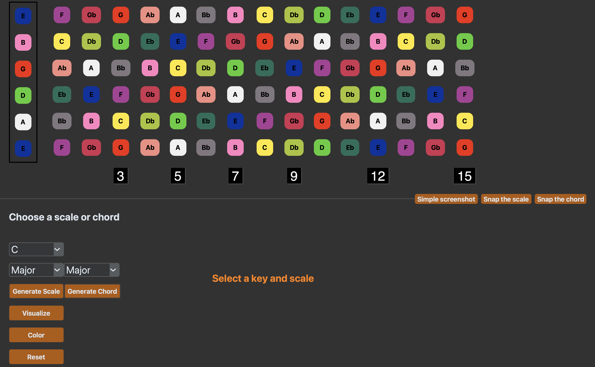
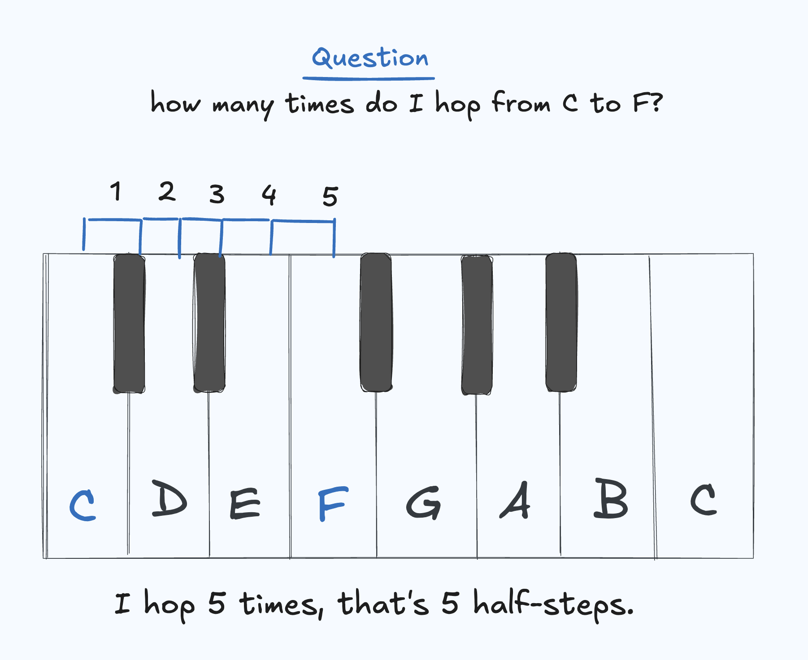
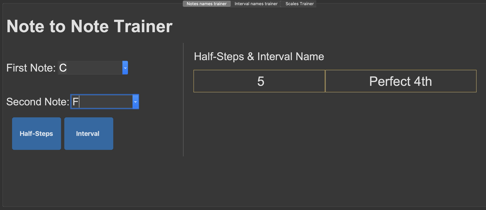
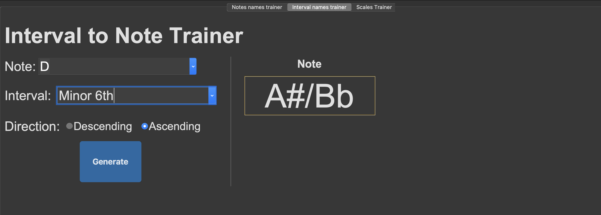
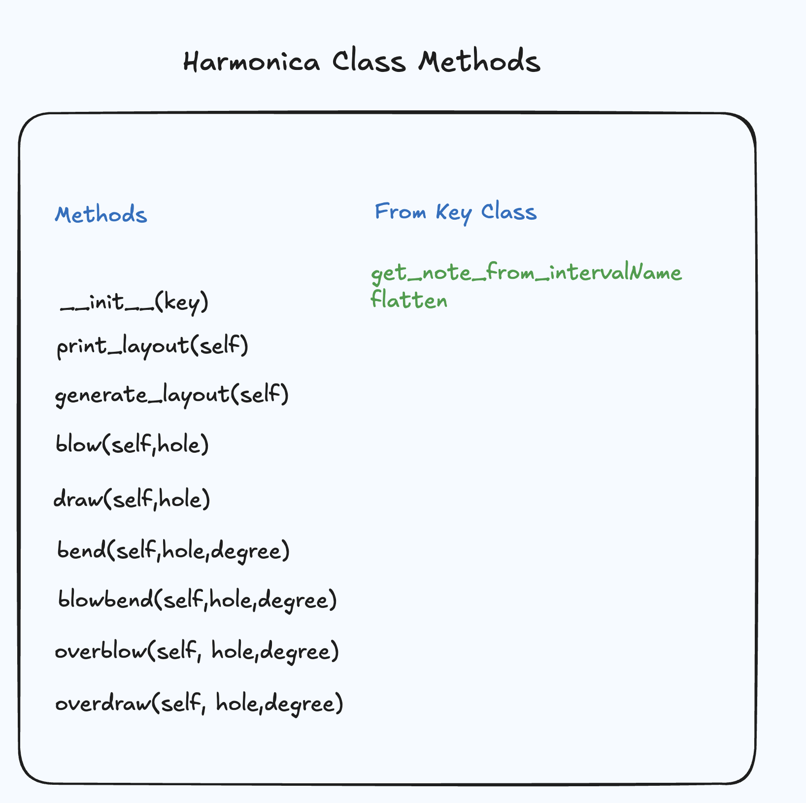
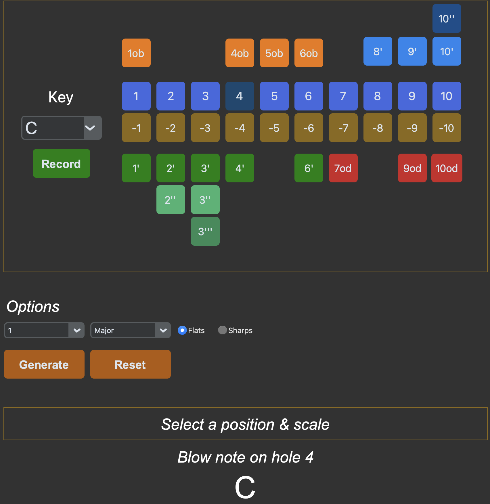
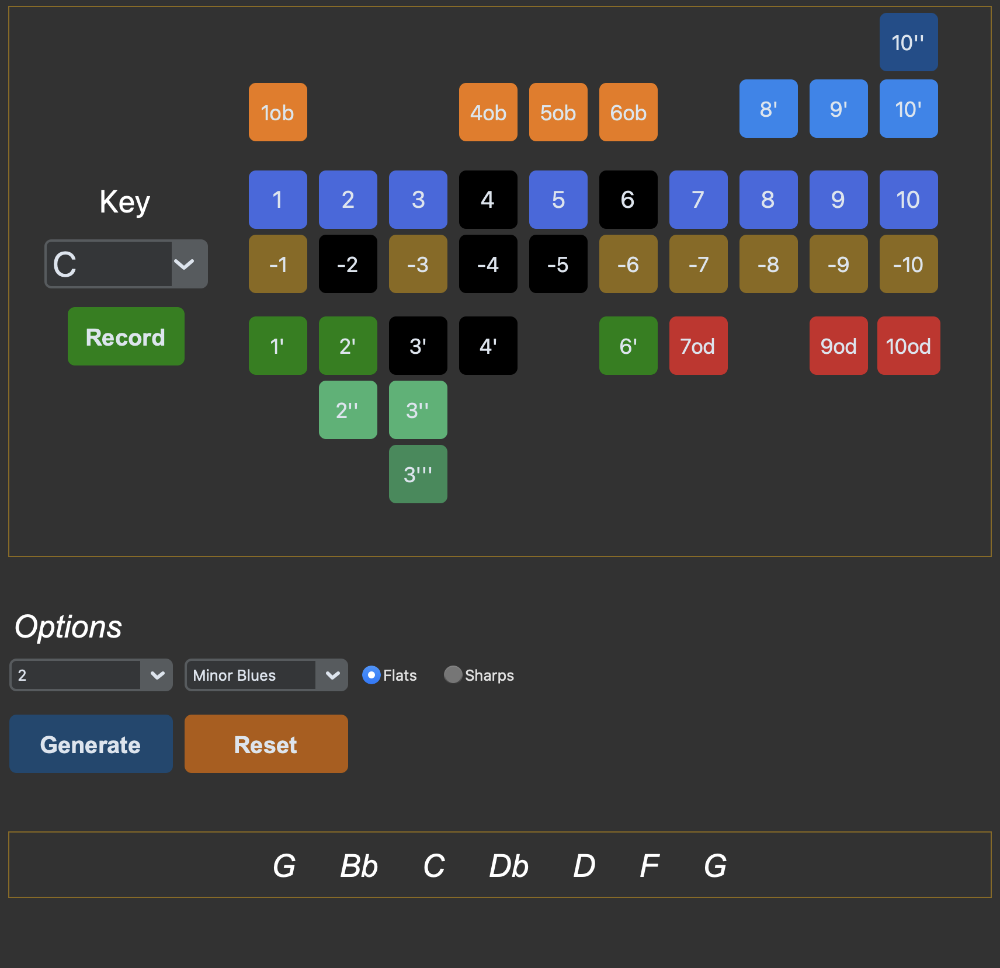
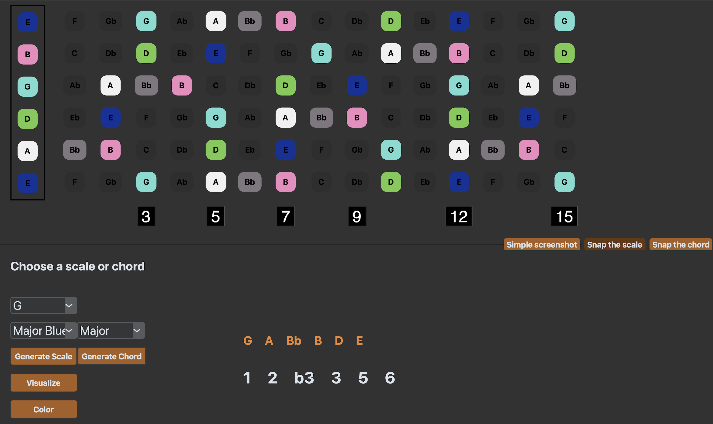
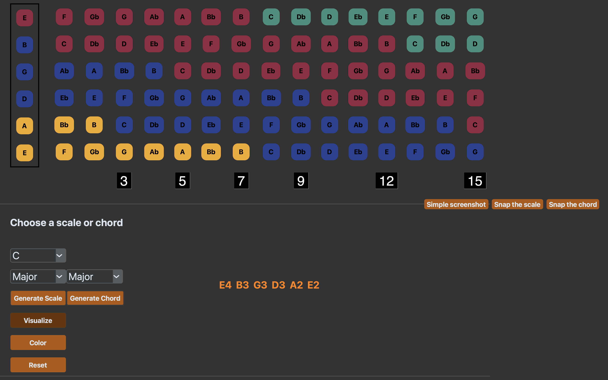

## Quick Glance

Harmonica GUI 

&nbsp; 

Guitar GUI 
&nbsp;



&nbsp;

## Why?

I started learning musical instruments relatively late in life. Keys, modes, intervals and whatever music notions were all foreign concepts and frankly overwhelming ones. 
I was interested in music theory and moreso trying to understand links between harmonica, guitar and piano. I was asking questions along the lines of: if I play a C4 key on the piano, where would that exact note be located on the guitar and harmonica? How would I play a blues scale on each of these instruments? What the heck is the Phrygian mode? 

&nbsp;

## Brief lesson


### Half-steps, degrees and intervals.


For reference and simplicity, the piano is a great instrument to demonstrate distance between notes. On a piano, there are white and black keys. The smallest distance you can travel on a piano is called a half-step or semitone. It's the smallest hop your finger can make. If I do 2 hops, that's 2 half-steps, 3 is 3 half-steps etc. You can also say that 2 half-steps are a whole step. Consequently, 3 hops are either 3 half-steps or 1 whole step and 1 half-step. In my opinion, it's much easier to initially see everything as half-steps and then start converting and calculating the way you want. 

&nbsp;



- Note that I haven't included the note names of the black keys for readability. (sharps or flats) 

&nbsp;

That distance I keep mentioning is commonly called a music interval. Every interval has its own name depending on the number of half-steps. 
It can also be represented by another notation called a music degree. Degrees are what you'll commonly see used with scales. I've included a non-exhaustive table 
for comparison. 

 &nbsp;

| <u>Half Steps</u> | <u>Interval Name</u> | <u>Degree</u>     |
|:-----------------:|:-------------------:|:-----------------:|
|        0          |  Perfect Unison     | 1        |
|        1          |  Minor 2nd          | b2                |
|        2          |  Major 2nd          | 2                 |
|        3          |  Minor 3rd          | b3                |
|        4          |  Major 3rd          | 3                 |
|        5          |  Perfect 4th        | 4                 |
|        6          |  Tritone            | #4 / b5          |
|        7          |  Perfect 5th        | 5                 |
|        8          |  Minor 6th          | b6                |
|        9          |  Major 6th          | 6                 |
|       10          |  Minor 7th          | b7                |
|       11          |  Major 7th          | 7                 |
|       12          |  Octave             | 8    |

&nbsp; 

### Scales and Chords

Essentially, a scale is an arrangement of intervals.  The major scale for any key is:
-  Perfect Unison (Root)
-  Major 2nd, 
-  Major 3rd, 
-  Perfect 4th, 
-  Major 6th
-  Major 7th. 

&nbsp;

That's pretty long, right? Well, in that case, it's a good idea to use degrees instead.
- 1 2 3 4 5 6 7. 

&nbsp; 

A chord can be seen as a subset of a scale. The major chord is composed of 
- Perfect Unison
- Major 3rd 
- Perfect 5th 

&nbsp;

I learned my lesson, so I'll use:

- 1
- 3 
- 5

Personally, I like seeing the degrees and the intervals in parallel. That's how I integrated them in my GUIs.  By the way, if you're struggling with modes, just see them as another scale, another formula.


&nbsp; 

##  Key Class


### Motivation: Python rules
I thought Python was a great language to use because of the power of dictionaries, lists and tkinter. The libraries I used were mss and customtkinter, but I didn't use any music libraries for the sake of reinforcing my learning. I also like the fact that practicing doesn't require any internet, because you could just open a terminal and run a command to launch the GUIs.

&nbsp;

### Key Class


Before implementing the Harmonica & Guitar GUIs, we need a main class that could handle any musical operations on any key. I asked myself the following questions before implementing the methods: 

- If I have two notes (X,Y), how many half-steps do I need to get to Y? What interval name is that?
- If I have a note X, and I ask you to give me a Minor 6th above it, what would that note be? What about Perfect 4th below it?
- How will I generate a scale? Ah, I could just use a list of numbers representing the half-steps.
- And more...

The whole idea becomes to play with half-steps and convert them appropriately to whatever musical unit you need.

&nbsp;


&nbsp;

### Demo: Generating notes from scales

I instantiate an object Key('C'), and I want to generate the scale of my choice in that key. The intervals in my scales are represented in half-steps. The root is included by adding 0 in the beginning of the list. In the generate_scale method, a list comprehension that calls get_note_from_halfSteps gets you each note you need in that scale.


```python
# Inside constants.py 

NOTES = ["C", "C#/Db", "D", "D#/Eb", "E", "F", "F#/Gb", "G", "G#/Ab", "A", "A#/Bb", "B"]
SCALES = {

    "Major": [0,2,4,5,7,9,11],
    "Minor": [0,2,3,5,7,8,10],
    "Major Pentatonic": [0,2,4,7,9],
    "Minor Pentatonic": [0,3,5,7,10],
    "Major Blues": [0,2,3,4,7,9],
    "Minor Blues": [0,3,5,6,7,10],
    "Dorian": [0,2,3,5,7,9,10],
    "Phrygian": [0,1,3,5,7,8,10],
    "Lydian": [0,2,4,6,7,9,11],
    "Mixolydian": [0,2,4,5,7,9,10],
    "Aeolian": [0,1,3,5,7,8,10],
    "Locrian": [0,1,3,5,6,8,10]
    
}

# Inside key.py

def get_note_from_halfSteps(self, number_of_halfSteps):

        if not isinstance(number_of_halfSteps, int):
            raise ValueError("The half steps must be an integer")
        
        note = NOTES[(NOTES.index(self.key) + number_of_halfSteps) % len(NOTES)]
        return note

def generate_scale(self, scale):
    
        if scale not in SCALES:
            raise ValueError(f"The scale {scale} does not exist")
        
        generated_scale = [self.get_note_from_halfSteps(x) for x in SCALES[scale]]
        return generated_scale
```


&nbsp; 

### Key GUI
Using the Key class, I built a Key GUI. With it, I can:
- see the interval/half-steps between the notes
- get a note from an interval either ascending or descending from that note 
- seeing the notes in each scale with their matching intervals and degrees (I like seeing them hand in hand)



&nbsp;


&nbsp;


&nbsp;


##  Harmonica Class

### Turning a harmonica into a dictionary
Harmonicas are built with a specific key and the notes change depending on the key. However, the underlying logic stays the same. The diatonic harmonica has 10 holes. You can either blow air through a hole or draw air into one to produce a note. An effective way to figure out which notes are produced on the harmonica is to view each hole in terms of intervals relative to the harmonica's key. For blow notes, hole 1 is the root which means the key of the harmonica , hole 2 is a Major 3rd and Hole 3 is a Perfect 5th. Blow notes cycle every 3 holes, so a blow on hole 4 is also the root. Breaking News! Blow notes form a major chord! 

&nbsp;


For example, If I have a C harmonica, the blow notes on hole 1-2-3 are respectively C-E-G.  Blow 4 is also a C. The blow on hole 4 corresponds to a C4 which is the middle C of the piano, and the blow on hole 1 is a C3, the C an octave lower. Draw notes are less direct to catch, take a look at the code if you get the chance.

&nbsp;


That being said, I can instantiate a Harmonica object with a Key object in order to use the methods provided by the Key class. 




&nbsp;

The harmonica can be represented as a dictionary with:
- Hole numbers from 1-10 as keys 
- A dictionary of actions (blow,draw, bend etc.) as values

```
 Hole              Actions
 1:                {'blow': 'E', 'draw': 'F#', 'bend': 'F'}
```

&nbsp;


Here's a portion of the code that shows how I populated the harmonica dictionary. 

```python
# harmonica.py 

BLOW_NOTES = (
    ["Perfect Unison", "Major 3rd", "Perfect 5th"] * 3 + ["Perfect Unison"]
)

DRAW_NOTES = [
    "Major 2nd", "Perfect 5th", "Major 7th",
    "Major 2nd", "Perfect 4th", "Major 6th",
    "Major 7th", "Major 2nd", "Perfect 4th", "Major 6th"
]

harmonica = {}

# Generate the blow and draw notes based on intervals
blow_notes = [self.key.get_note_from_intervalName(interval, False) for interval in BLOW_NOTES]
draw_notes = [self.key.get_note_from_intervalName(interval, False) for interval in DRAW_NOTES]

# Fill the harmonica with basic blow and draw notes
# Holes are numbered from 1 to 10
for i in range(1, 11):
    harmonica[i] = {
        "blow": blow_notes[i - 1],
        "draw": draw_notes[i - 1]
    }

# Bends, overblows and overdraws are not shown here.

# To actually see the note you're playing
 def blow(self, hole):
    
        if not isinstance(hole,int) or  hole < 1 or hole > 10 :
         raise ValueError("Hole number must be an integer between 1 and 10.")
        return self.harmonica[hole]["blow"]


```


&nbsp;


### Scales on the harmonica

One challenge when learning the harmonica is figuring out what a "position" means and how it relates to the key your harmonica is in. There are 3 positions any one learning the mouth organ (comical term) gets exposed to.


- Position 1 - starts by blowing on hole 4. Root note
- Position 2 - starts by drawing on hole 2. Perfect 5th
- Position 3 - starts by drawing on hole 1. Major 2nd.

&nbsp;

Suppose that you're in the key of C and you want to play the major pentatonic scale for each position. In position 1, you're playing a C major pentatonic, but in position 2, you're playing a G major pentatonic even though your harmonica is in the key C. When I was endlessly navigating online for explanations, it only clicked for me when I realized that the positions correspond to different keys even though your harmonica is in a specific key. 

An interesting problem I ran into here was trying to figure out how to integrate scales in the harmonica GUI with those previously dicussed positions in mind.  I couldn't blindly map the notes of the scales I wanted to generate to the appropriate holes. I had to see the notes of the scales relative to the position I was playing in. I ended up hard-coding them.

```python

# harmonica.py 

FIRST_POSITION_SCALES = {
    "Major": [(4,"blow"), (4, "draw"), (5, "blow"), (5,"draw"), (6, "blow"), (6, "draw"), (7, "draw"), (7, "blow")],
    "Major Pentatonic": [(4,"blow"), (4, "draw"), (5, "blow"), (6, "blow"), (6, "draw"), (7,  "blow")]
    
}

SECOND_POSITION_SCALES = {
    "Major": [(2, "draw"), (3, "bend", 2), (3, "draw"), (4, "blow"), (4, "draw"), (5, "blow"), (5, "overblow", 1), (6, "blow")],
    "Minor Blues": [(2, "draw"), (3, "bend",1), (4, "blow"), (4, "bend",1),(4,"draw"), (5,"draw"), (6,"blow")],
    "Myxolidian": [(2, "draw"), (3, "bend", 2), (3, "draw"), (4,"blow"),(4,"draw"),(5,"blow"),(5,"draw"),(6,"blow")]
}

THIRD_POSITION_SCALES= {
    "Major Pentatonic": [(1,"draw"), (2, "blow"), (2,"bend",1), (3,"bend",2),(3,"draw"),(4,"draw")],
}

 def generate_1st_position_scale(self,scale):
        
        result = []
        for entry in FIRST_POSITION_SCALES[scale]:
            
            if len(entry) == 3:
               
                result.append(self.layout[entry[0]][entry[1]][entry[2]-1])
            else:
               
                result.append(self.layout[entry[0]][entry[1]])
        # Result 
        return result

# And more...

```

&nbsp;


Using the harmonica class, I built the Harmonica GUI using tk, ttk and <a class="secondary-a" href="https://customtkinter.tomschimansky.com/"> CustomTkInter</a>. 

The most intere, e.g., (4, "blow) from the Harmonica class to buttons belonging to my GUI class. To do so, I created a dictionary of buttons with the actions acting as keys. Furthermore, every button gets a unique action by adding a lambda function. If we don't use a lambda function and  directly put <u>self.play_blow(i)</u> as a command, it would mean that we're assigning the result of the function call to the button rather than a reference to the function itself. 

```python

buttons = {}
# Adding blow buttons to the buttons 
for i in range(1, 11):
            blow_button = self.create_ctkbutton(
                self.harmonica_frame,
                a_text=f"{i}", 
                # Use an anonymous function here!
                a_command=lambda i=i: self.play_blow(i), 
             
            )


            self.buttons[(i,"blow")] = blow_button


```


&nbsp; 

 After playing with tkinter's frames, grids and labels, this is the resulting layout. Clicking any button will give you the action associated to the hole and the note. There's also a record function that just writes harmonica notation to a text file.


&nbsp;


&nbsp;


## Guitar Gui Class
&nbsp;

### Turning a fretboard into a list of lists

Each guitar string can be represented as a Python list starting at different indices. Every item (fret) repeats itself after every 12 frets; that's 12 half-steps which is an octave.  The fretboard then represents a list of lists.

```python

GUITAR_STRINGS = ["E", "B", "G", "D", "A", "E"]
NOTES = ["C","C#/Db","D","D#/Eb","E","F","F#/Gb","G", "G#/Ab","A","A#/Bb","B"]
fretboard = []
# Get 12 notes + extras for every string
for guitarString in GUITAR_STRINGS:
	notes = 
    NOTES[NOTES.index(guitarString) :] +
    NOTES[: NOTES.index(guitarString) + 1] + 
   [NOTES[(NOTES.index(guitarString) + i) % len(NOTES)] for i in range(1, 4)]
	
	
	fretboard.append(notes)

    

```
&nbsp;
### Scales on the guitar

Using the generate_scale function from the Key class, we can color the buttons on the fretboard if they're present in the scale. The buttons this time are also stored in a dictionary like harmonica GUI, but this time the keys are based on (i,j): i being the guitar string number and j being the fret number. I've also done the same for chords, but it isn't shown here.

```python
def scale_color_mapper(self):
        scale_key = Key(self.key)
        scale = scale_key.generate_scale(self.scale_name)
    

        for i, guitarString in enumerate(self.fretboard):
            for j, fret in enumerate(guitarString):
                # Check if the fret matches the tonic (root note of the scale)
                if fret == self.key:
                    self.update_color(self.buttons[(i, j)], "turquoise")
                # Check if the fret is in the scale and color based on the degree
                elif fret in scale:
                    # Find its position in the scale
                    self.update_color(self.buttons[(i, j)], COLORED_NOTES[fret])
                else:
                    self.update_color(self.buttons[(i, j)], UNCLICKED_COLOR)

```
&nbsp;


&nbsp;

### Extras


&nbsp;
I've included other features like:
- Visualizing piano notes on on the guitar fretboard.
- Coloring the fretboard.
- Taking snapshots of the scales/chords/screen.

&nbsp;




&nbsp;


&nbsp;

## Takeaways 

- Initializing an empty __init__ file inside a folder treats the folder it's in as a package. This was useful for separating normal and gui classes.
- Implement color pickers that let the user choose the colors for each individual note.
- Consider how tkinter looks on different operating systems
- Use more CTk as opposed to TK for scaling issues.
- Comment way more than I think.
- Even if it's something's that's already been  made, I should give it a shot.
